# ShipFlow AI — AI Agent System Design

**Document Version:** 1.0.0  
**Author:** Principal AI Systems Architect & Staff Backend Engineer  
**Status:** Approved for Implementation  
**Dependency Baselines:** `architecture.md`, `database-architecture.md`  

---

## Table of Contents
1. [Supervisor Agent Architecture](#1-supervisor-agent-architecture)
2. [Complete Agent Catalog](#2-complete-agent-catalog)
3. [AI Tool Registry](#3-ai-tool-registry)
4. [AI Memory Architecture](#4-ai-memory-architecture)
5. [Repository RAG Pipeline](#5-repository-rag-pipeline)
6. [Repository Intelligence & AST Parsing](#6-repository-intelligence--ast-parsing)
7. [Prompt Pipeline & Context Assembly](#7-prompt-pipeline--context-assembly)
8. [Intelligent Model Routing](#8-intelligent-model-routing)
9. [Agent Communication & Inngest Sequence](#9-agent-communication--inngest-sequence)
10. [Execution Lifecycle & Safety Gates](#10-execution-lifecycle--safety-gates)
11. [Failure Recovery & Self-Healing Loops](#11-failure-recovery--self-healing-loops)
12. [AI Cost Optimization Strategy](#12-ai-cost-optimization-strategy)
13. [Observability & Telemetry Framework](#13-observability--telemetry-framework)
14. [Mermaid System Diagrams Catalog](#14-mermaid-system-diagrams-catalog)

---

## 1 Supervisor Agent Architecture

The **Supervisor Agent** (Orchestrator) is the central state coordinator for ShipFlow AI. It manages the lifecycle of developer requests without executing repository-level file operations directly, delegating execution tasks to dedicated child workers.

### Supervisor Execution Topology

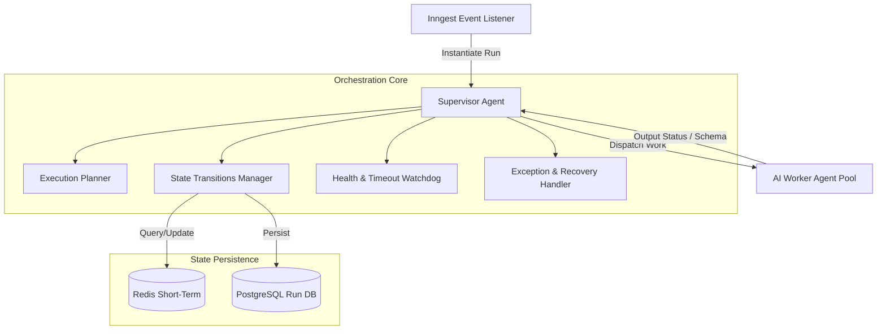

### Supervisor Core Responsibilities

* **Workflow Orchestration:** Manages state transitions dynamically based on state mappings.
* **Execution Planning:** Decomposes developer PRD definitions into dependency-ordered execution graphs.
* **Dependency Resolution:** Analyzes task dependencies, running independent coding tasks concurrently and locking sequential tasks.
* **Scheduling & Concurrency Throttling:** Groups operations to fit inside token and rate limit constraints.
* **Timeout & Health Monitoring:** Cancels execution loops if child workers hang or exceed latency parameters.
* **Event Coordination:** Dispatches Inngest event payloads to trigger workers and listens to status updates.
* **Cancellation Management:** Cleans up git branches, halts workflows, and reverts files if users cancel active requests.

---

## 2 Complete Agent Catalog

ShipFlow AI divides development duties across 9 specialized agent definitions.

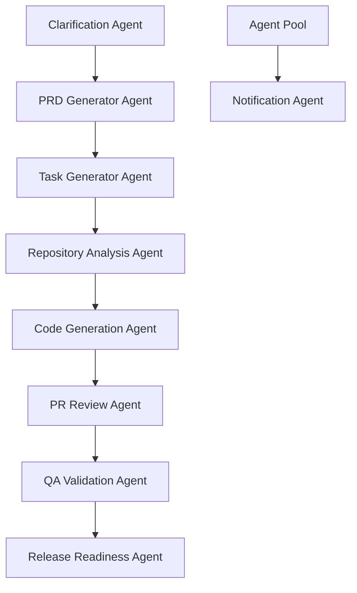

### 1. Requirement Clarification Agent
* **Responsibilities:** Analyzes developer inputs, checks context boundaries, and prompts users to clarify ambiguities.
* **Inputs:** Raw feature description text, workspace project documentation files.
* **Outputs:** Zod Schema matching structured multiple-choice questions.
* **Tools:** `Documentation Tool`.
* **Prompts:** Guides the model to behave as a product analyst, evaluating tech constraints.
* **Memory requirements:** Session chat log memory (Redis).
* **Retry & Failure Policy:** Falls back to basic text input boxes after 3 failed schema-generation parses.
* **Execution Limits:** Timeout: 60s, Cost Cap: $0.05.
* **Events Consumed:** `shipflow/feature.created`
* **Events Produced:** `shipflow/feature.clarifying`, `shipflow/feature.clarified`

### 2. PRD Generator Agent
* **Responsibilities:** Compiles answers into Markdown Product Requirements Documents (PRDs).
* **Inputs:** Raw request, user responses to clarification questions.
* **Outputs:** Markdown PRD document.
* **Tools:** `Prisma Tool`, `Documentation Tool`.
* **Prompts:** Directs the model to design comprehensive system outlines, database schemas, and endpoints mappings.
* **Memory requirements:** Workspace memory, project details, and user answers.
* **Retry & Failure Policy:** Re-runs with standard requirements template if generation fails. Max retries: 2.
* **Execution Limits:** Timeout: 120s, Cost Cap: $0.20.
* **Events Consumed:** `shipflow/feature.clarified`
* **Events Produced:** `shipflow/prd.generated`

### 3. Task Generator Agent
* **Responsibilities:** Splits approved PRD designs into file-level code modifications check-lists.
* **Inputs:** Approved PRD, Repository AST mapping data.
* **Outputs:** JSON list containing target file modifications paths and tasks dependencies.
* **Tools:** `Repository Search Tool`, `File System Tool`.
* **Prompts:** Technical lead context. Directs formatting into structured step-by-step programming tasks.
* **Memory requirements:** Logical code-block memory context.
* **Retry & Failure Policy:** Skips dependencies if graph circles are found, issuing warnings. Max retries: 3.
* **Execution Limits:** Timeout: 90s, Cost Cap: $0.15.
* **Events Consumed:** `shipflow/prd.approved`
* **Events Produced:** `shipflow/tasks.generated`

### 4. Repository Analysis Agent
* **Responsibilities:** Scans directories, identifies import/export hierarchies, extracts AST maps, and runs semantic code retrievals.
* **Inputs:** Project file index, search term vector coordinates.
* **Outputs:** Target file codes snippets, AST trees, dependencies graphs.
* **Tools:** `Repository Search Tool`, `File System Tool`, `Memory Tool`.
* **Prompts:** Focuses on extracting function parameters and directory structures without modifying files.
* **Memory requirements:** Vector embeddings cache (PgVector).
* **Retry & Failure Policy:** Returns flat files list mapping if structural AST parsing fails. Max retries: 5.
* **Execution Limits:** Timeout: 180s, Cost Cap: $0.30.
* **Events Consumed:** `shipflow/task.start`
* **Events Produced:** `shipflow/repository.analyzed`

### 5. Code Generation Agent
* **Responsibilities:** Modifies and creates codebase files to resolve technical tasks.
* **Inputs:** Target code files, task description details, API boundaries context.
* **Outputs:** Unified Git Diff patch.
* **Tools:** `File System Tool`, `Terminal Tool`.
* **Prompts:** Coding agent instructions. Directs edits using direct file replacements rather than mock code placeholders.
* **Memory requirements:** Short-term execution workspace context files.
* **Retry & Failure Policy:** Passes errors back to Repository Analysis to refine prompt bounds. Max retries: 4.
* **Execution Limits:** Timeout: 240s, Cost Cap: $0.50.
* **Events Consumed:** `shipflow/repository.analyzed`
* **Events Produced:** `shipflow/code.generated`

### 6. PR Review Agent
* **Responsibilities:** Reviews pull request changes diffs for style compliance and bugs.
* **Inputs:** PR diff, code guidelines, PRD requirements.
* **Outputs:** JSON list containing file names, line numbers, comments, and severity.
* **Tools:** `GitHub Tool`, `Documentation Tool`.
* **Prompts:** Code reviewer instructions, enforcing ESLint and safety guidelines.
* **Memory requirements:** Workspace styling rules context.
* **Retry & Failure Policy:** Splits files review steps if diff payload limits are hit. Max retries: 3.
* **Execution Limits:** Timeout: 120s, Cost Cap: $0.20.
* **Events Consumed:** `github/pull_request.opened`, `github/pull_request.synchronize`
* **Events Produced:** `github/pr.review_completed`

### 7. QA Validation Agent
* **Responsibilities:** Executes compiler actions and tests files within sandboxed containers.
* **Inputs:** Target branch, tests commands, DB migration parameters.
* **Outputs:** Tests log statuses, coverage reports, error reasons.
* **Tools:** `Terminal Tool`, `Database Tool`.
* **Prompts:** Directs diagnostic parsing of build or test crash dumps.
* **Memory requirements:** Prior successful runs metrics caches.
* **Retry & Failure Policy:** Halts pipeline and dispatches test errors to active developer workspace channels. Max retries: 1.
* **Execution Limits:** Timeout: 300s, Cost Cap: $0.10.
* **Events Consumed:** `github/pr.review_passed`
* **Events Produced:** `qa/validation.completed`

### 8. Release Readiness Agent
* **Responsibilities:** Compiles release changelogs, builds tags, and updates tracking files.
* **Inputs:** Commits lists, database schema updates.
* **Outputs:** Version tag, semantic changelog markdown.
* **Tools:** `GitHub Tool`, `Deployment Tool`.
* **Prompts:** Focuses on extracting commit logs and categorizing changes.
* **Memory requirements:** Workspace deployment release records.
* **Retry & Failure Policy:** Restores previous stable production build deployment alias if tagging operations fail. Max retries: 3.
* **Execution Limits:** Timeout: 90s, Cost Cap: $0.05.
* **Events Consumed:** `qa/validation.completed` (after Gate 3 PM approval)
* **Events Produced:** `release.shipped`

### 9. Notification Agent
* **Responsibilities:** Dispatches status notifications to linked workspace communication channels.
* **Inputs:** Event status, developer email details, Slack webhook coordinates.
* **Outputs:** API post payload statuses.
* **Tools:** `Notification Tool`.
* **Prompts:** Formats raw metrics and changelog summaries into clean Slack blocks or email templates.
* **Memory requirements:** Recipient channel preference mappings.
* **Retry & Failure Policy:** Caches failed alerts in Redis before retrying. Max retries: 5.
* **Execution Limits:** Timeout: 30s, Cost Cap: $0.01.
* **Events Consumed:** All lifecycle events.
* **Events Produced:** None.

---

## 3 AI Tool Registry

To protect system integrity, agents invoke external services through a centralized **AI Tool Registry**.

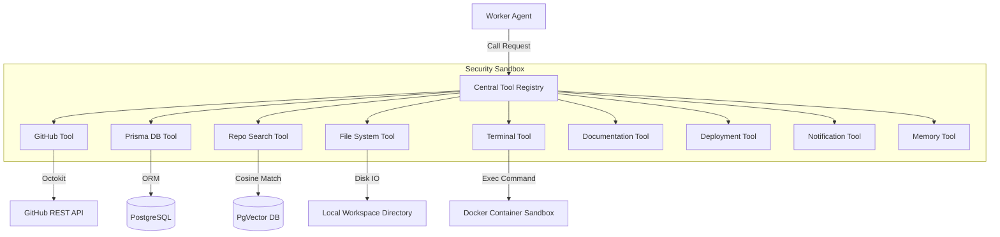

### Central Registry Invocation Protocol

Tools are defined as JSON structures matching the function calling formats of OpenAI, Anthropic, and Gemini.

```json
{
  "name": "write_file",
  "description": "Writes code changes to a local workspace file path.",
  "parameters": {
    "type": "object",
    "properties": {
      "filePath": { "type": "string", "description": "Absolute workspace path" },
      "content": { "type": "string", "description": "Full file content replacement" }
    },
    "required": ["filePath", "content"]
  }
}
```

* **Execution Routing:** The registry intercepts agent tool calls, validates input parameters, confirms workspace permissions, and routes execution to the target tool wrapper, returning outcomes to the requesting agent.

---

## 4 AI Memory Architecture

To track conversational and codebase context across agent runs, ShipFlow AI deploys a tiered memory hierarchy.

### Memory Layout Topology

```mermaid
graph TD
    Agent[AI Agent] --> MemoryRouter{Memory Router}
    
    subgraph Memory_Tiers [AI Memory Hierarchy]
        MemoryRouter -->|Task Step Logs| Working[Working Memory]
        MemoryRouter -->|Chat Threads| Conversation[Conversation Memory]
        MemoryRouter -->|Workspace Rules| Workspace[Workspace Memory]
        MemoryRouter -->|AST Embeddings| Repository[Repository Memory]
    end
    
    subgraph Persistence [Storage Providers]
        Working -->|Fast Cache| Redis[(Redis)]
        Conversation -->|Relational| Postgres[(PostgreSQL)]
        Workspace -->|Settings| Postgres
        Repository -->|Vector Index| PgVector[(PgVector DB)]
    end
```

### Retrieval & Storage Strategy

* **Working Memory:** Stores variables, task planning files lists, and active agent execution logs. Persisted in **Redis** (caches expire after task completion).
* **Conversation Memory:** Stores chat logs between PMs and Clarification Agents. Saved in **PostgreSQL** (loaded as historical messages).
* **Workspace Memory:** Configures prompt parameters, ESLint rules, and database schema context. Loaded from **PostgreSQL** on agent initialization.
* **Repository Memory:** Indexes directory layouts, function headers, and code definitions. Backed by **PgVector** for semantic code search.

---

## 5 Repository RAG Pipeline

To search codebase definitions without sending entire repositories to LLM contexts, ShipFlow uses a Repository Retrieval-Augmented Generation (RAG) pipeline.

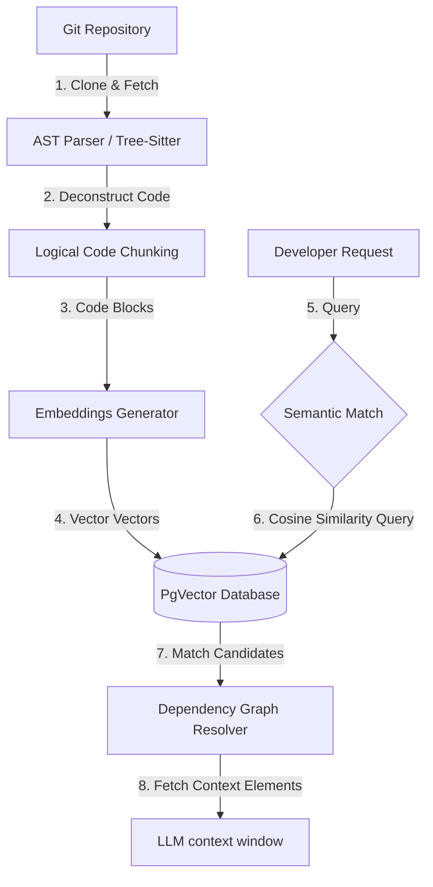

### Core Pipeline Phases

1. **AST Parsing:** Tree-Sitter parses source code files, indexing functions, variables, imports, and exports.
2. **Logical Code Chunking:** Code files are split into logical chunks based on class definitions, functions, and interfaces.
3. **Embeddings Generation:** Code blocks are converted to vector coordinates using embedding models (e.g. `text-embedding-3-small`).
4. **Vector Database indexing:** Vectors and coordinates are stored in PostgreSQL using PgVector extensions.
5. **Retriever Match:** Queries are compared to database vector vectors using cosine-distance checks.
6. **Dependency Resolver:** Retrieves adjacent import chains for matched code chunks, ensuring the LLM has complete context.

---

## 6 Repository Intelligence & AST Parsing

To support code edits, the Repository Analysis Agent constructs abstract syntax trees (AST) and dependency maps for linked projects.

* **Cloning & Sandboxing:** Clones the git repository to isolated workspace directories.
* **AST Extraction:** Deconstructs source files into classes, parameters, and return types using Tree-Sitter.
* **Import Graphing:** Maps import statements to build a dependency graph of the codebase.
* **File Ranking:** A PageRank-like algorithm identifies core framework components, database clients, and configuration files, assigning higher importance weights to these files.
* **Context Assembly:** Selects relevant codebase contexts by blending semantic search results with dependency graphs and database schemas.

---

## 7 Prompt Pipeline & Context Assembly

To prevent context window bloat and optimize reasoning, the prompt builder parses inputs into a structured system template.

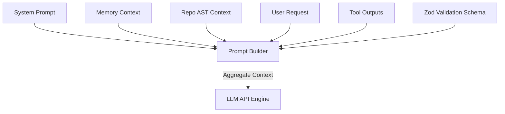

* **System Prompt:** Sets role constraints, coding standards, and Zod output schemas.
* **Memory Context:** Pulls relevant task progress logs from Redis and PostgreSQL.
* **Repository Context:** Resolves dependency paths, import structures, and relevant database schemas.
* **User Input:** Raw feature request parameters and developer replies.
* **Tool Outputs:** Execution logs, sandbox test results, and file status parameters.

---

## 8 Intelligent Model Routing

To manage costs and token constraints, ShipFlow AI deploys a Model Router that assigns LLM calls to models based on task requirements.

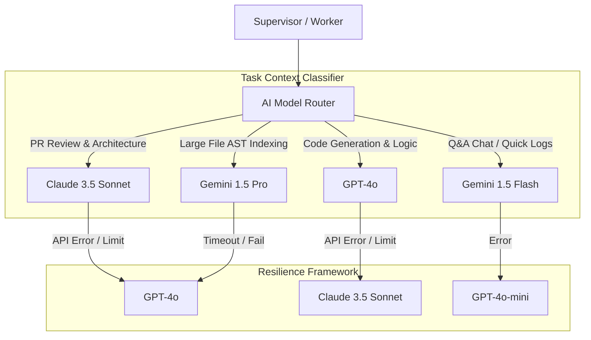

### Model Capabilities & Routing Matrix

| Target Task | Primary Model | Fallback Model | Selection Rationale |
| :--- | :--- | :--- | :--- |
| **PR Review / Design** | Claude 3.5 Sonnet | GPT-4o | Highest reasoning capabilities and alignment with coding style guidelines. |
| **Code Generation** | GPT-4o | Claude 3.5 Sonnet | Fast response speeds and robust execution logs parsing. |
| **AST Indexing** | Gemini 1.5 Pro | GPT-4o | Massive context window (up to 2M tokens) for reading large code repositories. |
| **Clarification Q&A** | Gemini 1.5 Flash | GPT-4o-mini | Lower token costs and fast execution speeds for simple tasks. |

---

## 9 Agent Communication & Inngest Sequence

Agents coordinate tasks asynchronously using Inngest event messaging, passing contexts via unified event payloads.

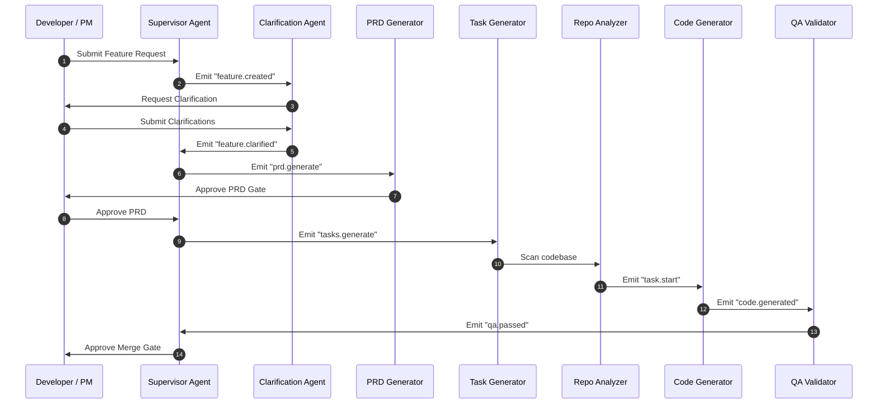

---

## 10 Execution Lifecycle & Safety Gates

Features navigate a strict execution lifecycle governed by the Supervisor, requiring human sign-offs at critical checkpoints before promoting changes to production.

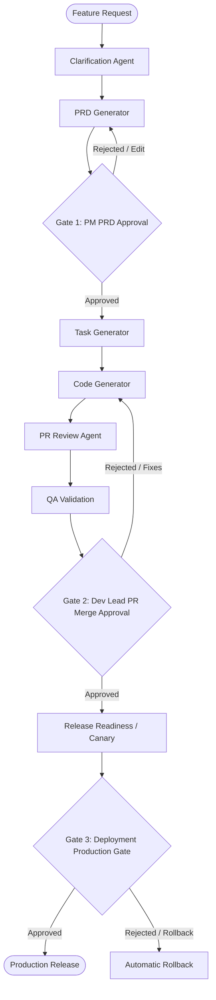

* **Gate 1: Requirements Check:** PM approval of the generated PRD is required before creating tasks or editing code.
* **Gate 2: Merge Verification:** A lead engineer reviews AI code edits and test results before merging changes to `main`.
* **Gate 3: Deployment Checkpoint:** Verification of canary performance metrics is required before routing 100% of production traffic to the new build.

---

## 11 Failure Recovery & Self-Healing Loops

To prevent pipeline crashes, ShipFlow AI integrates automated self-healing loops.

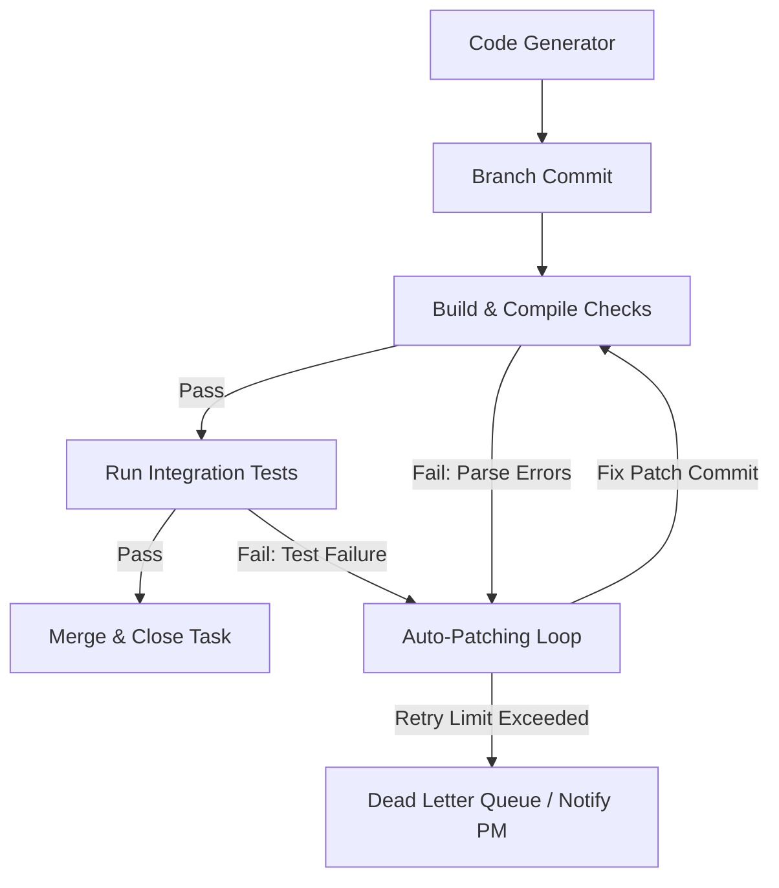

### Self-Healing Specifications

* **Retry Budget Policies:** Code editing loops are capped at a maximum of 4 self-healing retries before alerting developer channels.
* **Exponential Backoff:** Third-party API calls implement exponential backoff multipliers (`minDelay = 1000ms`, `maxDelay = 16000ms`, `multiplier = 2`).
* **Dead Letter Queue (DLQ):** Task runs that fail repeatedly are pushed to a DLQ, halting the pipeline and alerting developers.
* **Timeout Recovery:** The Supervisor cancels worker processes if execution times exceed threshold configurations, restoring files from git caches.

---

## 12 AI Cost Optimization Strategy

To control operational costs under production scale workloads, ShipFlow AI implements several cost optimization strategies.

* **Prompt Caching:** Enables cache tokens triggers on supported LLM APIs (e.g. Anthropic prompt caching), saving up to 90% of token evaluation overhead on repeated codebase context blocks.
* **Context Compression:** Filters out non-essential boilerplate files and code comments using dynamic AST token reduction engines before sending code files context to the model.
* **Token Budget limits:** Enforces maximum tokens budgets for each task execution loop. Aborts execution if costs exceed preset developer thresholds.
* **Model Downgrading:** Switches to smaller, cheaper LLMs (Gemini Flash, GPT-4o-mini) for simple validation pings.
* **Retry Budget Caps:** Limits the maximum number of error remediation attempts inside code editing loops.

---

## 13 Observability & Telemetry Framework

ShipFlow AI uses OpenTelemetry trace definitions and custom dashboards to track agent performance, costs, and latencies.

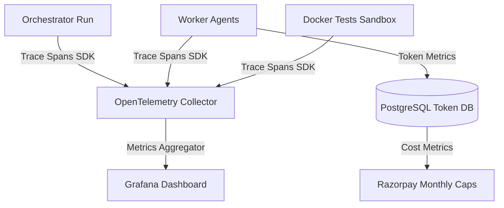

### Telemetry Trackers

* **Execution Spans:** OpenTelemetry metrics track calls across database clients, Next.js routers, Inngest triggers, and external LLM APIs.
* **Timeline Dashboard:** Live agent execution logs are streamed to client dashboards using Server-Sent Events (SSE).
* **Token & Cost Metrics:** Relational indexes track token consumption per agent run, updating workspace credit balances.
* **Latency Telemetry:** Tracks processing times for each agent step to identify bottlenecks in the pipeline.

---

## 14 Mermaid System Diagrams Catalog

All architectural representations, including the **Supervisor Orchestrator**, **Tool Registry**, **Memory Tiers**, **RAG Pipeline**, **AST Parsing**, **Model Routing**, **Inngest Sequence**, **Lifecycle Gates**, **Self-Healing Loops**, and **Observability Metrics**, are defined inside the respective sections above.
