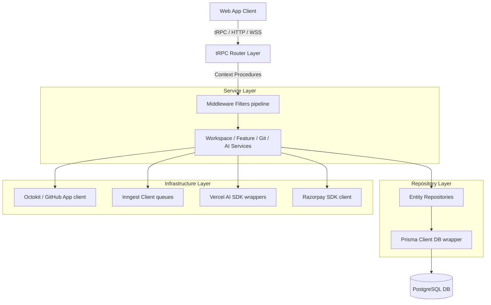
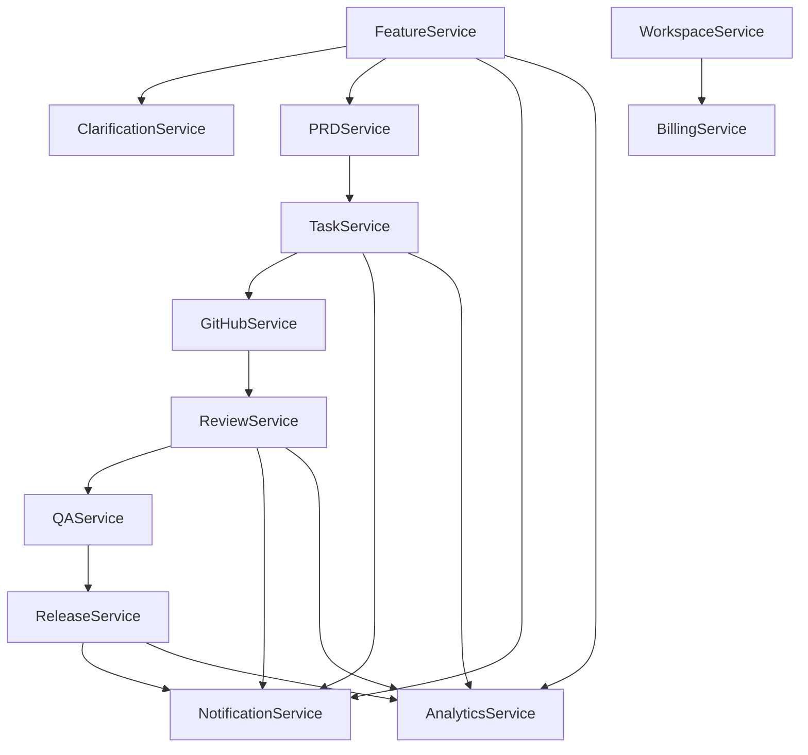
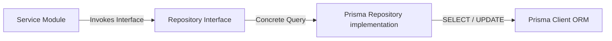
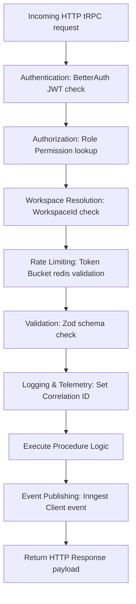
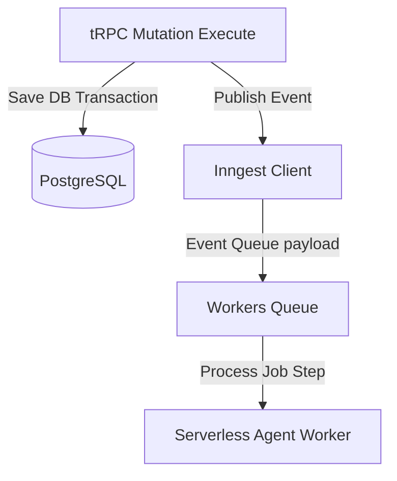
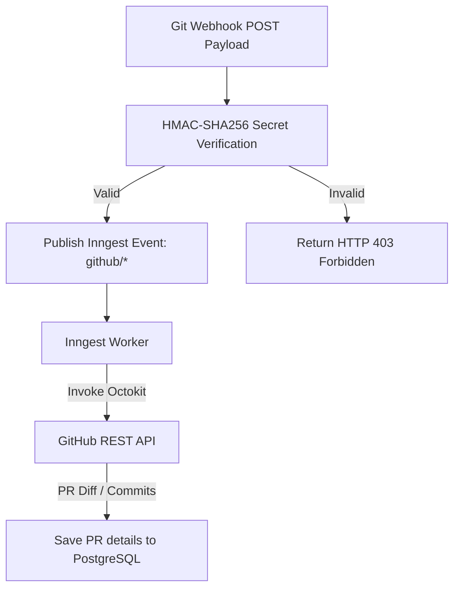
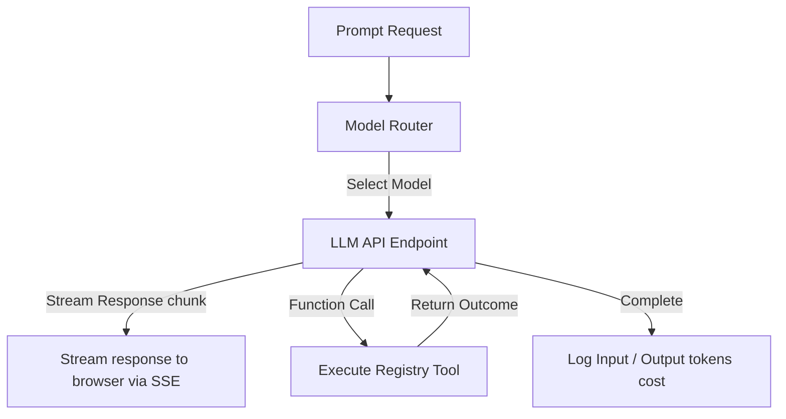
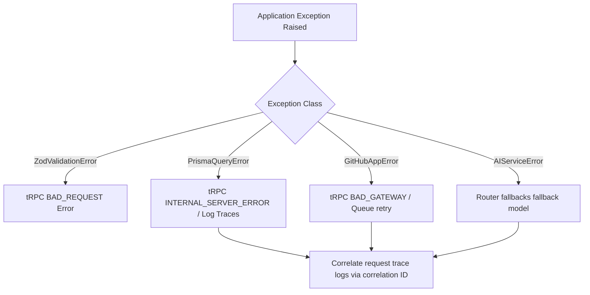

# ShipFlow AI — API & Backend Service Architecture

**Document Version:** 1.0.0  
**Author:** Principal Backend Architect & Distributed Systems Engineer  
**Status:** Approved for Implementation  
**Dependency Baselines:** `architecture.md`, `database-architecture.md`, `ai-agent-architecture.md`, `frontend-architecture.md`  

---

## Table of Contents
1. [Backend Architecture](#1-backend-architecture)
2. [Folder Structure](#2-folder-structure)
3. [tRPC Router Tree](#3-trpc-router-tree)
4. [Router Procedure Contracts](#4-router-procedure-contracts)
5. [Service Layer](#5-service-layer)
6. [Repository Layer](#6-repository-layer)
7. [Validation Layer](#7-validation-layer)
8. [Middleware Pipeline](#8-middleware-pipeline)
9. [Event Integration](#9-event-integration)
10. [GitHub Service Integration](#10-github-service-integration)
11. [AI Service Integration](#11-ai-service-integration)
12. [Security Architecture](#12-security-architecture)
13. [Error Handling Strategy](#13-error-handling-strategy)
14. [Observability & Diagnostics](#14-observability--diagnostics)
15. [Mermaid System Diagrams Catalog](#15-mermaid-system-diagrams-catalog)

---

## 1 Backend Architecture

ShipFlow AI employs a **Layered Architecture** to segregate concerns across the monorepo, keeping database engines and external GitHub or AI APIs decoupled from procedure handlers.

### Backend Layer Topology



### Layer Responsibilities

* **tRPC Layer:** Implements API gateways. Handles parameter schemas compilation, routes authorization, and exposes public/protected procedures.
* **Middleware Layer:** Intercepts incoming requests, processes BetterAuth cookies, sets workspace identifiers, applies rate limit rules, and publishes telemetry traces.
* **Service Layer:** Houses the business logic (e.g. running task distributions, triggering reviews, auditing release notes).
* **Repository Layer:** Isolates Prisma configurations, exposing entity interfaces and preventing database schema models from leaking to services.
* **Event Layer (Inngest):** Handles background jobs, asynchronous worker steps, and retries.
* **AI Layer:** Packages LLM prompt templates, schemas validations, and model router operations.
* **Infrastructure Layer:** Handles integrations with PostgreSQL, Redis, Vercel APIs, Octokit clients, and Razorpay endpoints.

---

## 2 Folder Structure

The monorepo organizes backend operations into decoupled sub-packages:

```
shipflow-ai/packages/
├── api/                  # tRPC router endpoints, procedure wrappers, and contexts
├── db/                   # Prisma schema models, clients, and database migrations
├── ai/                   # Prompt structures, Zod output schemas, and model routers
├── github/               # Octokit integrations, webhook checkers, and git operations
├── events/               # Inngest workflow definitions and queues configurations
├── services/             # Core business logic services (WorkspaceService, PRDService, etc.)
├── repositories/         # Prisma query abstraction repositories
├── validators/           # Shared Zod validation schemas
├── lib/                  # Shared library configuration utilities (Redis, Resend, etc.)
├── types/                # Central TypeScript definitions and types
├── utils/                # Date calculators, string parsers, and hash helpers
└── logger/               # Winston tracing configurations
```

---

## 3 tRPC Router Tree

tRPC procedures are organized into a tree matching application workspaces, projects, billing, and administrative paths.

```mermaid
graph TD
    RootRouter[Root tRPC Router] --> AuthRouter[auth]
    RootRouter --> WorkspaceRouter[workspace]
    RootRouter --> MemberRouter[member]
    RootRouter --> OrgRouter[organization]
    RootRouter --> ProjectRouter[project]
    RootRouter --> RepoRouter[repository]
    RootRouter --> FeatureRouter[feature]
    RootRouter --> ClarifyRouter[clarification]
    RootRouter --> PRDRouter[prd]
    RootRouter --> TaskRouter[task]
    RootRouter --> ReviewRouter[review]
    RootRouter --> QARouter[qa]
    RootRouter --> ReleaseRouter[release]
    RootRouter --> DeployRouter[deployment]
    RootRouter --> NotifRouter[notification]
    RootRouter --> AnalyticsRouter[analytics]
    RootRouter --> BillingRouter[billing]
    RootRouter --> DashRouter[dashboard]
    RootRouter --> AIRouter[ai]
    RootRouter --> GithubRouter[github]
    RootRouter --> SettingsRouter[settings]
    RootRouter --> AdminRouter[admin]
    RootRouter --> HealthRouter[health]
```



---

## 4 Router Procedure Contracts

### 1. auth Router
Exposes session controls and profiles.
* **`getSession`** (Query):
  * Input: `void`
  * Output: `{ session: Session, user: User }`
  * Authorization: Public.
  * Side Effects: Verifies BetterAuth cookie state.
* **`updateProfile`** (Mutation):
  * Input: `z.object({ name: z.string().min(1), avatarUrl: z.string().url().optional() })`
  * Output: `User`
  * Authorization: Protected (Session required).
  * Side Effects: Updates the User record. Fires audit log.

### 2. workspace Router
Manages multi-tenant workspaces.
* **`create`** (Mutation):
  * Input: `z.object({ name: z.string().min(1), organizationId: z.string().uuid() })`
  * Output: `Workspace`
  * Authorization: Protected (Admin+).
  * Side Effects: Creates a Workspace and default Credit balance.
* **`list`** (Query):
  * Input: `z.object({ organizationId: z.string().uuid() })`
  * Output: `Workspace[]`
  * Authorization: Protected (Session required).

### 3. member Router
Manages workspace team memberships.
* **`invite`** (Mutation):
  * Input: `z.object({ workspaceId: z.string().uuid(), email: z.string().email(), role: z.nativeEnum(UserRole) })`
  * Output: `Member`
  * Authorization: Workspace Admin+.
  * Side Effects: Dispatches invitation email. Fires audit log.

### 4. organization Router
* **`create`** (Mutation):
  * Input: `z.object({ name: z.string().min(1) })`
  * Output: `Organization`
  * Authorization: Protected.
  * Side Effects: Creates an Organization and free Subscription.

### 5. project Router
Manages projects.
* **`create`** (Mutation):
  * Input: `z.object({ workspaceId: z.string().uuid(), name: z.string().min(1) })`
  * Output: `Project`
  * Authorization: Workspace Admin+.

### 6. repository Router
Manages Git configuration.
* **`link`** (Mutation):
  * Input: `z.object({ projectId: z.string().uuid(), externalId: z.string(), name: z.string(), owner: z.string() })`
  * Output: `Repository`
  * Authorization: Workspace Admin+.
  * Side Effects: Registers webhook secrets with GitHub.

### 7. feature Router
Manages user feature requests.
* **`create`** (Mutation):
  * Input: `z.object({ workspaceId: z.string().uuid(), projectId: z.string().uuid(), title: z.string(), description: z.string() })`
  * Output: `Feature`
  * Authorization: Workspace Developer+.
  * Side Effects: Emits Inngest event `shipflow/feature.created` to launch the Clarification Agent.

### 8. clarification Router
Manages clarification loops.
* **`submitAnswers`** (Mutation):
  * Input: `z.object({ featureId: z.string().uuid(), answers: z.array(z.object({ questionId: z.string().uuid(), answerText: z.string() })) })`
  * Output: `Success`
  * Authorization: Workspace Developer+.
  * Side Effects: Emits `shipflow/feature.clarified` to trigger the PRD Generator Agent.

### 9. prd Router
Manages requirements documents.
* **`approve`** (Mutation):
  * Input: `z.object({ prdId: z.string().uuid() })`
  * Output: `PRD`
  * Authorization: Workspace PM+.
  * Side Effects: Emits `shipflow/prd.approved` to launch the Task Generator Agent.

### 10. task Router
Manages Kanban tasks.
* **`updateStatus`** (Mutation):
  * Input: `z.object({ taskId: z.string().uuid(), status: z.nativeEnum(TaskStatus) })`
  * Output: `Task`
  * Authorization: Workspace Developer+.

### 11. review Router
Manages reviews.
* **`retriggerReview`** (Mutation):
  * Input: `z.object({ prId: z.string().uuid() })`
  * Output: `Success`
  * Authorization: Workspace Developer+.
  * Side Effects: Retriggers Inngest review workers.

### 12. qa Router
* **`runSandboxTests`** (Mutation):
  * Input: `z.object({ prId: z.string().uuid() })`
  * Output: `Success`
  * Authorization: Workspace Developer+.

### 13. release Router
Manages releases.
* **`publish`** (Mutation):
  * Input: `z.object({ releaseId: z.string().uuid() })`
  * Output: `Release`
  * Authorization: Workspace PM+.
  * Side Effects: Merges PR, updates tags, and dispatches release notes.

### 14. deployment Router
* **`triggerCanaryRollback`** (Mutation):
  * Input: `z.object({ deploymentId: z.string().uuid() })`
  * Output: `Success`
  * Authorization: Workspace Admin+.
  * Side Effects: Reverts Vercel alias bindings.

### 15. notification Router
* **`markAsRead`** (Mutation):
  * Input: `z.object({ notificationIds: z.array(z.string().uuid()) })`
  * Output: `Success`
  * Authorization: Workspace Member.

### 16. analytics Router
* **`getDoraMetrics`** (Query):
  * Input: `z.object({ projectId: z.string().uuid() })`
  * Output: `DoraMetrics`
  * Authorization: Workspace Member.

### 17. billing Router
* **`createCheckoutSession`** (Mutation):
  * Input: `z.object({ workspaceId: z.string().uuid(), plan: z.nativeEnum(BillingPlan) })`
  * Output: `CheckoutSession`
  * Authorization: Workspace Admin.

### 18. dashboard Router
* **`getSummaryStats`** (Query):
  * Input: `z.object({ workspaceId: z.string().uuid() })`
  * Output: `DashboardStats`
  * Authorization: Workspace Member.

### 19. ai Router
* **`getRunStatus`** (Query):
  * Input: `z.object({ runId: z.string().uuid() })`
  * Output: `AgentRun`
  * Authorization: Workspace Member.

### 20. github Router
* **`syncInstallations`** (Mutation):
  * Input: `void`
  * Output: `Installation[]`
  * Authorization: Protected.

### 21. settings Router
* **`updateWorkspaceConfig`** (Mutation):
  * Input: `z.object({ workspaceId: z.string().uuid(), tokenCap: z.number().int() })`
  * Output: `Workspace`
  * Authorization: Workspace Admin+.

### 22. admin Router
* **`suspendWorkspace`** (Mutation):
  * Input: `z.object({ workspaceId: z.string().uuid() })`
  * Output: `Workspace`
  * Authorization: System Administrator.

### 23. health Router
* **`ping`** (Query):
  * Input: `void`
  * Output: `{ status: string, time: Date }`
  * Authorization: Public.

---

## 5 Service Layer

The **Service Layer** encapsulates business logic, executing integrations, and emitting Inngest event payloads.

### Service Dependencies



### Core Services Specifications

* **WorkspaceService:** Coordinates workspace creation, organization structure mappings, member invitations, and role validations.
* **ProjectService:** Manages projects, links GitHub App repositories, and registers webhooks.
* **FeatureService:** Manages feature request state transitions (`DRAFT` to `SHIPPED`).
* **ClarificationService:** Coordinates requirements clarification Q&As.
* **PRDService:** Tracks PRD revisions and compile states.
* **TaskService:** Manages Kanban tasks configurations and dependencies.
* **GitHubService:** Octokit client wrapper managing git branching, file commits, PR creations, and reviews.
* **ReviewService:** Validates code changes against PRD guidelines, publishing review comments.
* **QAService:** Executes sandboxed builds and unit tests command sets.
* **ReleaseService:** Updates changelogs, publishes version tags, and triggers deployments.
* **BillingService:** Coordinates Razorpay payments checkout sessions, plans limit validations, and credits tracking.
* **NotificationService:** Routes messages to email (Resend), Slack, or Discord webhooks.
* **AnalyticsService:** Gathers usage telemetry (LLM tokens consumed, cycle times).
* **AIService:** Wraps Vercel AI SDK, model routes, fallbacks, and PgVector search runs.

---

## 6 Repository Layer

The **Repository Layer** isolates the Prisma ORM from business services, ensuring database queries are partitioned by workspace.



### Repository Interfaces Definition (Sample Interface Contracts)

```typescript
// packages/repositories/src/feature.repository.ts
export interface IFeatureRepository {
  findById(id: string, workspaceId: string): Promise<Feature | null>;
  listByProject(projectId: string, workspaceId: string): Promise<Feature[]>;
  create(data: Prisma.FeatureCreateInput): Promise<Feature>;
  updateStatus(id: string, status: FeatureStatus, workspaceId: string): Promise<Feature>;
  softDelete(id: string, workspaceId: string): Promise<Feature>;
}
```

---

## 7 Validation Layer

System endpoints enforce strict request parameters and response payload checks using Zod.

```typescript
// packages/validators/src/feature.ts
import { z } from "zod";

export const createFeatureRequestSchema = z.object({
  workspaceId: z.string().uuid({ message: "Invalid workspace UUID configuration" }),
  projectId: z.string().uuid(),
  title: z.string().min(5).max(120),
  description: z.string().min(20),
});

export const updateTaskStatusSchema = z.object({
  taskId: z.string().uuid(),
  status: z.enum(["TODO", "IN_PROGRESS", "DONE"]),
});
```

* **Zod Schemas Compilation:** All schemas compile at build time, rejecting invalid API payloads before processing.
* **tRPC Error Formatting:** Translates validation errors into clean payloads containing diagnostic codes.

---

## 8 Middleware Pipeline

Every tRPC request traverses a strict middleware pipeline.

### Middleware Pipeline Execution Topology



---

## 9 Event Integration

Mutations emit Inngest event payloads to trigger background workers.



### Event Queue Mappings

* **`shipflow/feature.created`**
  * Producer: `feature.create` mutation.
  * Consumer: `Requirement Clarification Agent`.
  * Payload: `{ featureId: string, workspaceId: string }`
  * Retry Policy: 3 retries, exponential backoff.
* **`shipflow/feature.clarified`**
  * Producer: `clarification.submitAnswers` mutation.
  * Consumer: `PRD Generator Agent`.
  * Payload: `{ featureId: string, workspaceId: string }`
  * Retry: 5 retries.
* **`shipflow/prd.approved`**
  * Producer: `prd.approve` mutation.
  * Consumer: `Task Generator Agent`.
  * Payload: `{ prdId: string, workspaceId: string }`
  * Retry: 3 retries.
* **`shipflow/tasks.generated`**
  * Producer: `Task Generator Agent`.
  * Consumer: `Repository Analysis Agent`.
  * Payload: `{ projectId: string, tasksIds: string[] }`
  * Retry: 5 retries.

---

## 10 GitHub Service Integration

The `GitHubService` interacts with repositories, branches, pull requests, and webhooks using the Octokit client.



* **Repository Syncing:** Validates installations and saves repository configurations.
* **Git Branching & Commits:** Creates feature branches (`shipflow/feat-*`), modifies files, and commits updates.
* **Pull Request Management:** Opens pull requests and posts inline review comments.
* **Secure Webhook Verification:** Verifies webhook payloads using HMAC-SHA256 signature hashes before parsing inputs.

---

## 11 AI Service Integration

The `AIService` wraps the Vercel AI SDK to manage prompts, model routing, and token metrics.



* **Dynamic Model Routing:** Selects the most cost-effective model based on task complexity (e.g. Claude 3.5 Sonnet for code logic, Gemini Flash for chat).
* **Tool Calling Interface:** Intercepts agent tool requests, executing validated operations through the registry.
* **Token Cost Tracking:** Logs input/output token counts to postgres tables to adjust workspace credit balances.

---

## 12 Security Architecture

* **RBAC & Authorization:** Middeleware verifies session roles (Owner, Admin, PM, Dev) before executing operations.
* **Workspace Isolation:** Enforces PostgreSQL Row-Level Security (RLS) and Prisma query filter wrappers.
* **OAuth Token Security:** Enforces AES-256-GCM encryption for credentials stored in PostgreSQL.
* **Webhook Replay Protections:** Validates webhook signature timestamps, ignoring duplicates.

---

## 13 Error Handling Strategy

Backend services employ standardized exception classes to wrap errors and manage compensations.



* **tRPC Error Handling:** Maps errors to tRPC codes (`BAD_REQUEST`, `UNAUTHORIZED`, `INTERNAL_SERVER_ERROR`).
* **Database Rollbacks:** Executes updates within Prisma transactions (`$transaction`), rolling back changes if queries fail.
* **Octokit & API Retries:** Caches git requests to prevent timeouts, using retry budgets to alert developers on failure.

---

## 14 Observability & Diagnostics

To support system diagnostics under production scale workloads, ShipFlow routes observability metrics through distinct collectors.

* **Correlation IDs:** Every request is tagged with a unique correlation ID (`x-correlation-id`) that propagates across Next.js routers, Inngest queues, and agent workflows.
* **OpenTelemetry Instrumentation:** Logs trace spans for external API calls, DB reads, and LLM requests.
* **Sentry Errors Capture:** Automatically catches runtime crashes and unhandled exceptions.
* **Live SSE Agent Logs:** Streams execution status updates directly to client UI timeline panels.

---

## 15 Mermaid System Diagrams Catalog

All backend system layouts, router hierarchies, service dependencies, repositories, middleware pipelines, request cycles, event queues, GitHub integrations, model routers, and error flows are defined inside the respective sections above.
