# ShipFlow AI — Production Architecture Design

**Document Version:** 1.2.0  
**Author:** Principal Software Architect & Staff Engineer  
**Status:** Approved for Design Phase  
**Target Stack:** Next.js 14, TypeScript, tRPC, PostgreSQL, Prisma, BetterAuth, Shadcn UI, Vercel AI SDK, Inngest, Octokit, Razorpay, Vercel  

---

## Table of Contents
1. [Executive Overview](#1-executive-overview)
2. [System Architecture](#2-system-architecture)
3. [Database Domain Overview](#3-database-domain-overview)
4. [Folder Architecture](#4-folder-architecture)
5. [Frontend Architecture](#5-frontend-architecture)
6. [UI Component Hierarchy](#6-ui-component-hierarchy)
7. [Complete Data Flow](#7-complete-data-flow)
8. [Product State Machine](#8-product-state-machine)
9. [AI Supervisor & Agent Architecture](#9-ai-supervisor--agent-architecture)
10. [AI Agent Tooling](#10-ai-agent-tooling)
11. [AI Tool Registry](#11-ai-tool-registry)
12. [AI Memory Architecture](#12-ai-memory-architecture)
13. [Repository RAG Architecture](#13-repository-rag-architecture)
14. [AI Model Routing & Fallback Architecture](#14-ai-model-routing--fallback-architecture)
15. [Advanced Repository Analysis & AST Parsing](#15-advanced-repository-analysis--ast-parsing)
16. [Human-in-the-Loop Approval Gates](#16-human-in-the-loop-approval-gates)
17. [tRPC Router Structure](#17-trpc-router-structure)
18. [GitHub Integration Architecture](#18-github-integration-architecture)
19. [Event Driven Architecture](#19-event-driven-architecture)
20. [Inngest Event Catalog](#20-inngest-event-catalog)
21. [Role Based Access Control (RBAC)](#21-role-based-access-control-rbac)
22. [Observability Architecture](#22-observability-architecture)
23. [Analytics Architecture](#23-analytics-architecture)
24. [Notification Architecture](#24-notification-architecture)
25. [Command Palette Architecture](#25-command-palette-architecture)
26. [Design System](#26-design-system)
27. [Performance Strategy](#27-performance-strategy)
28. [Error Handling Strategy](#28-error-handling-strategy)
29. [Security Architecture](#29-security-architecture)
30. [Security Enhancements](#30-security-enhancements)
31. [AI Cost Strategy](#31-ai-cost-strategy)
32. [Development Standards](#32-development-standards)
33. [Scaling Strategy](#33-scaling-strategy)
34. [Deployment Architecture](#34-deployment-architecture)
35. [Mermaid Diagrams](#35-mermaid-diagrams)
36. [Development Roadmap](#36-development-roadmap)
37. [Future Roadmap](#37-future-roadmap)

---

## 1 Executive Overview

ShipFlow AI is a state-of-the-art, autonomous product-to-release pipeline coordinator built for modern engineering teams. The core philosophy of ShipFlow AI is to minimize human latency in the software development lifecycle by leveraging AI agents to manage everything between a high-level feature idea and its production deployment.

Instead of developers manually writing product requirements documents (PRDs), breaking them down into Jira tasks, creating git branches, writing code, reviewing PRs, executing test suites, and publishing releases, ShipFlow AI automates these processes in an interactive, loop-driven environment.

```
[Feature Request] ──> (Clarification Loop) ──> [PRD] ──> [Task Breakdown] 
                                                                 │
[Release] <── (QA & Deploy) <── [AI PR Review] <── (Code Gen) <──┘
```

### Key Capabilities
- **Requirement Co-Piloting:** Engage in interactive clarifying Q&A with product owners to ensure zero-ambiguity feature definitions.
- **Auto-Generated Blueprints:** Create high-quality Markdown PRDs and technical tasks mapped directly to codebase architectures.
- **Git-Native Actionability:** Auto-analyze repositories, modify code files, check for code quality, submit PRs, and address code reviews dynamically.
- **Safety-First Release Engine:** Compile change logs, evaluate database migration risks, verify QA states, and automate Vercel-based promotions.

---

## 2 System Architecture

ShipFlow AI is structured as a decoupled monorepo leveraging serverless computing, event queues, database-native ORM structures, and AI-orchestrated micro-services.

```
┌────────────────────────────────────────────────────────────────────────┐
│                              Web App Client                            │
│                  (Next.js 14 App Router + Shadcn UI)                   │
└──────────────────┬──────────────────────────────────┬──────────────────┘
                   │ HTTPS (tRPC queries/mutations)   │ OAuth / Session
                   ▼                                  ▼
┌──────────────────────────────────────┐    ┌────────────────────────────┐
│              tRPC API                │    │         BetterAuth         │
│          (packages/api)              │    │     (Auth & Workspace)     │
└──────────────────┬───────────────────┘    └──────────────┬─────────────┘
                   │                                       │
                   ├───────────────────┬───────────────────┘
                   ▼                   ▼
┌──────────────────────────────────────┐    ┌────────────────────────────┐
│            Prisma Client             │    │    Inngest Event Engine    │
│            (packages/db)             │    │   (Workflows & Orchestr)   │
└──────────────────┬───────────────────┘    └──────────────┬─────────────┘
                   │                                       │
                   ▼                                       ▼
┌──────────────────────────────────────┐    ┌────────────────────────────┐
│            PostgreSQL DB             │    │      Third Party APIs      │
│          (AWS RDS / Neon)            │    │   - Vercel AI SDK (LLMs)   │
└──────────────────────────────────────┘    │   - Octokit (GitHub API)   │
                                            │   - Razorpay (Payments)    │
                                            └────────────────────────────┘
```

### Component Responsibilities

#### 1. Web App (`apps/web`)
* **Role:** Unified portal for developers, product managers, and workspace administrators.
* **Responsibilities:**
  * Render the React frontend dashboard using Tailwind CSS and Shadcn UI.
  * Serve Server-Sent Events (SSE) or long-polling mechanisms to display live execution logs from background AI agents.
  * Provide Next.js API Routes (`/api/trpc/*`, `/api/inngest`, `/api/auth/*`, `/api/webhooks/*`) to route system logic.

#### 2. tRPC (`packages/api`)
* **Role:** Type-safe API Gateway.
* **Responsibilities:**
  * Expose query and mutation endpoints for workspace activities, billing actions, dashboard stats, and project details.
  * Enforce authorization schemas using middleware contexts (e.g., verifying user session, verifying workspace-level permissions).
  * Act as the compile-time validation check for data structures shared between client and server.

#### 3. Database (`packages/db`)
* **Role:** Single source of truth.
* **Responsibilities:**
  * Keep relational models for Users, Sessions, Workspaces, Projects, Features, PRDs, Tasks, AgentLogs, PullRequests, and Billings.
  * Run index optimizations to support rapid workspace-isolated queries.
  * Support schema migrations through Prisma.

#### 4. AI SDK (`packages/ai`)
* **Role:** AI model abstractions and utility wrappers.
* **Responsibilities:**
  * Route requests to OpenAI Claude, GPT-4o, or Gemini 1.5 Pro via Vercel AI SDK.
  * Package system prompts, context injection structures, and schema enforcement code (using Zod validation schemas for structured outputs).
  * Manage agent rate-limits and token counters.

#### 5. GitHub (`packages/github`)
* **Role:** Codebase and Version Control integration.
* **Responsibilities:**
  * Authenticate workspace-linked repositories via GitHub App installations.
  * Read repository files, branch topologies, commit histographies, and PR diffs.
  * Orchestrate writes: branching, modifying code, committing, opening PRs, and posting inline review comments using Octokit.

#### 6. Inngest (`apps/web` and workflow engines)
* **Role:** Durable, event-driven scheduling and execution manager.
* **Responsibilities:**
  * Coordinate multi-agent states and long-running workflows without running raw cron jobs or state-heavy VMs.
  * Enforce retry mechanisms, queue concurrency, rate limiting, and sleep-until-event triggers (e.g., pausing execution until a human clicks "Approve PRD").

#### 7. BetterAuth (Multi-Tenant Auth)
* **Role:** Identity Provider.
* **Responsibilities:**
  * Manage authentication, credentials, social provider linkages (GitHub, Google), workspace invites, and RBAC token definitions.

#### 8. Razorpay (`packages/billing`)
* **Role:** Subscription and payment manager.
* **Responsibilities:**
  * Manage pricing tiers, payment sessions, subscriptions, checkout redirection links, and verify webhook signatures.

---

## 3 Database Domain Overview

Before mapping physical relational structures, ShipFlow AI designs its logical data constraints around multi-tenant isolation, version-controlled requirement structures, and auditable task executors.

### Entity-Relationship Diagram (Logical Schema)

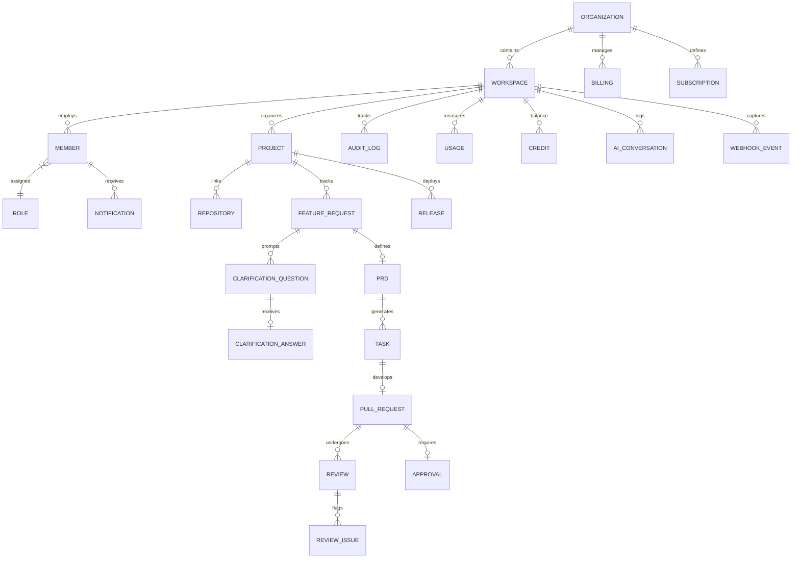

### Core Entities Description

* **Organization:** The highest billing and administrative entity representing a customer company.
* **Workspace:** Isolated environments inside an organization. Users contextually switch between workspaces, each holding its own projects and credentials.
* **Member:** Represents the user's link to a workspace, housing joined status and active roles.
* **Role:** Defines access schemas (Owner, Admin, Developer, etc.).
* **Project:** Container for features and integrations linked to single or multiple code repositories.
* **Repository:** Stores Git configuration, webhook secrets, target release branches, and integration authorization keys.
* **Feature Request:** The high-level product proposal describing a problem statement or functional demand.
* **Clarification Question:** Intermediary questions produced by the Clarification Agent to clarify features.
* **Clarification Answer:** Developer responses resolving ambiguity.
* **PRD:** Versioned requirements blueprint document written in Markdown.
* **Task:** Actionable development item specifying files to modify, code templates, and acceptance parameters.
* **Pull Request:** Reference to open GitHub pull requests with status trackers.
* **Review:** High-level record of an AI review iteration.
* **Review Issue:** Line-by-line syntax or architecture failures posted by the PR Review Agent.
* **Approval:** Audit logs capturing authorization signatures for code merge or deployment.
* **Release:** Release candidate status tracking version numbers and deployment output logs.
* **Billing:** Central entity storing payment preferences and invoice links.
* **Subscription:** Plan levels (Starter, Business, Enterprise) setting usage throttle rates.
* **Usage:** Trackers for tokens, AI prompt executions, and total deployment minutes.
* **Audit Log:** Strict, immutable log of administrative activity (role shifts, api key deletions, etc.).
* **Notification:** Delivery logs mapping triggers to in-app flags, emails, or Slack pings.
* **AI Conversation:** Text logs of multi-turn prompts used to hydrate LLM memory windows.
* **Credit:** Dollar-denominated balances matching subscription limits.
* **Webhook Event:** Incoming payloads containing signature validation checks.

---

## 4 Folder Architecture

```
shipflow-ai/
├── apps/
│   └── web/                   # Next.js 14 App Router portal & Serverless API routes
│       ├── src/
│       │   ├── app/           # App Router pages, layout, and API endpoints
│       │   ├── components/    # Page-specific components and UI containers
│       │   └── hooks/         # Custom React hooks (tRPC queries, UI status)
│       ├── package.json
│       └── next.config.js
├── packages/
│   ├── api/                   # tRPC server logic
│   │   ├── src/
│   │   │   ├── routers/       # Modular routers (workspace, prd, github, etc.)
│   │   │   ├── context.ts     # Request context configuration (session, prisma, client ip)
│   │   │   ├── trpc.ts        # Procedure creators & middleware definitions
│   │   │   └── root.ts        # Merged appRouter definition
│   │   └── package.json
│   ├── db/                    # Prisma DB client
│   │   ├── prisma/
│   │   │   └── schema.prisma  # Multi-tenant PostgreSQL Prisma Schema
│   │   ├── src/
│   │   │   └── index.ts       # Exported Prisma client instance
│   │   └── package.json
│   ├── ui/                    # Shared design system components (Shadcn UI)
│   │   ├── src/
│   │   │   ├── components/    # Reusable atomic UI (buttons, cards, dialogs)
│   │   │   ├── utils/         # cn helper function
│   │   │   └── globals.css    # Core styling & Tailwind theme variable mappings
│   │   └── package.json
│   ├── config/                # Central TypeScript and lint configurations
│   ├── github/                # Octokit wrapper for git operations & webhooks
│   │   ├── src/
│   │   │   ├── client.ts      # GitHub API client builder
│   │   │   ├── webhook.ts     # Signature validation and routing helpers
│   │   │   └── actions.ts     # PR creations, commits, and comments wrappers
│   │   └── package.json
│   ├── ai/                    # Vercel AI SDK agent engines and model routing
│   │   ├── src/
│   │   │   ├── agents/        # Agent prompt declarations & tools definitions
│   │   │   ├── models.ts      # Model fallback routing (Claude -> GPT -> Gemini)
│   │   │   └── schemas.ts     # Zod response definitions
│   │   └── package.json
│   └── billing/               # Razorpay integration and plans structure
│       ├── src/
│       │   └── client.ts      # Checkout endpoints, plans database mapping
│       └── package.json
├── package.json               # Monorepo workspaces definition
└── tsconfig.json
```

---

## 5 Frontend Architecture

ShipFlow AI employs Next.js 14 App Router architecture to deliver static page loads alongside high-velocity interactive dashboards.

### App Router Structure & Route Groups

* **Route Groups:** 
  * `(auth)`: Groups sign-in, sign-up, and recovery components. Shares an un-authenticated minimal screen wrapper.
  * `(dashboard)`: Encloses core workflows. Shares layout variables containing the workspace contexts, command-palette state registers, and webhooks listener nodes.
  * `(onboarding)`: Multi-step forms checking organizational credentials, linking initial repositories, and managing billing before releasing users to dashboards.

### Layout Hierarchy & Shared Layouts

```
Root Layout [font provider, tailwind configurations, query-client provider]
   └── (dashboard) Layout [sidebar navigation, workspace context selector, global keyboard command listener]
         └── Project Dashboard [stats panels, active task boards]
```

### Data Fetching Strategy

* **React Server Components (RSC):** Layout grids, index paths, and profile settings load via database queries straight inside RSCs using direct tRPC caller injections, removing server-to-server HTTP handshakes.
* **Client Components (RCC):** High-interaction components (e.g., collaborative PRD editor, live task cards, real-time agent output monitors) fetch data on-demand through tRPC hooks.
* **Suspense & Loading Boundaries:** Components fetch data concurrently. Skeleton elements defined in adjacent `loading.tsx` loaders prevent screen blocking, and components fetch states in isolation.
* **Error Boundaries:** Pages implement customized `error.tsx` layouts to intercept database timeouts or authorization issues without crashing sidebar controls or navigation headers.

### Authentication Flow (BetterAuth Integration)

Identity assertions run inside Next.js Edge Middleware (`middleware.ts`). Before static or dynamic payloads build on server routes, cookies are evaluated. Unauthenticated calls drop straight back to `(auth)/login` while workspace members are redirected to their active workspace ID.

---

## 6 UI Component Hierarchy

The application layout uses modular frontend component trees to manage specific workflows:

### Dashboard
* `<Sidebar>`: Main navigation items, active user info, help links.
* `<Navbar>`: Page context titles, quick links, global notification center button, user profile avatar.
* `<WorkspaceSwitcher>`: Dropdown containing all tenant workspaces, with options to create workspaces or invite members.
* `<CommandPalette>`: CMD+K modal dialog for global repository and action search.
* `<ActivityFeed>`: Real-time list of AI agent logs, PR reviews, and deployments.
* `<StatsCards>`: Grid of key metrics (Active features, pending reviews, cost, billing metrics).
* `<RecentReviews>`: Mini list of current PR reviews with status badges.
* `<Timeline>`: Chronological timeline of feature steps.

### Project Page
* `<ProjectHeader>`: Repo status, connected branches, settings.
* `<RepoConnector>`: Steps to connect a new GitHub repository.
* `<FeatureList>`: Searchable list of features, status, and assignees.

### Feature Request Page
* `<FeatureHeader>`: Description, status, target milestone.
* `<ClarificationDialog>`: Threaded Q&A widget displaying questions generated by the Requirement Agent.

### PRD Editor
* `<MarkdownPreview>`: Styled preview of the generated PRD.
* `<CollaborativeEditor>`: Workspace editor to adjust requirements.
* `<ApprovalTrigger>`: Single-click button for PMs to lock down requirements and fire task generation.

### Task Board
* `<KanbanBoard>`: Drag-and-drop tasks columns (TODO, IN_PROGRESS, READY_FOR_PR, MERGED).
* `<TaskCard>`: Impact level, affected files, estimated development tokens.

### Review Center
* `<DiffViewer>`: Syntax-highlighted git diff comparison container.
* `<ReviewCommentsList>`: Threaded list of AI and human code comments.
* `<PatchPreview>`: Code adjustments suggested by the patching agent.

### Release Center
* `<ReleaseChangelog>`: Auto-generated markdown list of PR descriptions since last release tag.
* `<DeploymentLog>`: Real-time progress bars showing Vercel production logs.

---

## 7 Complete Data Flow

```
[User Request]
      │
      ▼
┌──────────────┐      [Clarifications Complete]      ┌───────────────┐
│ Clarification│ ──────────────────────────────────> │ PRD Generator │
│    Agent     │                                     └───────┬───────┘
└────────┬─────┘                                             │
         │ (Requires Info)                                   ▼
         ▼                                           ┌───────────────┐
[User Answer Dialog]                                 │Task Generator │
                                                     └───────┬───────┘
                                                             │
                                                             ▼
┌──────────────┐      [Auto-Review Triggered]        ┌───────────────┐
│  AI Review   │ <────────────────────────────────── │Code Generation│
└────────┬─────┘                                     └───────────────┘
         │ (Has Issues)
         ▼
┌──────────────┐      [Review Passed]                ┌───────────────┐
│  AI Patching │ ──────────────────────────────────> │ QA Validation │
└──────────────┘                                     └───────┬───────┘
                                                             │
                                                             ▼
┌──────────────┐      [Production Merge]             ┌───────────────┐
│ Release Note │ <────────────────────────────────── │Lead Approval  │
│    Agent     │                                     └───────────────┘
└──────────────┘
```

1. **Feature Request Submission:**
   A Product Manager inputs a feature request (e.g., *"Add user profile photo upload using AWS S3"*) into the ShipFlow Web Dashboard.
2. **Clarification Loop:**
   The **Requirement Clarification Agent** analyzes the request. If constraints are missing (e.g., maximum photo size, allowed file extensions, crop functionality), it flags the status as `CLARIFYING` and queues specific questions. The user provides answers inside the web dialog.
3. **PRD Generation:**
   Once clarifications are completed, the **PRD Generator Agent** processes the input and generates a complete Product Requirements Document (PRD) in Markdown. It saves this inside the database and shows it to the user for approval.
4. **Task Breakdown:**
   The **Task Generator Agent** parses the PRD. By referencing codebase patterns (via the Repository Analysis Agent), it breaks down the feature into a structural checklist of coding tasks, mapping them to specific backend and frontend files.
5. **Codebase Navigation & Planning:**
   The **Repository Analysis Agent** runs to find imports, files to create, and potential code collisions. It constructs a visual execution tree.
6. **Code Writing & PR Submission:**
   An internal execution loop spawns the code edits, creates a new Git branch (`shipflow/feat-s3-upload`), updates the necessary files, and opens a Pull Request on GitHub.
7. **AI Code Review:**
   Opening the PR triggers a GitHub webhook back to ShipFlow AI, activating the **PR Review Agent**. This agent analyzes the diff line-by-line, checking code style, memory leak issues, security, and PRD alignment, posting feedback directly as inline GitHub comments.
8. **Auto-Patching Loop:**
   If issues are flagged, a background sub-agent processes the comments, develops patches, commits code adjustments to the branch, and resolves the GitHub comments.
9. **QA Validation:**
   The **QA Validation Agent** runs. It sets up serverless test execution (e.g. Vitest tests, Playwright checks) and validates API responses.
10. **Lead Agent Approval:**
    Once reviews and tests pass, a final review logic validates the codebase health and issues a GitHub Pull Request Approval.
11. **Release Automation:**
    The branch is merged to `main`. The **Release Readiness Agent** compiles the PR change logs, checks database migration success, drafts release notes, drafts a GitHub release tag, and commands Vercel to promote the deployment.

---

## 8 Product State Machine

Features navigate a strict transactional state layout, guaranteeing compliance and safety checks before merging code changes.

### State Transition Diagram (Visual Flows)

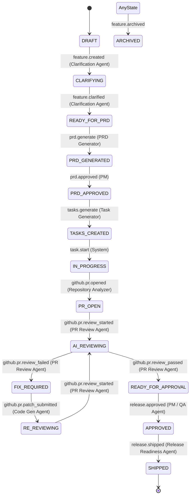

### State Transition Diagram (Text-based ASCII Flowchart)

```
[DRAFT] ─(feature.created)─> [CLARIFYING] ─(feature.clarified)─> [READY_FOR_PRD] 
                                                                        │
[TASKS_CREATED] <─(tasks.generate)─ [PRD_APPROVED] <─(Approve)─ [PRD_GENERATED] <─(generate)
       │
       └─(task.start)─> [IN_PROGRESS] ─(github.pr.opened)─> [PR_OPEN] ──> [AI_REVIEWING]
                                                                                │
   [READY_FOR_APPROVAL] <─(passed)─ [RE_REVIEWING] <─(patch)─ [FIX_REQUIRED] <──┘
           │
           └─(Approve)─> [APPROVED] ─(release.shipped)─> [SHIPPED]
```

### Transition Specifications

| Current State | Target State | Transition Action | Triggered By | Responsible Agent | Inngest Event Fired |
| :--- | :--- | :--- | :--- | :--- | :--- |
| **DRAFT** | **CLARIFYING** | Parse initial input, structure gaps | System (Autocommit) | Clarification Agent | `feature.created` |
| **CLARIFYING** | **READY_FOR_PRD** | Answer all clarifying questions | PM / Developer | Clarification Agent | `feature.clarified` |
| **READY_FOR_PRD** | **PRD_GENERATED** | Synthesize scope, generate doc | System | PRD Generator Agent | `prd.generated` |
| **PRD_GENERATED** | **PRD_APPROVED** | Review and click Approve PRD | Product Manager | None (Human Decision) | `prd.approved` |
| **PRD_APPROVED** | **TASKS_CREATED** | Codebase scans, sub-task maps | System | Task Generator Agent | `tasks.generated` |
| **TASKS_CREATED** | **IN_PROGRESS** | Trigger branch code production | Dev / System | Repository Analysis | `task.start` |
| **IN_PROGRESS** | **PR_OPEN** | Commit code updates, open PR | System (Agent) | Code Generator Agent | `github.pr.opened` |
| **PR_OPEN** | **AI_REVIEWING** | Scan code modifications diff | GitHub Webhook | PR Review Agent | `github.pr.review_started` |
| **AI_REVIEWING** | **FIX_REQUIRED** | Code guidelines/validation fail | PR Review Agent | PR Review Agent | `github.pr.review_failed` |
| **FIX_REQUIRED** | **RE_REVIEWING** | Commit code patch updates | System (Agent) | Code Generator Agent | `github.pr.patch_submitted` |
| **RE_REVIEWING** | **READY_FOR_APPROVAL**| Re-evaluate patch commits passes | PR Review Agent | PR Review Agent | `github.pr.review_passed` |
| **READY_FOR_APPROVAL**| **APPROVED** | Final release checkoff | Admin / PM | QA Validation Agent | `release.approved` |
| **APPROVED** | **SHIPPED** | Merge to main, promote Vercel | System | Release Readiness Agent | `release.shipped` |
| **Any State** | **ARCHIVED** | Cancel development or delete | Owner / Admin | None | `feature.archived` |

---

## 9 AI Supervisor & Agent Architecture

ShipFlow AI employs an **AI Supervisor (Orchestrator)** layer to coordinate execution flows across specialized worker agents. Instead of running worker agents in isolated containers, the Supervisor acts as a centralized controller to manage workflow ordering, aggregate metrics, and handle code-writing recovery steps.

### Supervisor Agent Execution Topology

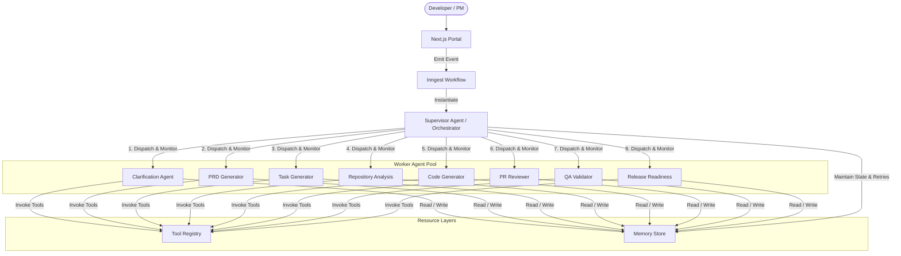

### Supervisor Core Responsibilities

1. **State Machine Enforcement:** Verifies that no worker agent execution bypasses active transactional constraints (e.g. preventing the Code Generator from modifying files until the PRD is marked approved).
2. **Dynamic Task Dispatching:** Evaluates requirements, partitions tasks into logical sub-tasks, and invokes worker agents sequentially or in parallel.
3. **Execution Context Management:** Aggregates inputs/outputs of child agents, formatting and passing contexts to downstream executors.
4. **Resiliency & Self-Healing Loops:** Intercepts worker agent syntax errors or QA compiler flags, feeding error reports back to the Code Generator for auto-patches.
5. **Durable Pause & Resume:** Integrates with Inngest's wait mechanisms during Human-in-the-Loop gates.
6. **Agent Health Monitoring:** Tracks timeouts, handles rate-limiting backoffs, and logs exceptions to centralized trace buffers.

---

## 10 AI Agent Tooling

To execute actions reliably across local code structures and cloud boundaries, each AI agent is equipped with customized tooling, error mitigations, and context parameters.

### 1. Requirement Clarification Agent
* **Purpose:** Refines user inputs into granular specifications.
* **Input:** Raw user request text, workspace project documentation files.
* **Output:** JSON list of questions and answer options (Zod schema).
* **Context:** Technology stack configuration keys, API specifications, and database schema snapshot.
* **Tools:** `read_documentation_files`, `retrieve_project_config`.
* **Failure Handling & Retries:** Falls back to simple text input fields if schema generation fails. Limits parsing loop to 3 retries.
* **Memory & LLM:** Stateless session memory. Uses **Gemini 1.5 Flash** (fast response, structured output validation).
* **Example Prompt Structure:**
  ```markdown
  System: You are an expert Product Manager.
  Context: Project uses Next.js 14, tRPC, PostgreSQL.
  User Input: "Add photo uploads"
  Instruction: Output a list of questions resolving file storage destination, sizing rules, and image types.
  ```

### 2. PRD Generator Agent
* **Purpose:** Compiles requirements documents.
* **Input:** User clarification responses, technical stack files.
* **Output:** Markdown Requirements Document (PRD).
* **Context:** Complete active database schemas and directory mapping structures.
* **Tools:** `get_database_schema`, `read_imports_tree`.
* **Failure Handling & Retries:** Re-runs with simple generic templates if layout constraints cause generation failures. Max 2 retries.
* **Memory & LLM:** High-context window memory. Uses **Claude 3.5 Sonnet** (advanced architecture designs).
* **Example Prompt Structure:**
  ```markdown
  System: You are a Principal Software Architect.
  Context: DB Schema: [User Model], Answers: [AWS S3, 5MB limit].
  Instruction: Generate a PRD covering DB adjustments, security tokens, and API endpoints.
  ```

### 3. Task Generator Agent
* **Purpose:** Translates PRDs into concrete sub-tasks.
* **Input:** Approved PRD, repository directory list.
* **Output:** JSON mapping file modifications and checklists.
* **Context:** Active code folders and database models.
* **Tools:** `list_directory_files`, `check_dependencies`.
* **Failure Handling & Retries:** Skips circular dependency chains and reports warnings in task boards. Max 3 retries.
* **Memory & LLM:** Stateless execution. Uses **GPT-4o**.
* **Example Prompt Structure:**
  ```markdown
  System: Act as a Lead Software Engineer.
  PRD: [Markdown content]
  Instruction: Split this into coding tasks listing exact files that require modifications.
  ```

### 4. Repository Analysis Agent
* **Purpose:** Explores files and verifies imports.
* **Input:** Code patterns, search directories.
* **Output:** Source code snippets, import structures.
* **Context:** Abstract Syntax Trees (AST) of key codebase directories.
* **Tools:** `grep_search`, `view_file`, `list_dir`.
* **Failure Handling & Retries:** Returns file directory layout if deep code scans time out. Max 5 retries.
* **Memory & LLM:** Local file cache memory. Uses **Gemini 1.5 Pro** (large context window for indexing codebase directories).
* **Example Prompt Structure:**
  ```markdown
  System: Act as an AST analysis tool.
  Target: Find existing database access patterns in packages/db.
  ```

### 5. PR Review Agent
* **Purpose:** Scans pull request diffs for quality gates.
* **Input:** PR diff patches, PRD scope.
* **Output:** Inline GitHub PR comment arrays (file, line, content).
* **Context:** Style guidelines and code security constraints.
* **Tools:** `read_git_diff`, `validate_es_lint`.
* **Failure Handling & Retries:** If diff payload exceeds LLM limits, splits request file-by-file. Max 2 retries.
* **Memory & LLM:** Stateless. Uses **Claude 3.5 Sonnet**.
* **Example Prompt Structure:**
  ```markdown
  System: Act as a Senior QA Reviewer.
  Diff: [PR Diff text]
  PRD: [PRD constraints]
  Instruction: Output code feedback highlighting syntax or design issues.
  ```

### 6. QA Validation Agent
* **Purpose:** Triggers unit and integration tests.
* **Input:** Branch code context, database migrations.
* **Output:** QA test execution logs, coverage stats.
* **Context:** Sandbox test settings and mockup configurations.
* **Tools:** `run_test_runner`, `check_build_status`.
* **Failure Handling & Retries:** Returns test failures straight to developer channels, halting release workflows. Max 1 retry.
* **Memory & LLM:** Test cache storage. Uses **GPT-4o-mini**.
* **Example Prompt Structure:**
  ```markdown
  System: Act as a CI pipeline runner.
  Command: `npm run test`
  Output: [Test failure logs]
  Instruction: Explain the errors and suggest fixes.
  ```

### 7. Release Readiness Agent
* **Purpose:** Prepares release documentation and deployment triggers.
* **Input:** Merged commit list, migration summaries.
* **Output:** Version tags, semantic release changelogs.
* **Context:** Historical deployment releases.
* **Tools:** `publish_git_tag`, `trigger_vercel_deployment`.
* **Failure Handling & Retries:** Rolls back target preview branch if production Vercel builds fail. Max 3 retries.
* **Memory & LLM:** Release history indices. Uses **Gemini 1.5 Flash**.
* **Example Prompt Structure:**
  ```markdown
  System: Act as a release manager.
  Commits: [Commit titles list]
  Instruction: Draft a semantic changelog categorizing changes into Features, Fixes, or Chores.
  ```

---

## 11 AI Tool Registry

Rather than allowing agents to execute arbitrary serverless code, access databases, or call API hooks directly, all operations run through an isolated, permission-gated **AI Tool Registry**.

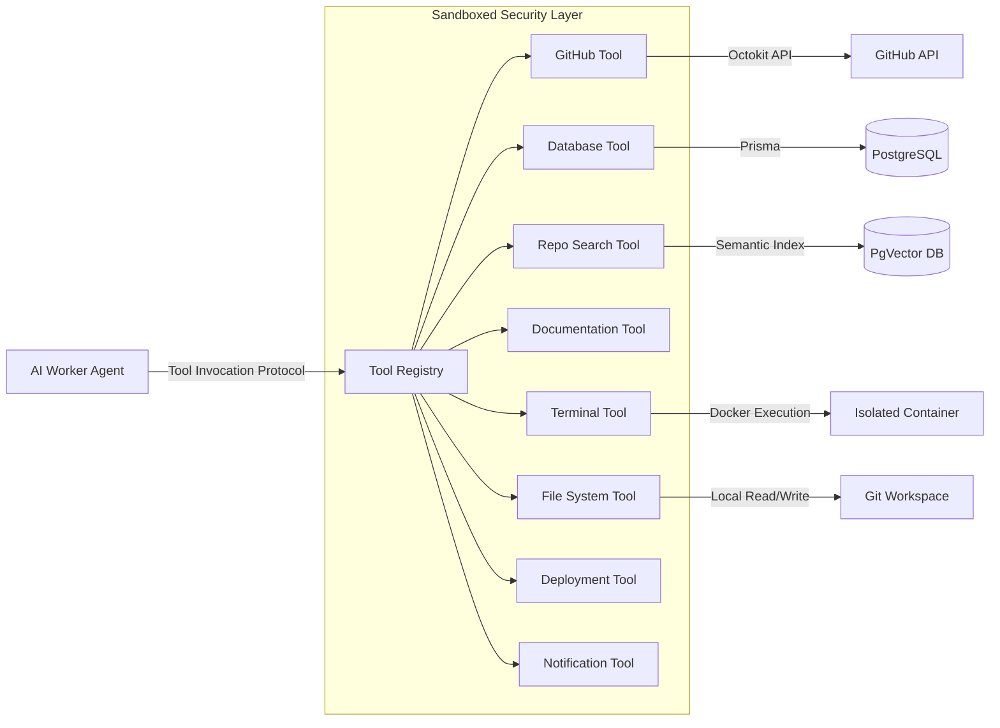

### Registered Core Tools

* **GitHub Tool:** Wraps Octokit calls. Restricts actions to the selected branch, handling branch creation, file commits, PR updates, and inline comment additions.
* **Database Tool:** Secure database access layer utilizing Prisma client context. Restricts queries via the workspace session filters.
* **Repository Search Tool:** Executes AST lookups and ripgrep searches across target project structures.
* **Documentation Tool:** Fetches external markdown documents and framework specs.
* **Terminal Tool:** Runs commands (e.g. `npm run build`, `npm test`) inside sandboxed Docker containers to isolate dependencies.
* **File System Tool:** Performs standard IO tasks (file reads, writes, relocations, deletions) within target workspace directories.
* **Deployment Tool:** Interacts with Vercel API routes to retrieve deployment statuses or promote canary slots.
* **Notification Tool:** Coordinates alerts across Slack webhook links, Resend mail templates, and client-side Server-Sent Events (SSE).

---

## 12 AI Memory Architecture

To track agent tasks, prompt contexts, and repository graphs, ShipFlow AI integrates a tiered memory layout.

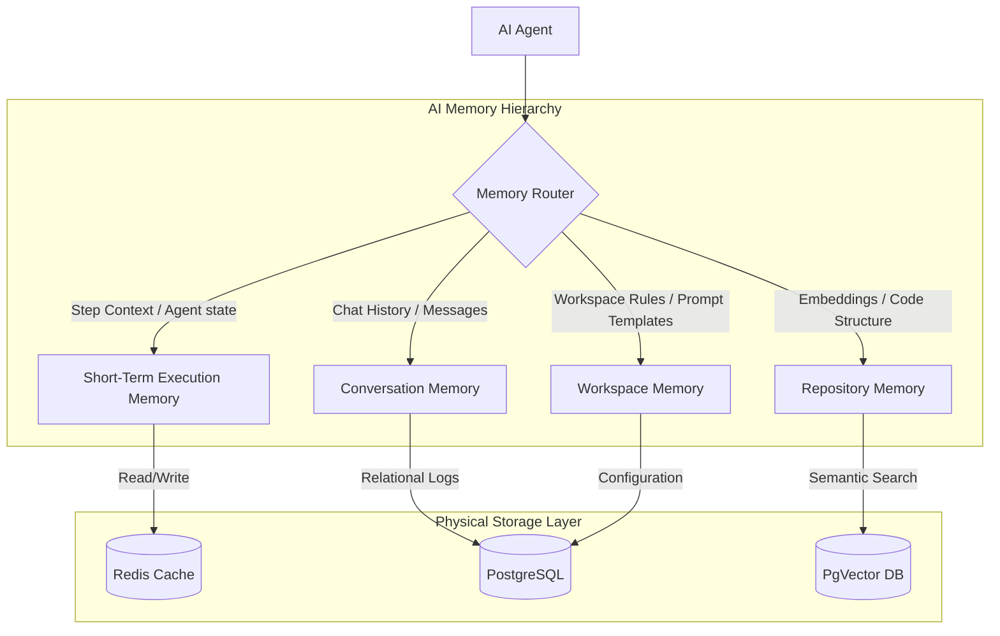

### Memory Tiers Specifications

1. **Short-Term Execution Memory:**
   * **Purpose:** Holds step context variables, token usage tracking values, and current code edit plans.
   * **Backup Store:** **Redis** (expiring caches keyed on the active Task ID).
2. **Conversation Memory:**
   * **Purpose:** Stores multi-turn chat threads between users and agents.
   * **Backup Store:** **PostgreSQL** (relational tables indexing messages chronologically).
3. **Workspace Memory:**
   * **Purpose:** Houses developer rules, workspace parameters, database access rules, and prompt preferences.
   * **Backup Store:** **PostgreSQL** (loaded as static system context tags during LLM runs).
4. **Repository Memory:**
   * **Purpose:** Stores parsed Abstract Syntax Trees (AST) code structures, import/export dependency graphs, and code block definitions.
   * **Backup Store:** **PgVector** (updated dynamically on push webhook events).

---

## 13 Repository RAG Architecture

To allow repository analysis without sending entire codebases to LLM contexts, ShipFlow AI incorporates a Retrieval-Augmented Generation (RAG) code indexing pipeline.

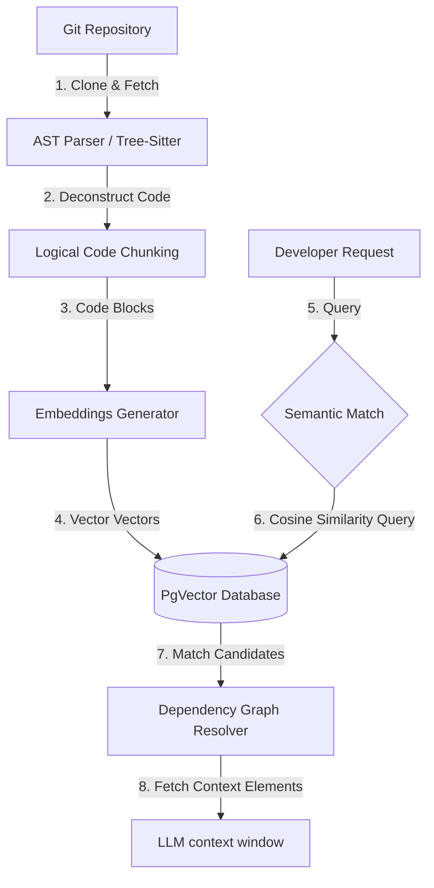

### Core Pipeline Steps

1. **Repository Indexing & Clones:** Webhook pushes clone repositories to isolated worker environments, parsing the file structures using Tree-Sitter.
2. **Code Chunking & AST Identifiers:** Code files are split into logical chunks based on class definitions, functions, and interfaces.
3. **Embeddings Generation:** Chunks are sent to embedding models (e.g. `text-embedding-3-small`) to convert code definitions into vectors.
4. **PgVector Store:** Vectors are indexed in PostgreSQL using cosine distance metrics.
5. **Semantic Retrieval:** Natural language queries (e.g. *"Where do we update database users?"*) are mapped to vectors to find the most relevant code definitions.
6. **Dependency Graph Retrieval:** The system retrieves adjacent import chains and dependencies for matched code chunks, ensuring the LLM context has all relevant definition fields.

---

## 14 AI Model Routing & Fallback Architecture

To manage costs and token constraints, ShipFlow AI deploys a Model Router that assigns LLM calls to models based on task requirements.

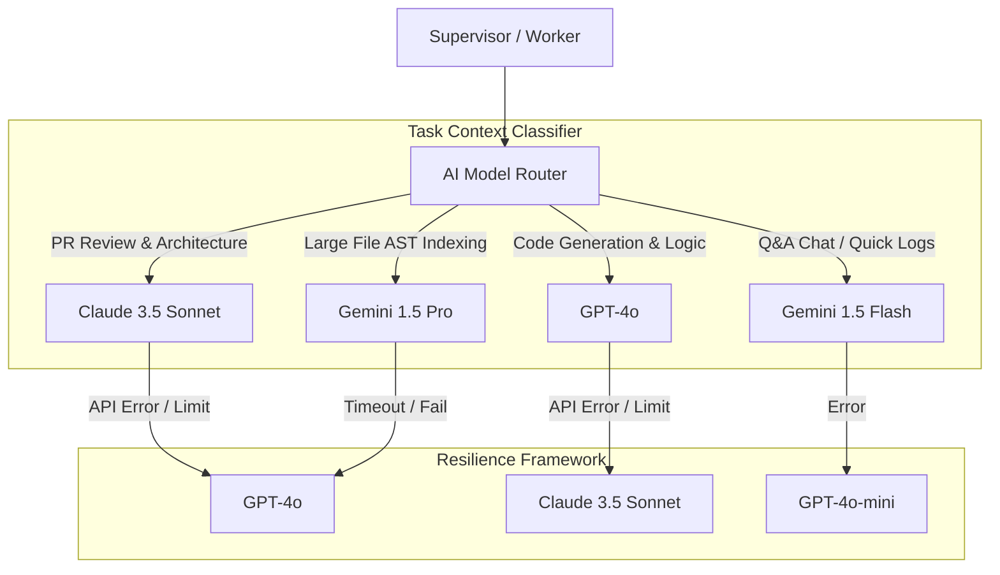

### Routing Strategy

* **Claude 3.5 Sonnet:** Architecture decisions, requirements generation, multi-file code editing, and PR reviews.
* **GPT-4o:** Complex code generation tasks, unit tests creation, and validation operations.
* **Gemini 1.5 Pro:** Repository AST indexing and context extraction tasks.
* **Gemini 1.5 Flash / GPT-4o-mini:** Interactive clarification questions and notification logs.
* **Fallback Policy:** If an API endpoint fails (rate limits, timeouts, service outages), the router switches to the fallback model to maintain execution continuity.

---

## 15 Advanced Repository Analysis & AST Parsing

To support code edits, the Repository Analysis Agent constructs abstract syntax trees (AST) and dependency maps for linked projects.

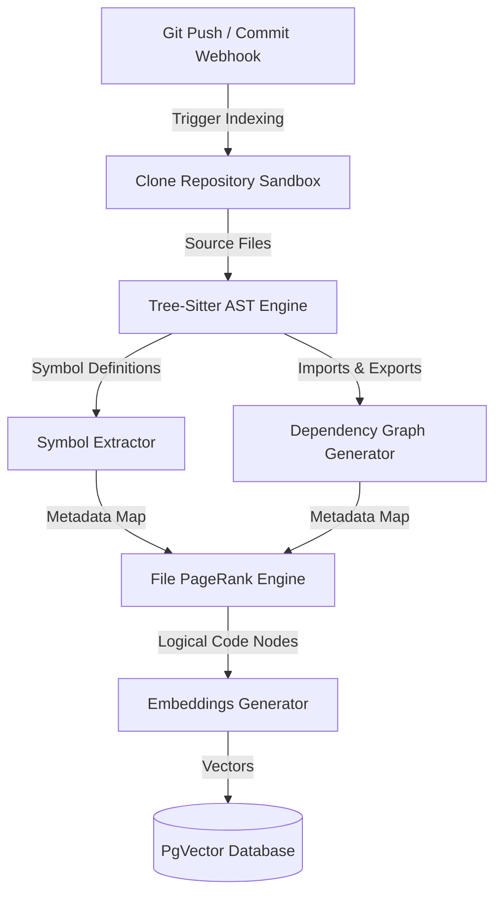

### Analysis & Parsing Pipeline

1. **AST Deconstruction:** Tree-Sitter parses project code files, extracting symbol tables (classes, methods, variables, typings).
2. **Dependency Graph Construction:** Traces import and export statements, building a dependency graph to prevent compile-time import cycles.
3. **File Ranking:** A PageRank-like algorithm identifies core framework components, route handlers, and configurations, assigning higher importance weights.
4. **Context Construction:** Packs target files, matching imports, framework requirements, and database schemas into the LLM context prompt structure.

---

## 16 Human-in-the-Loop Approval Gates

To ensure system safety and align code output with developer expectations, ShipFlow AI integrates Human-in-the-Loop (HITL) checkpoints throughout the development lifecycle.

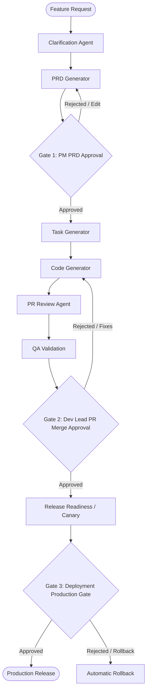

### Core Approval Gates

* **Gate 1: PRD Validation:** Requires PM authorization before generating sub-tasks or editing code.
* **Gate 2: Pull Request Merge Approval:** A senior developer reviews code diffs and test results on the PR before merging changes to `main`.
* **Gate 3: Canary Release Checkoff:** Administrator approval triggers the final promotion of canary versions to 100% production traffic.

---

## 17 tRPC Router Structure

All database interactions, billing flows, and agent triggers are exposed via a type-safe tRPC API router structure. Below is the TypeScript definition design.

```typescript
// packages/api/src/root.ts
import { router } from "./trpc";
import { authRouter } from "./routers/auth";
import { workspaceRouter } from "./routers/workspace";
import { projectRouter } from "./routers/project";
import { featureRequestRouter } from "./routers/featureRequest";
import { prdRouter } from "./routers/prd";
import { taskRouter } from "./routers/task";
import { githubRouter } from "./routers/github";
import { reviewRouter } from "./routers/review";
import { billingRouter } from "./routers/billing";
import { approvalRouter } from "./routers/approval";
import { releaseRouter } from "./routers/release";
import { dashboardRouter } from "./routers/dashboard";
import { notificationsRouter } from "./routers/notifications";
import { analyticsRouter } from "./routers/analytics";

export const appRouter = router({
  auth: authRouter,
  workspace: workspaceRouter,
  project: projectRouter,
  featureRequest: featureRequestRouter,
  prd: prdRouter,
  task: taskRouter,
  github: githubRouter,
  review: reviewRouter,
  billing: billingRouter,
  approval: approvalRouter,
  release: releaseRouter,
  dashboard: dashboardRouter,
  notifications: notificationsRouter,
  analytics: analyticsRouter,
});

export type AppRouter = typeof appRouter;
```

### Router Interfaces Design (Procedure Specifications)

```typescript
// Example structures of routers inside packages/api/src/routers/

// authRouter
auth: {
  getSession: publicProcedure.query(async ({ ctx }) => Session),
  updateProfile: protectedProcedure.input(z.object({ name: z.string().min(1) })).mutation(async ({ input, ctx }) => User)
}

// workspaceRouter
workspace: {
  create: protectedProcedure.input(z.object({ name: z.string() })).mutation(Workspace),
  list: protectedProcedure.query(Workspace[]),
  inviteMember: workspaceAdminProcedure.input(z.object({ email: z.string().email(), role: z.enum(["ADMIN", "DEVELOPER"]) })).mutation(Invite),
  removeMember: workspaceAdminProcedure.input(z.object({ userId: z.string() })).mutation(Success)
}

// projectRouter
project: {
  create: workspaceAdminProcedure.input(z.object({ name: z.string(), repoUrl: z.string().url() })).mutation(Project),
  list: protectedProcedure.query(Project[]),
  linkRepository: workspaceAdminProcedure.input(z.object({ projectId: z.string(), githubInstallationId: z.string() })).mutation(Project)
}

// featureRequestRouter
featureRequest: {
  create: workspaceDevProcedure.input(z.object({ title: z.string(), description: z.string() })).mutation(FeatureRequest),
  list: protectedProcedure.input(z.object({ projectId: z.string() })).query(FeatureRequest[]),
  updateStatus: workspaceDevProcedure.input(z.object({ featureId: z.string(), status: z.string() })).mutation(FeatureRequest)
}

// prdRouter
prd: {
  generate: workspaceDevProcedure.input(z.object({ featureId: z.string() })).mutation(PRD),
  approve: workspaceDevProcedure.input(z.object({ prdId: z.string() })).mutation(PRD),
  update: workspaceDevProcedure.input(z.object({ prdId: z.string(), content: z.string() })).mutation(PRD)
}

// taskRouter
task: {
  listForProject: protectedProcedure.input(z.object({ projectId: z.string() })).query(Task[]),
  updateStatus: workspaceDevProcedure.input(z.object({ taskId: z.string(), status: z.enum(["TODO", "IN_PROGRESS", "DONE"]) })).mutation(Task)
}

// githubRouter
github: {
  listRepos: protectedProcedure.query(Repository[]),
  createPR: workspaceDevProcedure.input(z.object({ taskId: z.string(), title: z.string(), description: z.string() })).mutation(PRUrl)
}

// reviewRouter
review: {
  getReviewComments: protectedProcedure.input(z.object({ prId: z.string() })).query(Comment[]),
  retriggerReview: workspaceDevProcedure.input(z.object({ prId: z.string() })).mutation(Success)
}

// billingRouter
billing: {
  createSubscription: workspaceAdminProcedure.input(z.object({ planId: z.string() })).mutation(RazorpayOrder),
  verifyPayment: workspaceAdminProcedure.input(z.object({ orderId: z.string(), paymentId: z.string(), signature: z.string() })).mutation(SubscriptionStatus),
  cancelSubscription: workspaceAdminProcedure.mutation(Success)
}

// approvalRouter
approval: {
  approveRelease: workspaceAdminProcedure.input(z.object({ prId: z.string() })).mutation(Success)
}

// releaseRouter
release: {
  generateNotes: workspaceDevProcedure.input(z.object({ prId: z.string() })).mutation(ReleaseNotes),
  triggerDeploy: workspaceAdminProcedure.input(z.object({ prId: z.string() })).mutation(DeploymentStatus)
}
```

---

## 18 GitHub Integration Architecture

ShipFlow AI connects directly to development workflows via a native GitHub App installation.

### Integration Pipeline & Handshakes

```
[GitHub App Installation] ──> [Save Credentials] ──> [Webhooks Verification]
                                                               │
[PR Squash & Merge] <── [PR Review / Auto-Patch] <── [Git Diff Webhook Payload]
```

* **GitHub App Installation:** Users authorize the ShipFlow GitHub App for their organization, redirecting OAuth tokens to `@shipflow/github`. Cryptographic keys are saved securely in Postgres databases.
* **Repository Linkage:** Projects connect to target repositories by registering webhooks dynamically using the Octokit client.
* **Webhook Verification:** Next.js endpoints verify incoming GitHub POST request headers using HMAC-SHA256 tokens.
* **Supported Webhook Events:**
  * `installation`: Listens to user subscription grants and updates repository listings.
  * `push`: Notifies when code updates arrive, validating active commit signatures.
  * `pull_request`: Triggers review, test execution on opened/synchronize/close events.
  * `issue_comment`: Processes developer commands like `/refactor` or `/re-review`.
  * `workflow_run` & `check_run`: Captures compilation warnings or third-party tests passes.
* **Branch Strategy:** AI modifications run on target branches prefixed with `shipflow/feat-*` or `shipflow/fix-*`.
* **Code Review & Inline Comments:** Code analysis errors are pinned straight to specific PR lines using the REST review comments endpoint.
* **Merge Workflows:** After receiving verification, the GitHub client squashes and merges the branch using Octokit, cleaning up the remote branch dynamically.

---

## 19 Event Driven Architecture

ShipFlow AI relies heavily on Inngest workflows to manage asynchronous steps, retries, and integrations with slow external systems (like GitHub operations and LLM tokens generation).

```
[Inngest Event: shipflow/feature.created]
                 │
                 ▼
     ┌───────────────────────┐
     │ Clarification Agent   │
     └───────────┬───────────┘
                 │
                 ▼
┌─────────────────────────────────┐
│ step.waitForEvent:              │ <─── User answers questions
│ "shipflow/feature.clarified"    │
└────────────────┬────────────────┘
                 │
                 ▼
     ┌───────────────────────┐
     │  PRD Generator Agent  │
     └───────────┬───────────┘
                 │
                 ▼
┌─────────────────────────────────┐
│ step.waitForEvent:              │ <─── User clicks "Approve PRD"
│ "shipflow/prd.approved"         │
└────────────────┬────────────────┘
                 │
                 ▼
     ┌───────────────────────┐
     │ Task Generator Agent  │
     └───────────────────────┘
```

### Event Queue Architecture

To prevent API throttling and database lockups, ShipFlow routes event workloads through distinct queues managed by Inngest.

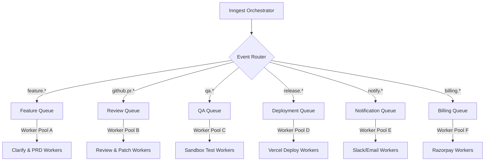

### Worker Queues Specifications

1. **Feature Queue:** Processes clarification question generations, PRD text assemblies, and sub-task decompositions.
2. **Review Queue:** Receives pull request events, runs code reviews, and executes auto-patch logic.
3. **QA Queue:** Handles serverless container runs, test executions, and compilation checks.
4. **Deployment Queue:** Handles Vercel configuration updates, migrations, and semantic version bumps.
5. **Notification Queue:** Manages email dispatches, Slack webhooks, and client-side notifications.
6. **Billing Queue:** Integrates Razorpay operations and subscription limit validations.

---

## 20 Inngest Event Catalog

To guarantee message reliability, Inngest manages events asynchronously across serverless functions.

| Event Name | Producer | Consumer | Payload Schema (Core Keys) | Retry Policy |
| :--- | :--- | :--- | :--- | :--- |
| `feature.created` | Web App (tRPC Mutation) | Clarification Agent | `featureId`, `workspaceId`, `creatorId` | Max: 3, Backoff: Exponential |
| `feature.clarified` | Web App Client Dialog | PRD Generator Agent | `featureId`, `answers` (JSON schema) | Max: 5, Backoff: Fixed 5s |
| `prd.generated` | PRD Generator Agent | Dashboard UI (SSE) | `prdId`, `contentSummary` | Max: 2, Backoff: None |
| `prd.approved` | Web App (tRPC Approval) | Task Generator Agent | `prdId`, `approverId` | Max: 3, Backoff: Exponential |
| `tasks.generated` | Task Generator | Git Orchestrator | `projectId`, `tasks` (Array) | Max: 5, Backoff: Exponential |
| `task.start` | Web App Task Board | Repository Analysis | `taskId`, `developerId` | Max: 3, Backoff: Exponential |
| `github.pr.opened` | GitHub App Webhook | PR Review Agent | `prNumber`, `repoName`, `diffUrl` | Max: 5, Backoff: Fixed 10s |
| `github.pr.review_passed`| PR Review Agent | QA Validation Agent | `prNumber`, `commitSha` | Max: 3, Backoff: Exponential |
| `github.pr.review_failed`| PR Review Agent | Code Fixer Agent | `prNumber`, `issues` (JSON) | Max: 4, Backoff: Exponential |
| `release.approved` | QA Agent / PM Action | Release Readiness Agent | `releaseId`, `reviewerId` | Max: 3, Backoff: Exponential |
| `release.shipped` | Vercel Deploy Hook | Slack / Discord Notifiers | `releaseId`, `version`, `changelog` | Max: 5, Backoff: Exponential |

---

## 21 Role Based Access Control (RBAC)

ShipFlow AI enforces strict multi-tenant authorization controls using organization-wide access schemas.

### Roles and Permission Mapping

* **Owner:**
  * **Permissions:** Full system access.
  * **Accessible Pages:** All views (Dashboard, Billing, Integrations, Audit Logs, Settings).
  * **Allowed Actions:** Update subscriptions, change payment methods, delete organization workspaces, transfer account ownership.
  * **Restrictions:** None.
* **Admin:**
  * **Permissions:** Workspace management.
  * **Accessible Pages:** Dashboard, Projects, Settings, Member Invites.
  * **Allowed Actions:** Connect new GitHub installations, update projects, manage invitations, change API limits.
  * **Restrictions:** Cannot edit Razorpay subscription billing cards or delete organizations.
* **Project Manager (PM):**
  * **Permissions:** Requirement validations.
  * **Accessible Pages:** Features, PRD layouts, Release trackers, Notification views.
  * **Allowed Actions:** Create feature requests, edit requirements, approve PRDs, trigger release promotions.
  * **Restrictions:** Cannot view organization billing profiles or modify repository webhooks.
* **Developer:**
  * **Permissions:** Core development.
  * **Accessible Pages:** Dashboards, Projects, Tasks board, PR comments reviews.
  * **Allowed Actions:** Submit feature requests, write answers to clarifications, trigger code generators, review inline files.
  * **Restrictions:** Cannot edit organization roles, change repository hook secrets, or approve final releases.
* **Reviewer:**
  * **Permissions:** Quality inspection.
  * **Accessible Pages:** Diff views, tasks checklists, reviewer dashboards.
  * **Allowed Actions:** Post inline comments, toggle review status (Approved / Changes requested).
  * **Restrictions:** Cannot create feature requests or deploy releases.
* **Viewer:**
  * **Permissions:** Read-only access.
  * **Accessible Pages:** Status grids, timeline dashboards, charts views.
  * **Allowed Actions:** Read status logs.
  * **Restrictions:** No write, approval, configuration, or trigger privileges.

---

## 22 Observability Architecture

ShipFlow AI uses OpenTelemetry standard traces and Sentry reporting configurations to track system events and logs.

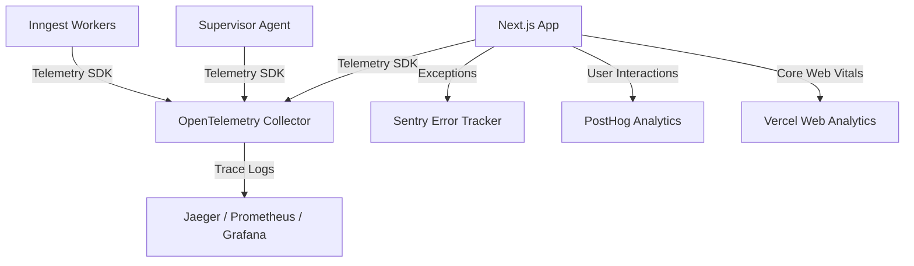

### Telemetry Pipeline Integrations

* **Structured Logging:** Enforces Winston logger bindings across `@shipflow/api` and `@shipflow/ai` layers, cataloging trace events with unique Request and Tenant identifiers.
* **OpenTelemetry Tracing:** Captures call spans across next.js API endpoints, database operations, Inngest triggers, and external LLM models requests.
* **Real-time Live Execution Timelines:** Next.js Server-Sent Events (SSE) stream agent execution milestones directly to client dashboards.
* **Sentry Errors Capture:** Automatically reports code compilation errors, model timeout parameters, and database query crashes.
* **User Behavior Analytics:** Dispatches engagement stats to PostHog and Web Vitals metrics to Vercel Analytics.

---

## 23 Analytics Architecture

ShipFlow AI metrics dashboards collect developer telemetry data to track cycle times and token costs.

* **DORA Metrics Tracker:**
  * **Lead Time:** Calculates minutes from a feature’s initial creation (`DRAFT`) to its production release (`SHIPPED`).
  * **Deployment Frequency:** Weekly production deployments count.
  * **Mean Time to Recovery (MTTR):** Tracks deployment rollback frequencies on Vercel.
* **AI & Agent Analytics:**
  * **AI Review Accuracy:** Monitors the ratio of AI reviews passed without human developers manual refactoring.
  * **PR Review Duration:** Calculates minutes between pull request creation and approval.
  * **Token Usage tracking:** Measures prompt and completion tokens for Claude, GPT, and Gemini inside Postgres databases.
* **Cost & Billing Telemetry:**
  * **Credit Balances:** Deducts balance metrics dynamically based on LLM calls.
  * **Workspace Revenue (MRR):** Calculates pricing limits and invoices via Razorpay queries.

---

## 24 Notification Architecture

Keep stakeholders informed by routing events dynamically through a unified notification pipeline.

```
[Inngest Workflow Event] ──> [Notification Router] ──> [Deliver to Channel Adapters]
                                                               │
                   ┌─────────────────┬─────────────────┼─────────────────┐
                   ▼                 ▼                 ▼                 ▼
               [In-App]           [Email]           [Slack]          [Discord]
```

* **Notification Router:** Validates recipient profiles and channels configurations before forwarding event payloads.
* **Channel Adapters:**
  * **In-App:** Pushes SSE records to the dashboard layout navigation headers.
  * **Email:** Fires HTML templates via Resend.
  * **GitHub:** Appends details to pull request review threads.
  * **Slack / Discord:** Dispatches markdown payloads to project channels.

---

## 25 Command Palette Architecture

A global keyboard shortcut interface (CMD+K or CTRL+K) allows developers to access search paths and context switches instantly.

* **Search index:** Loads workspaces, active projects, and active features concurrently.
* **Keyboard Navigation:** Uses Arrow keys for navigation, `Enter` to confirm, and `Escape` to close the palette.
* **Contextual Actions:**
  * Connect repository -> displays the GitHub configuration panel.
  * Generate PRD -> triggers tRPC mutations on the selected feature.
  * Search projects -> filters active repositories.
  * Approve Release -> routes to the deployment approval workspace.

---

## 26 Design System

Consistent styling variables verify WCAG AA compliance across desktop and mobile devices.

* **Typography:** Enforces Google Fonts Inter for interfaces, and JetBrains Mono for markdown code boxes.
* **Harmonious Color Palette:** Custom CSS Tailwind colors.
  ```css
  --background: 224 71% 4%;
  --foreground: 213 31% 91%;
  --primary: 263.4 70% 50.4%; /* Modern Indigo accent */
  ```
* **Spacers & Grid layouts:** Tailwind 4px grids (`gap-4`, `p-6`) ensure consistent alignments.
* **Accessibility:** Native ARIA labels and clean color contrast check-outs.
* **Responsive breakpoints:** Standard flex wraps and grids for screen dimensions between 320px to 1920px.
* **Animations:** Subtle transition rules (`transition-all duration-200`) prevent layout shift glitches.

---

## 27 Performance Strategy

Minimize latency through caching layers and streaming response configurations.

* **Server-Sent Events (SSE):** Streaming responses for long-running AI generation steps prevent gateway timeouts.
* **Optimistic UI Updates:** Task board cards adjust position instantly in browser views before database confirmations finish.
* **Pagination & Virtualization:** Lists exceeding 50 elements (like audit logs) load via cursor-based database queries using virtual scrolling.
* **Database Indexes:** Core database fields (`workspaceId`, `featureId`, `projectId`) use B-Tree indexes to ensure rapid queries.

---

## 28 Error Handling Strategy

Resilient error handling policies prevent server crashes.

* **Client Layout Boundaries:** Route-specific `error.tsx` blocks prevent UI failures from propagating to other sidebar views.
* **Network & Database Failures:** Enforces connection retry rules in Prisma database links.
* **Agent Fallbacks:** If API tokens for Claude exhaust, requests fall back to GPT-4o or Gemini services.
* **Inngest Workflow Retries:** Configures exponential backoff durations on failed asynchronous workers.

---

## 29 Security Architecture

### 1. Authentication
* **Implementation:** Powered by **BetterAuth**.
* **Flow:** Sessions are stored as HTTP-only, secure, same-site cookies, mitigating Cross-Site Scripting (XSS) risks.
* **Integrations:** Enforce OAuth 2.0 flow for GitHub authentication to acquire access tokens for Git actions.

### 2. Authorization & Workspace Isolation
* **Workspace Enclosure:** Every record contains a `workspaceId` column.
* **tRPC Procedures:** Database queries are gated behind `workspaceProcedure` and `workspaceAdminProcedure` contexts.
* **Database Level:** Use multi-tenant indices in PostgreSQL. Run application-level checks to verify that a user's session matches the requested `workspaceId`.

### 3. GitHub Tokens Security
* **Access Control:** User GitHub tokens are encrypted before being written to PostgreSQL.
* **Encryption Type:** `AES-256-GCM` algorithm using a system secret key.
* **Scope Minimization:** Request only the narrowest scopes (e.g., repository content read/write, pull request read/write, webhooks read/write).

### 4. Webhook Verification
* **GitHub Webhooks:** Validated using HMAC-SHA256 signatures derived from the secret configured on the GitHub App.
* **Razorpay Webhooks:** Signature verified using the Razorpay SDK using the webhook secret.

### 5. Secrets Management
* **Storage:** No secrets stored in codebase repository. Enforce Vercel Environment Variables.
* **Rotations:** Cycle database connections strings and webhook keys quarterly.

### 6. Rate Limiting
* **API endpoints:** Rate limited using Redis Token Bucket strategy via Upstash.
* **Agent Operations:** Implement concurrency limits on Inngest workflows to avoid hitting rate limits on Vercel AI SDK (LLMs) and GitHub APIs.

---

## 30 Security Enhancements

We harden application borders and secure sensitive data through advanced isolation patterns.

* **Row-Level Security (RLS):** Database sessions filter rows contextually using active tenant workspace IDs.
* **Input Sanitization:** Fast validation of REST and tRPC incoming values using strict Zod types.
* **Prompt Injection Mitigations:** System templates enforce structural guidelines, rejecting instructions wrapped in markdown code tags.
* **Webhook Replay Protections:** Validates webhook event payloads against unique ID databases to ignore identical duplicate payloads.
* **Audit Trails:** Relational audits track changes to key database records.
* **Secret Manager & API Vault:** Integrates AWS Secrets Manager and Doppler client interfaces inside `@shipflow/config` layers.
* **Encryption in Transit:** Enforces TLS 1.3 standards on all public tRPC router routes.

---

## 31 AI Cost Strategy

To control operational costs under production scale workloads, ShipFlow AI implements several optimization strategies.

* **Prompt Caching:** Enables cache tokens triggers on supported LLM APIs (e.g. Anthropic prompt caching), saving up to 90% of token evaluation overhead on repeated codebase context blocks.
* **Context Compression:** Filters out non-essential boilerplate files and code comments using dynamic AST token reduction engines before sending code files context to the model.
* **Token Budget limits:** Enforces maximum tokens budgets for each task execution loop. Aborts execution if costs exceed preset developer thresholds.
* **Model Downgrading:** Switches to smaller, cheaper LLMs (Gemini Flash, GPT-4o-mini) for simple validation pings.
* **Retry Budget Caps:** Limits the maximum number of error remediation attempts inside code editing loops.

---

## 32 Development Standards

Enforces quality controls during local and deployment actions.

* **Folder Naming Conventions:** Strict lowercase kebab-case naming (`packages/github-api`).
* **Git Branches & Commits:** Conventional Commits (`feat(web):`, `fix(api):`) run on branches prefixed with `shipflow/feat-*` or `shipflow/fix-*`.
* **Testing Guidelines:**
  * API routers: Checked via vitest regression scripts.
  * Frontend dashboard: Validated using Playwright client simulations.
* **Documentation Standards:** Enforce JSDoc notation on workspace API route definitions.

---

## 33 Scaling Strategy

As ShipFlow AI expands to 10,000 active organizations, the primary bottlenecks will be database connections, background task concurrency, and API rate limits.

### 1. Database Scaling
* **PgBouncer & Connection Pooling:** Use Neon database with connection poolers (via Prisma's `DATABASE_URL` with transaction-mode connections).
* **Read-Replicas:** Route heavy analytical reports (e.g., shipping velocity dashboard charts) to a read-replica node.
* **Horizontal Partitioning:** Implement sharding based on `workspaceId` once a single database cluster grows beyond limits.

### 2. Serverless Execution & Inngest Optimization
* **Step Concurrency:** Set Inngest concurrency options on worker workflows. Limit LLM execution steps to avoid throttling.
* **Decoupled Workers:** Keep API latency below 100ms by pushing logic off Next.js HTTP routes directly into Inngest workflows.
* **Autoscaling Agents Worker Nodes:** Distributes long-running agent threads across auto-scaling compute groups (e.g. AWS Fargate) to prevent resource contention under load.

### 3. LLM Request Optimization
* **Prompt Caching:** Enable prompt caching on Anthropic/OpenAI providers to reduce token latency and costs.
* **Local Code Summaries:** Maintain a local vector database (e.g., PgVector or Pinecone) containing indexed codebase context summaries, reducing the amount of raw code sent with every prompt.

---

## 34 Deployment Architecture

ShipFlow AI is optimized for cloud-native deployment using Vercel's global serverless platform.

* **Vercel Frontend Hosting:** The static pages and React runtime are served directly via Vercel’s global Edge Network, ensuring fast load times globally.
* **Serverless Functions:** Next.js routes under `apps/web/src/app/api` compile to serverless Lambda functions.
* **Database Alignment:** The database cluster (PostgreSQL Neon) is placed in the same AWS region as Vercel's primary serverless runner (e.g. `us-east-1` or `eu-central-1`) to minimize database handshake latency.
* **Continuous Integration:** Every commit pushes to a preview environment on Vercel. Merges to `main` auto-run database migrations via a Vercel production deployment pipeline.

### Canary Deployment Pipeline

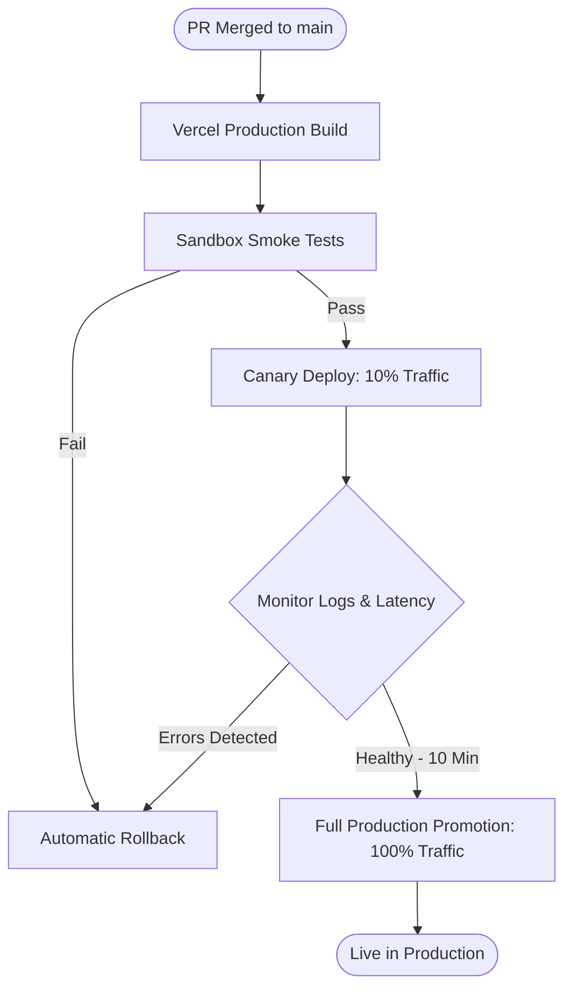

* **Smoke Tests:** Runs integration tests to verify database migrations and page rendering after the Vercel production build completes.
* **Canary Routing:** Routes 10% of workspace traffic to the new deployment.
* **Monitoring & Alerts:** Tracks error logs and latency metrics.
* **Promotion & Rollbacks:** If errors spike, the pipeline rolls back changes, restoring the previous production deployment version within seconds.

---

## 35 Mermaid Diagrams

This section groups all architectural, data flow, and sequence diagrams used throughout this design specification.

### 35.1 System Architecture
*(Detailed block diagram mapping Next.js frontend, tRPC endpoint routers, BetterAuth validations, Inngest queues, PostgreSQL DB, and integration APIs).*

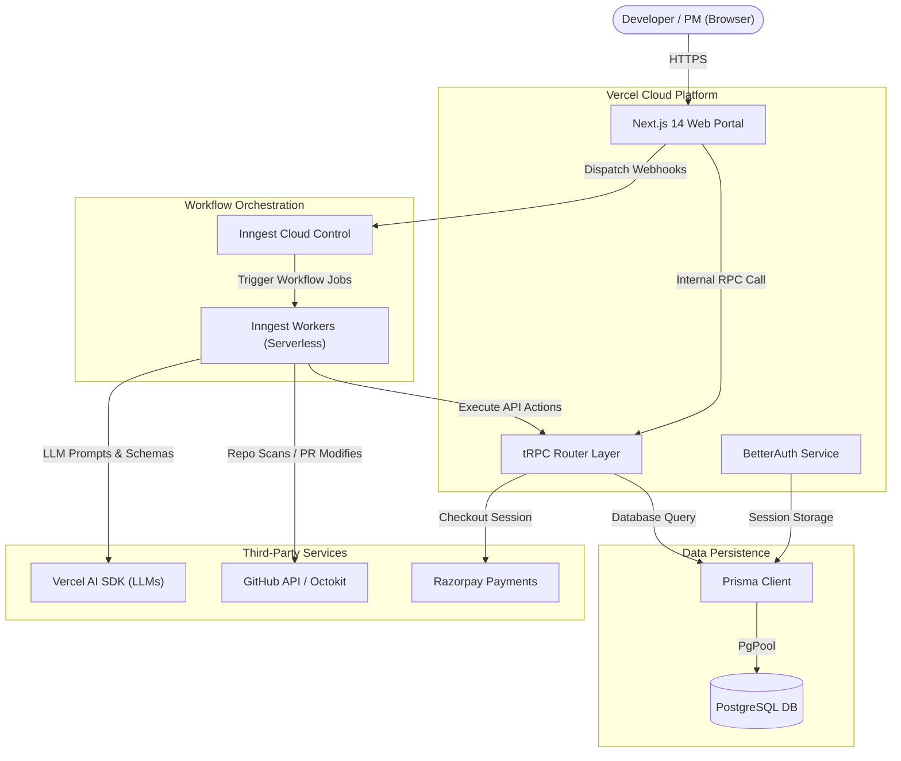

### 35.2 Data Flow
*(Step-by-step roadmap showing how requests traverse agents, reviews, and test validations).*

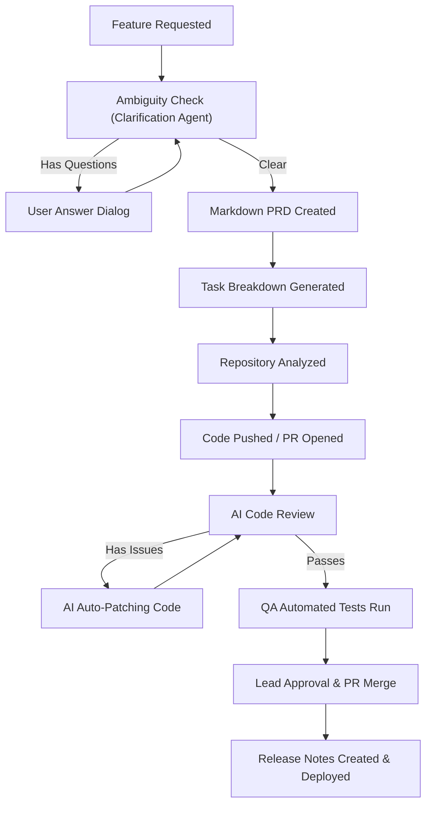

### 35.3 AI Workflow
*(Inter-agent pipeline detailing product, development, and verification divisions of labor).*

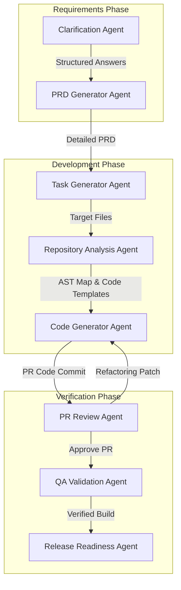

### 35.4 Sequence Diagram
*(Detailed sequence map showing communications across developer browsers, tRPC APIs, database connections, and Inngest jobs).*

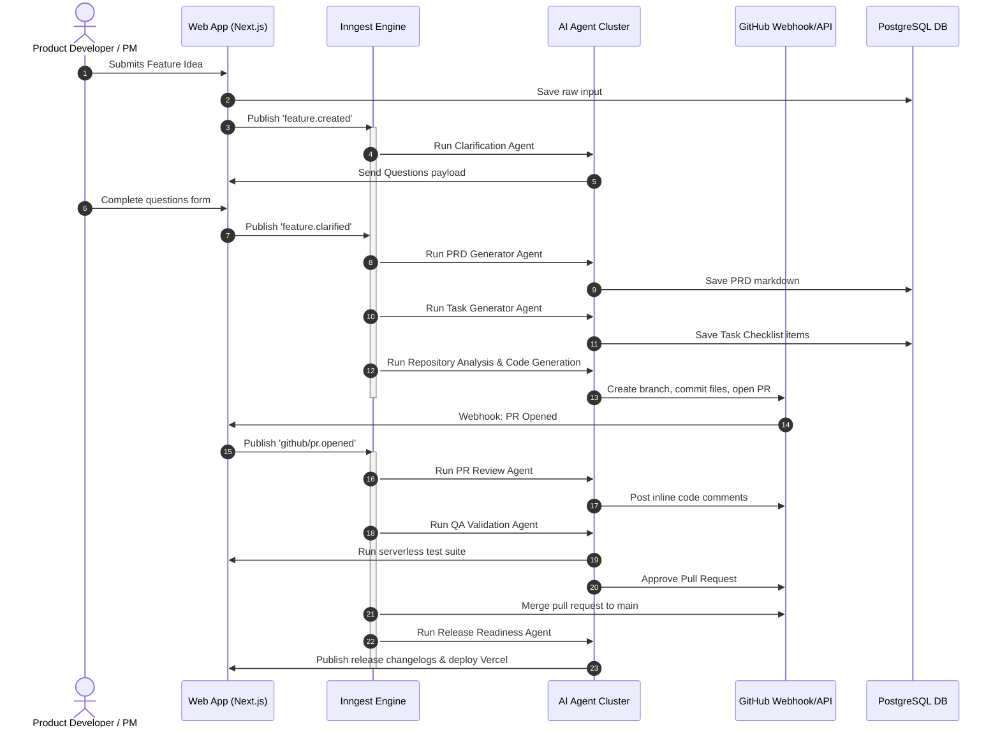

---

## 36 Development Roadmap

### Milestone 1: Monorepo Foundation & Core Auth (Weeks 1-2)
* **Objective:** Establish the workspace structure and setup secure multi-tenant routing.
* **Deliverables:**
  * Configure npm workspaces for `@shipflow/web`, `@shipflow/api`, `@shipflow/db`, `@shipflow/ui`, `@shipflow/config`.
  * Set up PostgreSQL with Prisma models for `User`, `Workspace`, `Session`, and `Member`.
  * Integrate BetterAuth with OAuth support for GitHub.
  * Build the multi-tenant base layout and routing middleware inside tRPC.

### Milestone 2: tRPC & Event Infrastructure (Weeks 3-4)
* **Objective:** Establish type-safe API boundaries and event-driven architectures.
* **Deliverables:**
  * Implement tRPC base routes (`auth`, `workspace`, `project`, `featureRequest`) with Zod schemas.
  * Connect local Next.js API routes with Inngest Cloud developer tools.
  * Set up Razorpay integration workflows, checkout paths, and signature verification endpoints.

### Milestone 3: AI Core & Requirement Agents (Weeks 5-6)
* **Objective:** Build initial AI collaboration pipelines.
* **Deliverables:**
  * Configure `@shipflow/ai` with Vercel AI SDK. Set up LLM failovers.
  * Construct prompt libraries and outputs parsing for `Requirement Clarification Agent`.
  * Build the `PRD Generator Agent` to produce requirements documents in Markdown.
  * Add real-time UI logging elements for the clarification loop.

### Milestone 4: Codebase Agents & GitHub Integration (Weeks 7-9)
* **Objective:** Allow the AI platform to modify repositories and submit pull requests.
* **Deliverables:**
  * Create `Repository Analysis Agent` containing code indexing scripts.
  * Implement `Task Generator Agent` to parse PRDs into lists of file changes.
  * Setup Octokit integrations within `@shipflow/github` to support branching and automated commits.
  * Handle incoming GitHub Pull Request webhooks.

### Milestone 5: PR Review & QA Verification (Weeks 10-11)
* **Objective:** Secure the release cycle with automated reviews and testing loops.
* **Deliverables:**
  * Deploy `PR Review Agent` to inspect git diffs and write inline review comments.
  * Build the code auto-patching loops.
  * Implement the `QA Validation Agent` to invoke test runners.
  * Implement the `Release Readiness Agent` to compile changelogs and trigger Vercel deployment webhooks.

### Milestone 6: Hardening, E2E Testing, & Production Launch (Week 12)
* **Objective:** Final checks and production setup.
* **Deliverables:**
  * Run security audits for database schemas and API paths.
  * Set up AES-256 encryption rules for storage of user GitHub API tokens.
  * Deploy production services to Vercel, Neon, and Inngest Cloud.
  * Perform scale test operations.

---

## 37 Future Roadmap

ShipFlow AI outlines its long-term enterprise growth objectives across advanced operations features.

* **Multi-LLM Hot Swaps:** Integrates runtime dynamic cost-optimization frameworks swapping between Claude, GPT, and custom local models based on query complexity.
* **Self-Hosted Engine:** Delivers Docker configurations to package PostgreSQL databases, Inngest runtimes, and local execution agents inside company private virtual clouds.
* **Enterprise SAML SSO:** Support corporate authentication integrations (Okta, Azure Active Directory) directly inside BetterAuth endpoints.
* **Custom AI Developer Profiles:** Organizations supply specific programming prompt rules, tuning the review and code generation agents to match specialized company framework versions.
* **Agent Plugin Marketplace:** Third-party developer tools hook into ShipFlow Inngest timelines (e.g., auto-triggering security vulnerability scanners or API mock servers).
* **Multi-Region Workflows Deployment:** Routes data storage and model calls strictly within user-defined geographic boundaries (e.g., GDPR compliant EU storage pools).
* **Voice Feature Input:** Interprets voice recordings from users, using Whisper APIs to generate initial `DRAFT` text fields automatically.
