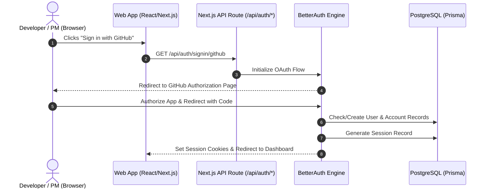
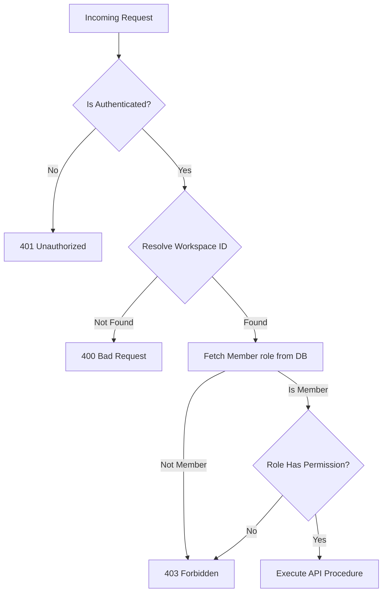
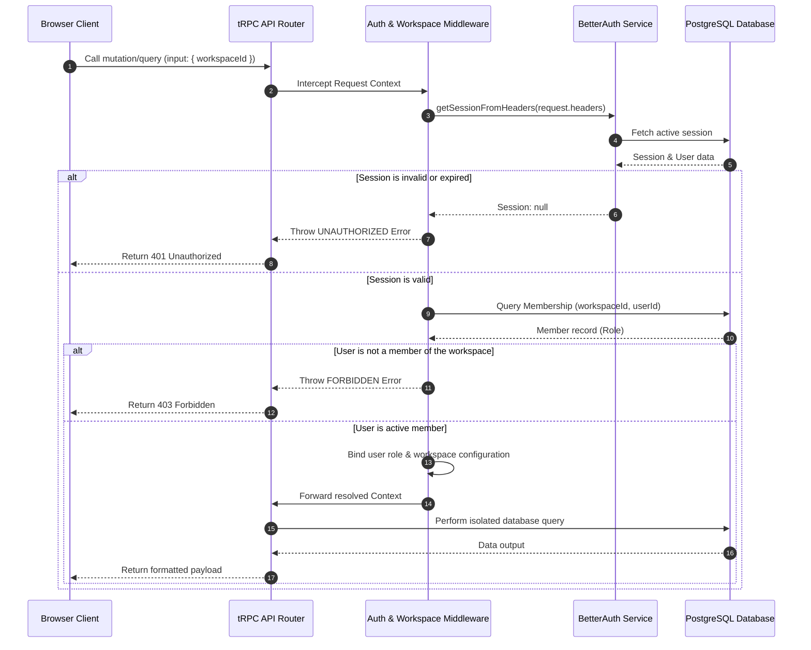
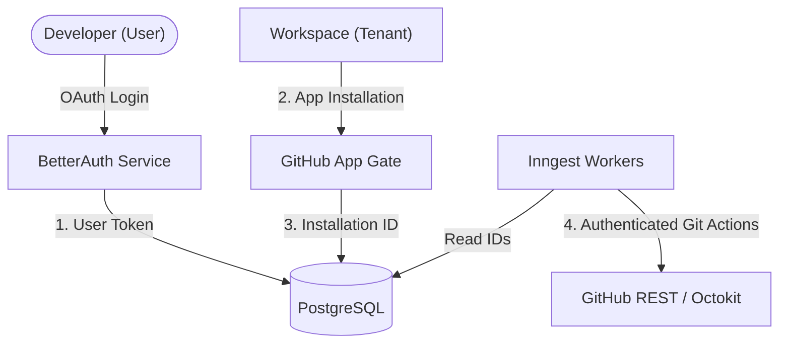

# ShipFlow AI — BetterAuth Integration Strategy & RBAC Architecture

**Document Version:** 1.0.0  
**Status:** Approved for Implementation Planning  
**Baseline References:** `docs/architecture.md`, `docs/database.md`, `packages/auth/src/`  

---

## 1. Authentication Architecture

ShipFlow AI employs a multi-tenant authentication and authorization architecture to guarantee data isolation and access controls.

### 1.1 Authentication Flow
When a user authenticates, they use either credentials (email/password) or OAuth (GitHub/Google). BetterAuth handles the handshakes, creates a session in the database, and sets secure cookies in the browser.



### 1.2 Authorization Flow
Authorization determines if an authenticated user can perform a specific operation. ShipFlow AI relies on a database-backed Role-Based Access Control (RBAC) system defined in `packages/auth/src/permission-service.ts`.



### 1.3 Session Flow
Browser clients communicate session tokens through HTTP-only cookies.
1. The server receives a request and extracts the `Authorization` header or cookie.
2. The server calls BetterAuth API `getSession` to validate the token against the `Session` table.
3. If valid, the session context is injected into tRPC or Next.js route context.

### 1.4 Workspace Resolution Flow
Every resource in ShipFlow AI belongs to a workspace. The workspace resolution flow determines the tenant scope for each request:
1. The client provides a `workspaceId` in the request parameters (tRPC inputs, request headers, or URL path).
2. The middleware fetches the membership record for the user and workspace.
3. If no active membership is found, the request is rejected with `403 Forbidden`.
4. If found, the user's role and the workspace scope are bound to the execution context.

---

## 2. BetterAuth Integration Strategy

ShipFlow AI leverages **BetterAuth** as its authentication provider, integrating it directly with PostgreSQL via Prisma.

### 2.1 BetterAuth Configuration
The server-side auth configuration is defined in `packages/auth/src/auth.ts` and exports the `auth` handler:
- **Database Adapter:** Uses `prismaAdapter` referencing the unified `@shipflow/db` client.
- **Provider support:** Email/Password and social logins (GitHub, Google).
- **Session Lifespans:** Configured for 30-day inactivity expiries, updating the session record daily.
- **Advanced Security:** Prefixing cookies with `shipflow` and toggling `useSecureCookies` based on environment states.

```typescript
// Core configuration baseline (defined in packages/auth/src/auth.ts)
export const auth = betterAuth({
  database: prismaAdapter(prisma, { provider: "postgresql" }),
  baseURL: process.env.BETTER_AUTH_URL || "http://localhost:3000",
  secret: process.env.BETTER_AUTH_SECRET,
  session: {
    expiresIn: 60 * 60 * 24 * 30, // 30 days
    updateAge: 60 * 60 * 24,     // 1 day
    cookieCache: { enabled: true, maxAge: 300 }
  },
  emailAndPassword: { enabled: true },
  socialProviders: {
    github: {
      clientId: process.env.GITHUB_CLIENT_ID,
      clientSecret: process.env.GITHUB_CLIENT_SECRET,
      scope: ["user:email", "read:user"]
    }
  }
});
```

### 2.2 Session Strategy
Sessions are database-backed. This allows the system to revoke sessions instantly (e.g., when a user logs out, resets their password, or is removed from a workspace) and enables auditing of active sessions across multiple devices.

### 2.3 Database Adapter
The database schema utilizes BetterAuth standard structures.
- **`User`**: Identity container.
- **`Session`**: Session state tracker.
- **`Account`**: Social logins registry.
- **`Verification`**: Sign-up / OTP tokens.

These maps directly to `User`, `Session`, `Account`, and `Verification` Prisma models in `packages/db/prisma/schema.prisma`.

### 2.4 Cookie Strategy
BetterAuth cookies are set with the following defaults:
- **`HttpOnly`**: `true` (prevents client-side scripts from reading tokens).
- **`SameSite`**: `Lax` (protects against CSRF during third-party redirections).
- **`Secure`**: `true` in production (enforces TLS transmission).
- **`Prefix`**: `shipflow` (names cookies `shipflow.session_token`).

### 2.5 Middleware
Next.js middleware intercepts incoming requests to perform route redirection and inject auth parameters:
- Routes under `/dashboard` check for valid cookies.
- If cookies are missing, the middleware redirects users to `/login`.
- If cookies exist, headers are updated and forwarded to route handlers.

### 2.6 Server Components
Server-rendered pages fetch session details directly from headers using `getSessionFromHeaders`:
```typescript
import { headers } from "next/headers";
import { getSessionFromHeaders } from "@shipflow/auth/server";

export default async function DashboardLayout() {
  const sessionData = await getSessionFromHeaders(headers());
  if (!sessionData) redirect("/login");
  // Render layout...
}
```

### 2.7 Client Components
React client components access session states using the react hook exports from `authClient` in `@shipflow/auth/client`:
```typescript
"use client";
import { useSession, signOut } from "@shipflow/auth/client";

export function UserProfile() {
  const { data: sessionData, isPending } = useSession();
  if (isPending) return <Spinner />;
  return (
    <div>
      <p>Hello, {sessionData?.user.name}</p>
      <button onClick={() => signOut()}>Logout</button>
    </div>
  );
}
```

---

## 3. RBAC Design

Multi-tenancy requires strict separation of permissions. Access controls are partitioned into six roles:

| Role | Hierarchy | Target Audience | Key Capabilities | Restrictions |
| :--- | :---: | :--- | :--- | :--- |
| **OWNER** | 6 | Organization / Workspace Creator | Billing, subscription management, workspace deletion, ownership transfer, full RBAC changes. | None. |
| **ADMIN** | 5 | Engineering Leads & Administrators | GitHub installations, API rate adjustments, workspace config settings, member invitations. | Cannot edit billing subscriptions or delete workspaces. |
| **PM** | 4 | Product Managers / Coordinators | Create features, generate/approve PRDs, review release notes, trigger production deployments. | Cannot view billing details or modify repository connections. |
| **DEVELOPER**| 3 | Software Engineers | Clarification answers, trigger agent runs, check tasks board, write reviews/comments. | Cannot assign administrative roles or approve final releases. |
| **REVIEWER** | 2 | QA Engineers / Tech Reviewers | Inline code reviews, approve/reject PR reviews, check sandbox tasks. | Cannot create features, edit PRDs, or deploy releases. |
| **VIEWER** | 1 | Stakeholders / Observers | Read-only dashboards, view features progress, check release notes. | No write, trigger, or configuration privileges. |

### 3.1 Permission Matrix
The permission matrix mapped in `packages/auth/src/permission-service.ts` details explicit role mappings:

```typescript
export const PERMISSION_MATRIX = {
  // Workspace Administration
  canDeleteWorkspace:   ["OWNER", "ADMIN"],
  canUpdateWorkspace:   ["OWNER", "ADMIN"],
  canTransferOwnership: ["OWNER"],
  canManageAPIKeys:     ["OWNER", "ADMIN"],
  canViewAPIKeys:       ["OWNER", "ADMIN", "DEVELOPER"],

  // Member Administration
  canInviteMembers:     ["OWNER", "ADMIN"],
  canRemoveMembers:     ["OWNER", "ADMIN"],
  canUpdateMemberRole:  ["OWNER", "ADMIN"],
  canLeaveworkspace:    ["OWNER", "ADMIN", "PM", "DEVELOPER", "REVIEWER", "VIEWER"],

  // Projects & Features
  canCreateProject:     ["OWNER", "ADMIN", "PM"],
  canDeleteProject:     ["OWNER", "ADMIN", "PM"],
  canUpdateProject:     ["OWNER", "ADMIN", "PM"],
  canCreateFeature:     ["OWNER", "ADMIN", "PM", "DEVELOPER"],
  canDeleteFeature:     ["OWNER", "ADMIN", "PM"],
  canUpdateFeature:     ["OWNER", "ADMIN", "PM", "DEVELOPER"],
  canReviewFeature:     ["OWNER", "ADMIN", "REVIEWER"],

  // AI & Git Integrations
  canManageRepositories:["OWNER", "ADMIN"],
  canConnectRepository: ["OWNER", "ADMIN", "PM"],
  canManageAI:          ["OWNER", "ADMIN"],
  canRunAIAgents:       ["OWNER", "ADMIN", "PM", "DEVELOPER"],
  canManageGitHub:      ["OWNER", "ADMIN"],
  canReviewPR:          ["OWNER", "ADMIN", "REVIEWER", "DEVELOPER"],
  canMergePR:           ["OWNER", "ADMIN"],
  canDeploy:            ["OWNER", "ADMIN"],

  // Billing & Observability
  canManageBilling:     ["OWNER", "ADMIN"],
  canViewBilling:       ["OWNER", "ADMIN"],
  canViewAuditLogs:     ["OWNER", "ADMIN"],
  canViewAnalytics:     ["OWNER", "ADMIN"],
};
```

---

## 4. Workspace Context Resolution

Every request entering the ShipFlow API must resolve contextual tenant variables. The resolution flows as follows:



---

## 5. Protected tRPC Design

tRPC routers employ custom procedure builders defined in `packages/api/src/trpc.ts` to enforce authentication, workspace isolation, and RBAC rules.

```
┌────────────────────────────────────────────────────────┐
│                    publicProcedure                     │ (No auth required)
└──────────────────────────┬─────────────────────────────┘
                           ▼
┌────────────────────────────────────────────────────────┐
│                   protectedProcedure                   │ (Enforces session existence)
└──────────────────────────┬─────────────────────────────┘
                           ▼
┌────────────────────────────────────────────────────────┐
│               createWorkspaceProcedure()               │ (Enforces active workspace membership)
└──────────┬───────────────────────────────┬─────────────┘
           ▼                               ▼
┌────────────────────────┐      ┌────────────────────────┐
│ createRoleProcedure()  │      │createPermissionProc()  │ (Enforces specific RBAC rules)
└────────────────────────┘      └────────────────────────┘
```

### 5.1 Procedure Catalog & Responsibilities

1. **`publicProcedure`**
   - **Access**: Anyone (anonymous).
   - **Responsibilities**: Health checks, landing metrics, basic validation queries.
2. **`protectedProcedure`**
   - **Access**: Logged-in users.
   - **Responsibilities**: Profile edits, listing personal workspaces, organization creations.
3. **`workspaceProcedure`**
   - **Access**: Workspace members.
   - **Responsibilities**: Fetches workspace metadata, verifies user membership, attaches user role and workspace state to request contexts.
4. **`adminProcedure`**
   - **Access**: Workspace OWNER or ADMIN.
   - **Responsibilities**: Workspace updates, API key configurations, limits updates.
5. **`ownerProcedure`**
   - **Access**: Workspace OWNER.
   - **Responsibilities**: Organization deletion, Razorpay subscriptions settings, ownership transfers.

---

## 6. Route Protection

The Next.js App Router and tRPC endpoints partition routes into public and protected segments.

### 6.1 Public Routes
* **`/`** (Landing Page): Marketing and feature descriptions.
* **`/login`** / **`/signup`**: Authentication gates.
* **`/api/auth/*`**: BetterAuth API endpoints.
* **`/api/webhooks/github`** / **`/api/webhooks/razorpay`**: Third-party webhook handlers (secured via HMAC signature verification).

### 6.2 Protected Routes
All dashboard modules require authentication and valid workspace mappings:

| Route Path | Context Required | Minimum Role | Page Purpose |
| :--- | :--- | :---: | :--- |
| `/dashboard` | Session Only | N/A | Choose workspace or view personal logs. |
| `/workspace/[slug]` | Workspace Context | VIEWER | Workspace activity dashboard. |
| `/workspace/[slug]/projects` | Workspace Context | VIEWER | List and update projects. |
| `/workspace/[slug]/features` | Workspace Context | DEVELOPER | Manage requirements clarification loops and PRD setups. |
| `/workspace/[slug]/features/[id]/prd`| Workspace Context | PM | Approve/Reject PRD versions. |
| `/workspace/[slug]/reviews` | Workspace Context | REVIEWER | View code reviews, comment logs, and patches. |
| `/workspace/[slug]/release` | Workspace Context | PM | Compile logs and trigger productions promotions. |
| `/workspace/[slug]/billing` | Workspace Context | ADMIN | Manage Razorpay transactions. |
| `/workspace/[slug]/settings` | Workspace Context | ADMIN | Edit workspace configurations and team invitations. |
| `/workspace/[slug]/settings/audit`| Workspace Context | ADMIN | Audit trail observations. |

---

## 7. Session Lifecycle

ShipFlow AI manages session lifecycles strictly to prevent hijacking while offering smooth developer interactions.

```
                  ┌───────────────┐
                  │ 1. Sign In    │ (OAuth / Credentials validation)
                  └───────┬───────┘
                          ▼
                  ┌───────────────┐
                  │ 2. Session OK │ (Set HTTP-only, Lax, Secure cookies)
                  └───────┬───────┘
                          │
            ┌─────────────┴─────────────┐
            ▼                           ▼
    ┌───────────────┐           ┌───────────────┐
    │ 3. Active Use │           │ 3. Idle Expiry│ (Expires after 30 days)
    └───────┬───────┘           └───────┬───────┘
            │                           │
            ▼                           ▼
    ┌───────────────┐           ┌───────────────┐
    │ 4. Auto Refresh           │ 4. Revocation │ (Removes Session record)
    │    (Daily)    │           └───────────────┘
    └───────────────┘
```

1. **Sign In (Login):** BetterAuth creates a session entry in the database containing metadata (IP, user agent, expiration time) and returns a unique session token inside client cookies.
2. **Auto-Refresh:** Sessions live for 30 days. BetterAuth middleware automatically updates the session table record if the session is accessed within 1 day of expiration (`updateAge: 86400`).
3. **Session Expiry:** Once the expiration timestamp passes, the database token is ignored and client cookies are cleared on the next network request.
4. **Logout:** The client calls `signOut()`. BetterAuth deletes the session row in PostgreSQL and invalidates client cookies.
5. **Session Revocation:** Users can revoke individual sessions remotely via their Settings dashboard. System administrators can invalidate all active sessions for a user if suspicious activity is detected.
6. **Multi-Device Support:** Users can sign in from multiple browsers or devices concurrently. The system creates a separate database row for each device, allowing granular session management and auditing.

---

## 8. GitHub Authentication & Integration Strategy

ShipFlow AI requires both **user-level authentication** (to verify identity) and **workspace-level integration** (to analyze and edit repositories).



### 8.1 Integration Pipeline Breakdown

1. **User Identity (GitHub OAuth):**
   - Developers sign into ShipFlow AI using GitHub OAuth.
   - BetterAuth stores the OAuth account details (`accessToken`, `refreshToken`) in the `Account` table.
   - This authenticates the user's personal identity.

2. **Workspace Permission (GitHub App Installation):**
   - An administrator installs the **ShipFlow GitHub App** onto their organization or personal account.
   - GitHub sends an `installation` event containing the `installationId` to our webhook endpoint.
   - The system creates a `GitHubInstallation` record associated with the administrator's `workspaceId`.

3. **Repository Connection:**
   - Workspace administrators link projects to specific repositories.
   - Operations are authenticated using the GitHub App's Installation token (derived from `installationId`), keeping work isolated from the personal access tokens of individual users.

4. **Webhook Authentication:**
   - GitHub sends webhook payloads (PR updates, comment additions, check completions) to `/api/webhooks/github`.
   - The endpoint computes the signature of the payload using `HMAC-SHA256` and the configured GitHub App webhook secret.
   - Validated payloads trigger Inngest workflow engines.

---

## 9. Security Design

```
┌────────────────────────────────────────────────────────┐
│                     Client Security                    │
│      - HttpOnly Cookies (mitigates XSS token theft)    │
│      - SameSite=Lax (blocks CSRF attacks)              │
│      - Rate Limiting via Redis Token Buckets           │
└──────────────────────────┬─────────────────────────────┘
                           ▼
┌────────────────────────────────────────────────────────┐
│                     API Gateways                       │
│      - tRPC Context Workspace isolation validations    │
│      - Strict input sanitization via Zod types         │
│      - HMAC-SHA256 signature verification for webhooks │
└──────────────────────────┬─────────────────────────────┘
                           ▼
┌────────────────────────────────────────────────────────┐
│                   Storage Hardening                    │
│      - AES-256-GCM encryption for credentials          │
│      - Database row isolation via workspaceId indices  │
│      - Comprehensive relational audit log trails       │
└────────────────────────────────────────────────────────┘
```

### 9.1 Core Security Practices

* **CSRF Mitigation:** Cookie attributes (`SameSite=Lax`) combined with tRPC verification protect mutations against Cross-Site Request Forgery.
* **XSS Mitigation:** Sensitive session tokens are never accessible by client-side JavaScript. Input strings are sanitized and validated via strict Zod schemas before database inserts.
* **Session Hijacking Protections:** IP address and user-agent configurations are logged on each session. IP address shifts trigger verification emails in production.
* **GitHub Token Storage:** Access tokens are encrypted using `AES-256-GCM` before being written to PostgreSQL, protecting credentials in the event of database leaks.
* **Workspace Isolation:** Every data query contains a strict `workspaceId` condition. Workspace resolution checks run at the API edge, preventing cross-tenant data access.
* **Rate Limiting:** Protects API endpoints against brute force attempts using Redis token buckets. Worker queues enforce step concurrency rules.
* **Audit Logging:** Critical actions (such as inviting members, modifying configurations, or triggering production releases) write immutable logs containing timestamps, IP addresses, and user identifiers to the database.

---

## 10. Folder Impact

Implementation of the authentication plan will touch the following areas of the monorepo:

### 10.1 Packages (Shared Auth Logic)
* [MODIFY] `packages/db/prisma/schema.prisma` *(Validate BetterAuth fields compatibility)*
* [NEW] `packages/auth/src/auth.ts` *(BetterAuth configuration)*
* [NEW] `packages/auth/src/client.ts` *(React auth client exports)*
* [NEW] `packages/auth/src/middleware.ts` *(Helper functions for Next.js route protection)*
* [NEW] `packages/auth/src/session.ts` *(Server-side helpers for session validation)*
* [NEW] `packages/auth/src/permission-service.ts` *(RBAC rules and matrices definition)*
* [NEW] `packages/auth/src/role-service.ts` *(Enforces role validations and assignments)*
* [NEW] `packages/auth/src/workspace-service.ts` *(Manages workspace membership checks)*

### 10.2 Apps (Next.js Application Integration)
* [NEW] `apps/web/src/middleware.ts` *(Edge middleware routing checking session cookies)*
* [NEW] `apps/web/src/app/api/auth/[...better-auth]/route.ts` *(BetterAuth endpoints routing)*
* [NEW] `apps/web/src/app/login/page.tsx` / `apps/web/src/app/signup/page.tsx` *(Client login views)*
* [MODIFY] `packages/api/src/context.ts` *(Integrate `getSessionFromHeaders` into tRPC context)*
* [MODIFY] `packages/api/src/trpc.ts` *(Inject workspace procedures and role verification checks)*

---

## 11. Implementation Roadmap

The authentication implementation is divided into 8 milestones. Each step is independently verifiable.

```
Step 1: Install BetterAuth ──> Step 2: Configure Database Adapter ──> Step 3: Configure auth.ts
                                                                            │
Step 6: Next.js Middleware <── Step 5: Protected tRPC Procedures  <── Step 4: Context Integration
      │
      ▼
Step 7: Workspace Resolution ──> Step 8: RBAC Verification
```

### Step 1: Install BetterAuth Dependencies
* **Actions:** Install `better-auth` in `packages/auth` and `better-auth/react` in `apps/web`.
* **Verification:** Run `tsc --noEmit` to verify type resolutions.

### Step 2: Configure Database Adapter
* **Actions:** Link `better-auth` to Prisma in `packages/auth/src/auth.ts` using `prismaAdapter`.
* **Verification:** Run `npx prisma validate` and verify connection initialization.

### Step 3: Configure Auth Server
* **Actions:** Add OAuth (GitHub/Google) and Email/Password configuration options in `packages/auth/src/auth.ts`.
* **Verification:** Instantiate auth server on dev endpoints. Confirm configuration options are parsed without errors.

### Step 4: Inject Session Context
* **Actions:** Integrate `getSessionFromHeaders` into tRPC context resolver in `packages/api/src/context.ts`.
* **Verification:** Write unit test to verify that requests containing mock session headers inject user data into the tRPC context.

### Step 5: Implement Protected tRPC Procedures
* **Actions:** Build `protectedProcedure`, `workspaceProcedure`, and `adminProcedure` wrappers in `packages/api/src/trpc.ts`.
* **Verification:** Confirm that requests without valid tokens return `UNAUTHORIZED` or `FORBIDDEN` error codes.

### Step 6: Next.js Edge Middleware
* **Actions:** Build `apps/web/src/middleware.ts` redirecting unauthenticated users to `/login`.
* **Verification:** Request `/dashboard` in browser and confirm redirect triggers.

### Step 7: Workspace Resolution
* **Actions:** Populate `workspaceContext` on `workspaceProcedure` execution.
* **Verification:** Call a workspace procedure and verify that membership is checked in the database.

### Step 8: RBAC Permission Verification
* **Actions:** Secure administrative routes using `adminProcedure` or `createPermissionProcedure`.
* **Verification:** Confirm that users with a `VIEWER` role receive a `FORBIDDEN` response when attempting administrative mutations.
