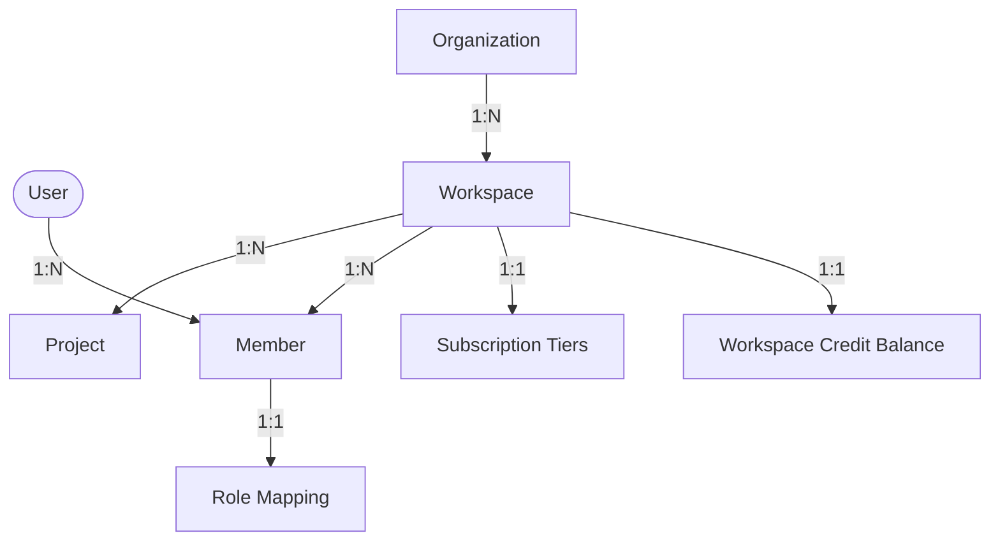
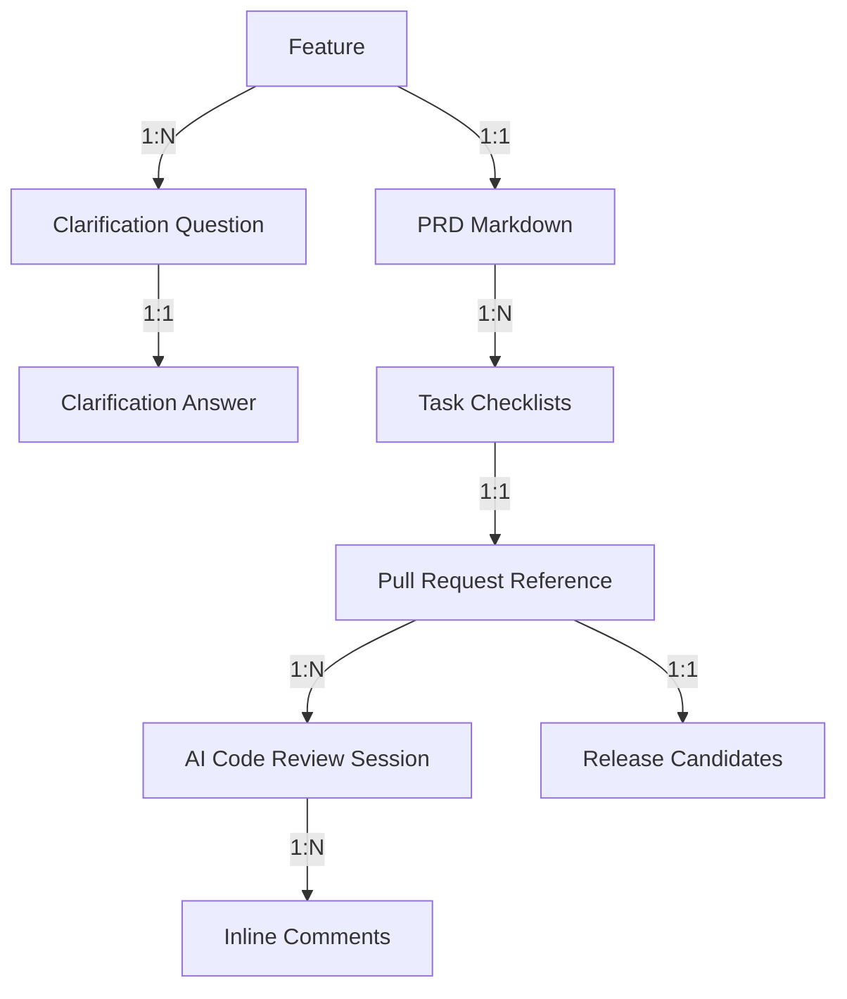
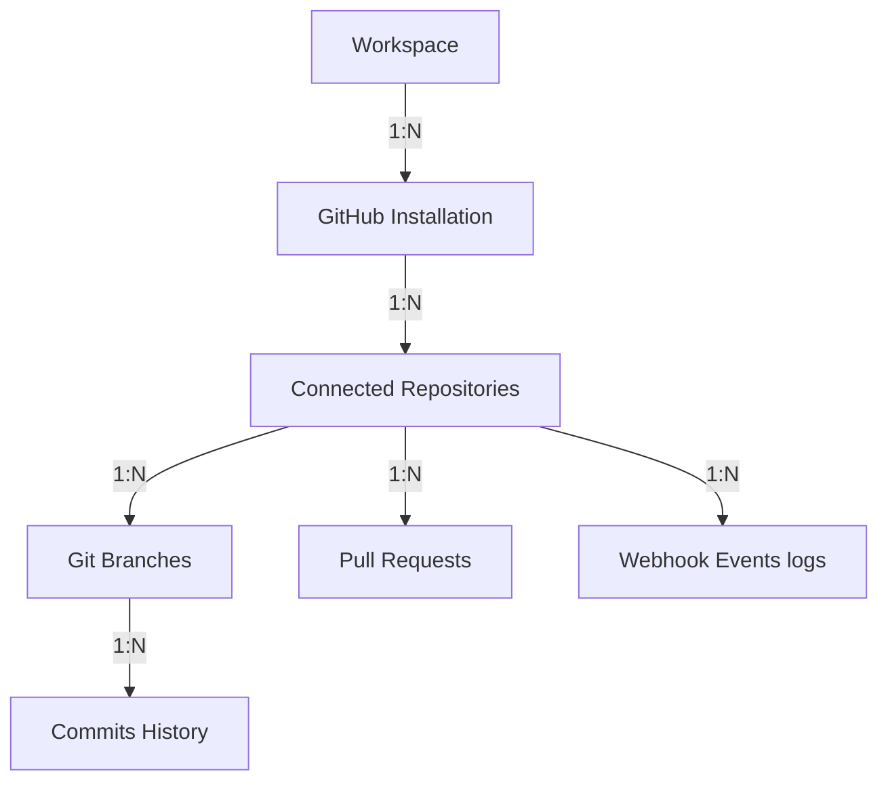
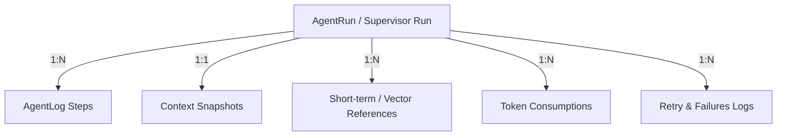
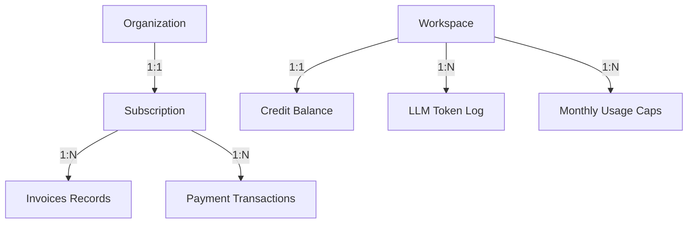
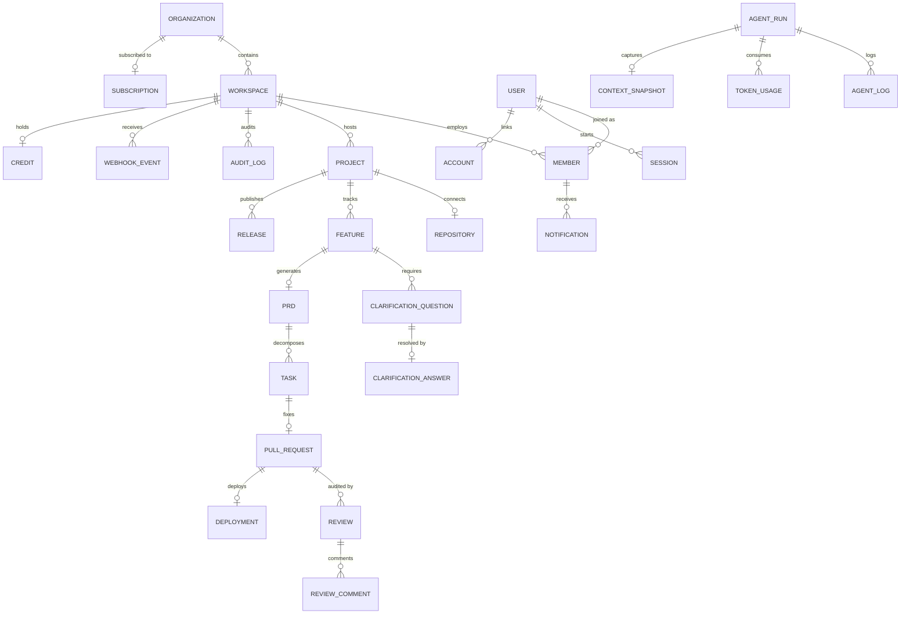

# ShipFlow AI — Production Database Architecture Design

**Document Version:** 1.0.0  
**Author:** Principal Database Architect & Staff Backend Engineer  
**Status:** Approved for Schema Implementation  
**Target Engine:** PostgreSQL 16+ (Neon / AWS RDS)  
**ORM Layer:** Prisma 5.12.0+  

---

## Table of Contents
1. [Domain Modeling](#1-domain-modeling)
2. [Visual Diagrams](#2-visual-diagrams)
3. [Prisma Schema](#3-prisma-schema)
4. [Multi-Tenant Design](#4-multi-tenant-design)
5. [Enumerations](#5-enumerations)
6. [AI Agent Database Design](#6-ai-agent-database-design)
7. [GitHub Integration Layout](#7-github-integration-layout)
8. [Billing & Credit Architecture](#8-billing--credit-architecture)
9. [Notification System Layout](#9-notification-system-layout)
10. [Immutable Audit Logging](#10-immutable-audit-logging)
11. [Performance Optimization](#11-performance-optimization)
12. [Database Security](#12-database-security)
13. [Scalability Strategies](#13-scalability-strategies)
14. [Model-by-Model Documentation Reference](#14-model-by-model-documentation-reference)

---

## 1 Domain Modeling

ShipFlow AI is structured as a multi-tenant, event-driven SaaS application. To maintain strict multi-tenant safety and track asynchronous AI loops, the domain model partitions data into separate layers: Identity, Git Integration, Requirement Engineering, Task Execution, AI Logs, Billing, and Auditing.

### Core Domain Entities

1. **User:** Central identity profile. Growth matches individual developer counts.
2. **Session & Account:** BetterAuth models tracking browser state and OAuth access links (GitHub, Google tokens).
3. **Workspace:** Logical security and execution unit. Every customer resource is linked here.
4. **Member & Role:** Represents membership in a workspace, enforcing role policies.
5. **Project:** A workspace can contain multiple projects, each linked to a specific code repository.
6. **Repository:** Configuration for connected repositories. Holds repo branches and webhook parameters.
7. **Feature:** The high-level product proposal (feature request) moving through clarification loops.
8. **ClarificationQuestion:** Questions spawned by the Clarification Agent to resolve requirements ambiguity.
9. **ClarificationAnswer:** Answers supplied by developers/PMs to questions.
10. **PRD:** Product Requirements Documents compiled in Markdown format.
11. **Task:** Actionable checklists mapped to specific code files and imports.
12. **PullRequest:** Trackers for git branches, diff files, and pull request URLs.
13. **Review:** Logs of AI PR reviews, checking diff validation results.
14. **ReviewComment:** Threaded inline PR comments identifying line-by-line errors.
15. **Release:** Release notes, semantic versions, and changelogs.
16. **Deployment:** Progression events mapping canaries status.
17. **Notification & NotificationPreferences:** Enforces notification routing (Slack, Email, In-app).
18. **AgentRun & AgentLog:** Central execution tracks for the Supervisor Agent and worker runs.
19. **AuditLog:** Write-once log tracking tenant administrator activity.
20. **Usage & Subscription:** Dynamic token, compute, and billing tracking.
21. **Payment & Credit:** Razorpay checkout tracking and workspace token balances.
22. **APIKey:** SHA-256 hashed keys authorizing external API calls.
23. **WebhookEvent & WebhookDelivery:** Inbound/outbound webhook event logging.

---

## 2 Visual Diagrams

### 2.1 Workspace Relationships (Multi-Tenant Hierarchy)



### 2.2 Feature Lifecycle Database Flow



### 2.3 GitHub Integration Database Flow



### 2.4 AI Agent Execution Tables Relationships



### 2.5 Billing Entities Layout



### 2.6 Master Domain ER Diagram



---

## 3 Prisma Schema

This schema is optimized for PostgreSQL 16+ using standard UUID fields, indices on foreign keys, soft deletes configurations, and cascade rules.

```prisma
datasource db {
  provider = "postgresql"
  url      = env("DATABASE_URL")
}

generator client {
  provider = "prisma-client-js"
}

// ==========================================
// ENUMS DEFINITIONS
// ==========================================

enum UserRole {
  OWNER
  ADMIN
  PM
  DEVELOPER
  REVIEWER
  VIEWER
}

enum FeatureStatus {
  DRAFT
  CLARIFYING
  READY_FOR_PRD
  PRD_GENERATED
  PRD_APPROVED
  TASKS_CREATED
  IN_PROGRESS
  PR_OPEN
  AI_REVIEWING
  FIX_REQUIRED
  RE_REVIEWING
  READY_FOR_APPROVAL
  APPROVED
  SHIPPED
  ARCHIVED
}

enum TaskStatus {
  TODO
  IN_PROGRESS
  DONE
}

enum PRStatus {
  DRAFT
  OPEN
  CHANGES_REQUESTED
  APPROVED
  MERGED
  CLOSED
}

enum ReviewStatus {
  PENDING
  COMMENTED
  CHANGES_REQUESTED
  APPROVED
}

enum ReleaseStatus {
  DRAFT
  PUBLISHED
  RETRACTED
}

enum DeploymentStatus {
  QUEUED
  BUILDING
  SMOKE_TESTING
  CANARY_ACTIVE
  PROMOTED
  FAILED
  ROLLED_BACK
}

enum NotificationType {
  SYSTEM
  FEATURE_STATUS_CHANGED
  PRD_APPROVAL_REQUIRED
  TASK_ASSIGNED
  PR_REVIEW_COMPLETED
  RELEASE_SUCCESS
  BILLING_ALERT
}

enum AgentType {
  SUPERVISOR
  CLARIFICATION
  PRD_GENERATOR
  TASK_GENERATOR
  REPO_ANALYZER
  CODE_GENERATOR
  PR_REVIEWER
  QA_VALIDATOR
  RELEASE_MANAGER
}

enum AgentStatus {
  QUEUED
  RUNNING
  PAUSED_FOR_APPROVAL
  SUCCESS
  FAILED
  TIMEOUT
}

enum BillingPlan {
  FREE
  STARTER
  BUSINESS
  ENTERPRISE
}

enum SubscriptionStatus {
  ACTIVE
  PAST_DUE
  CANCELED
  UNPAID
}

enum GitProvider {
  GITHUB
  GITLAB
}

enum RepositoryVisibility {
  PUBLIC
  PRIVATE
}

// ==========================================
// CORE IDENTITY & MULTI-TENANCY
// ==========================================

model User {
  id            String    @id @default(uuid()) @db.Uuid
  email         String    @unique
  name          String?
  avatarUrl     String?
  createdAt     DateTime  @default(now())
  updatedAt     DateTime  @updatedAt
  deletedAt     DateTime?
  
  sessions      Session[]
  accounts      Account[]
  memberships   Member[]
  auditLogs     AuditLog[]

  @@index([email])
}

model Session {
  id           String   @id @default(uuid()) @db.Uuid
  userId       String   @db.Uuid
  token        String   @unique
  expiresAt    DateTime
  ipAddress    String?
  userAgent    String?
  createdAt    DateTime @default(now())
  updatedAt    DateTime @updatedAt

  user         User     @relation(fields: [userId], references: [id], onDelete: Cascade)

  @@index([userId])
}

model Account {
  id           String   @id @default(uuid()) @db.Uuid
  userId       String   @db.Uuid
  provider     String
  providerId   String
  accessToken  String?  @db.Text
  refreshToken String?  @db.Text
  idToken      String?  @db.Text
  expiresAt    DateTime?
  createdAt    DateTime @default(now())
  updatedAt    DateTime @updatedAt

  user         User     @relation(fields: [userId], references: [id], onDelete: Cascade)

  @@unique([provider, providerId])
  @@index([userId])
}

model Organization {
  id           String        @id @default(uuid()) @db.Uuid
  name         String
  slug         String        @unique
  createdAt    DateTime      @default(now())
  updatedAt    DateTime      @updatedAt
  deletedAt    DateTime?

  workspaces   Workspace[]
  subscription Subscription?

  @@index([slug])
}

model Workspace {
  id             String          @id @default(uuid()) @db.Uuid
  organizationId String          @db.Uuid
  name           String
  slug           String          @unique
  createdAt      DateTime        @default(now())
  updatedAt      DateTime        @updatedAt
  deletedAt      DateTime?

  organization   Organization    @relation(fields: [organizationId], references: [id], onDelete: Cascade)
  members        Member[]
  projects       Project[]
  features       Feature[]
  apiKeys        APIKey[]
  auditLogs      AuditLog[]
  webhookEvents  WebhookEvent[]
  credit         Credit?
  tokenUsages    TokenUsage[]
  monthlyUsages  MonthlyUsage[]

  @@index([organizationId])
  @@index([slug])
}

model Member {
  id          String      @id @default(uuid()) @db.Uuid
  workspaceId String      @db.Uuid
  userId      String      @db.Uuid
  role        UserRole    @default(VIEWER)
  createdAt   DateTime    @default(now())
  updatedAt   DateTime    @updatedAt
  deletedAt   DateTime?

  workspace   Workspace   @relation(fields: [workspaceId], references: [id], onDelete: Cascade)
  user        User        @relation(fields: [userId], references: [id], onDelete: Cascade)
  
  notifications Notification[]
  preferences   NotificationPreferences?

  @@unique([workspaceId, userId])
  @@index([workspaceId])
  @@index([userId])
}

// ==========================================
// GIT INTEGRATIONS & PROJECTS
// ==========================================

model Project {
  id          String      @id @default(uuid()) @db.Uuid
  workspaceId String      @db.Uuid
  name        String
  createdAt   DateTime    @default(now())
  updatedAt   DateTime    @updatedAt
  deletedAt   DateTime?

  workspace   Workspace   @relation(fields: [workspaceId], references: [id], onDelete: Cascade)
  repository  Repository?
  features    Feature[]
  releases    Release[]

  @@index([workspaceId])
}

model Repository {
  id             String               @id @default(uuid()) @db.Uuid
  projectId      String               @unique @db.Uuid
  provider       GitProvider          @default(GITHUB)
  externalId     String
  name           String
  owner          String
  visibility     RepositoryVisibility @default(PRIVATE)
  webhookSecret  String
  defaultBranch  String               @default("main")
  createdAt      DateTime             @default(now())
  updatedAt      DateTime             @updatedAt

  project        Project              @relation(fields: [projectId], references: [id], onDelete: Cascade)
  branches       Branch[]
  pullRequests   PullRequest[]

  @@unique([owner, name])
  @@index([projectId])
}

model Branch {
  id           String      @id @default(uuid()) @db.Uuid
  repositoryId String      @db.Uuid
  name         String
  isDefault    Boolean     @default(false)
  createdAt    DateTime    @default(now())
  updatedAt    DateTime    @updatedAt

  repository   Repository  @relation(fields: [repositoryId], references: [id], onDelete: Cascade)
  commits      Commit[]
  tasks        Task[]

  @@unique([repositoryId, name])
}

model Commit {
  id        String   @id @default(uuid()) @db.Uuid
  branchId  String   @db.Uuid
  sha       String
  message   String
  author    String
  createdAt DateTime @default(now())

  branch    Branch   @relation(fields: [branchId], references: [id], onDelete: Cascade)

  @@unique([branchId, sha])
}

// ==========================================
// FEATURE REQUESTS & REQUIREMENTS
// ==========================================

model Feature {
  id          String        @id @default(uuid()) @db.Uuid
  workspaceId String        @db.Uuid
  projectId   String        @db.Uuid
  title       String
  description String        @db.Text
  status      FeatureStatus @default(DRAFT)
  createdAt   DateTime      @default(now())
  updatedAt   DateTime      @updatedAt
  deletedAt   DateTime?

  workspace   Workspace     @relation(fields: [workspaceId], references: [id], onDelete: Cascade)
  project     Project       @relation(fields: [projectId], references: [id], onDelete: Cascade)
  
  questions   ClarificationQuestion[]
  prd         PRD?
  agentRuns   AgentRun[]

  @@index([workspaceId])
  @@index([projectId])
  @@index([status])
}

model ClarificationQuestion {
  id          String               @id @default(uuid()) @db.Uuid
  featureId   String               @db.Uuid
  question    String               @db.Text
  options     Json?                // Optional multiple-choice choices
  createdAt   DateTime             @default(now())
  updatedAt   DateTime             @updatedAt

  feature     Feature              @relation(fields: [featureId], references: [id], onDelete: Cascade)
  answer      ClarificationAnswer?

  @@index([featureId])
}

model ClarificationAnswer {
  id                      String                @id @default(uuid()) @db.Uuid
  clarificationQuestionId String                @unique @db.Uuid
  answer                  String                @db.Text
  selectedOptions         Json?                 // Track checked indexes
  createdAt               DateTime              @default(now())
  updatedAt               DateTime              @updatedAt

  question                ClarificationQuestion @relation(fields: [clarificationQuestionId], references: [id], onDelete: Cascade)
}

model PRD {
  id        String   @id @default(uuid()) @db.Uuid
  featureId String   @unique @db.Uuid
  version   Int      @default(1)
  content   String   @db.Text
  createdAt DateTime @default(now())
  updatedAt DateTime @updatedAt

  feature   Feature  @relation(fields: [featureId], references: [id], onDelete: Cascade)
  tasks     Task[]
}

// ==========================================
// TASK EXECUTION & PULL REQUESTS
// ==========================================

model Task {
  id             String     @id @default(uuid()) @db.Uuid
  prdId          String     @db.Uuid
  branchId       String?    @db.Uuid
  title          String
  description    String     @db.Text
  filesAffected  Json?      // List of absolute paths
  status         TaskStatus @default(TODO)
  orderIndex     Int
  createdAt      DateTime   @default(now())
  updatedAt      DateTime   @updatedAt

  prd            PRD        @relation(fields: [prdId], references: [id], onDelete: Cascade)
  branch         Branch?    @relation(fields: [branchId], references: [id], onDelete: SetNull)
  pullRequests   PullRequest[]

  @@index([prdId])
  @@index([status])
}

model PullRequest {
  id           String        @id @default(uuid()) @db.Uuid
  repositoryId String        @db.Uuid
  taskId       String        @db.Uuid
  number       Int
  title        String
  url          String
  status       PRStatus      @default(DRAFT)
  createdAt    DateTime      @default(now())
  updatedAt    DateTime      @updatedAt

  repository   Repository    @relation(fields: [repositoryId], references: [id], onDelete: Cascade)
  task         Task          @relation(fields: [taskId], references: [id], onDelete: Cascade)
  
  reviews      Review[]
  deployments  Deployment[]

  @@unique([repositoryId, number])
  @@index([taskId])
}

model Review {
  id            String        @id @default(uuid()) @db.Uuid
  pullRequestId String        @db.Uuid
  commitSha     String
  status        ReviewStatus  @default(PENDING)
  summary       String?       @db.Text
  createdAt     DateTime      @default(now())
  updatedAt     DateTime      @updatedAt

  pullRequest   PullRequest   @relation(fields: [pullRequestId], references: [id], onDelete: Cascade)
  comments      ReviewComment[]

  @@index([pullRequestId])
}

model ReviewComment {
  id            String   @id @default(uuid()) @db.Uuid
  reviewId      String   @db.Uuid
  filePath      String
  line          Int
  content       String   @db.Text
  isResolved    Boolean  @default(false)
  createdAt     DateTime @default(now())
  updatedAt     DateTime @updatedAt

  review        Review   @relation(fields: [reviewId], references: [id], onDelete: Cascade)

  @@index([reviewId])
}

// ==========================================
// RELEASE MANAGEMENT & DEPLOYMENTS
// ==========================================

model Release {
  id          String        @id @default(uuid()) @db.Uuid
  projectId   String        @db.Uuid
  version     String
  changelog   String        @db.Text
  status      ReleaseStatus @default(DRAFT)
  publishedAt DateTime?
  createdAt   DateTime      @default(now())
  updatedAt   DateTime      @updatedAt

  project     Project       @relation(fields: [projectId], references: [id], onDelete: Cascade)

  @@unique([projectId, version])
}

model Deployment {
  id            String           @id @default(uuid()) @db.Uuid
  pullRequestId String           @db.Uuid
  vercelId      String           @unique
  url           String
  status        DeploymentStatus @default(QUEUED)
  canaryPercent Int              @default(0)
  createdAt     DateTime         @default(now())
  updatedAt     DateTime         @updatedAt

  pullRequest   PullRequest      @relation(fields: [pullRequestId], references: [id], onDelete: Cascade)

  @@index([pullRequestId])
}

// ==========================================
// OBSERVABILITY & AI METRICS
// ==========================================

model AgentRun {
  id                String            @id @default(uuid()) @db.Uuid
  featureId         String            @db.Uuid
  agentType         AgentType
  status            AgentStatus       @default(QUEUED)
  executionDuration Int?              // in milliseconds
  cost              Decimal?          @db.Decimal(10, 4)
  createdAt         DateTime          @default(now())
  updatedAt         DateTime          @updatedAt

  feature           Feature           @relation(fields: [featureId], references: [id], onDelete: Cascade)
  logs              AgentLog[]
  tokenUsages       TokenUsage[]
  contextSnapshots  ContextSnapshot[]
  memoryReferences  MemoryReference[]
  retries           AgentRetry[]

  @@index([featureId])
  @@index([status])
}

model AgentLog {
  id         String   @id @default(uuid()) @db.Uuid
  agentRunId String   @db.Uuid
  logLevel   String
  message    String   @db.Text
  createdAt  DateTime @default(now())

  agentRun   AgentRun @relation(fields: [agentRunId], references: [id], onDelete: Cascade)

  @@index([agentRunId, createdAt])
}

model ContextSnapshot {
  id         String   @id @default(uuid()) @db.Uuid
  agentRunId String   @unique @db.Uuid
  snapshot   Json     // Complete prompt schema context hydration
  createdAt  DateTime @default(now())

  agentRun   AgentRun @relation(fields: [agentRunId], references: [id], onDelete: Cascade)
}

model MemoryReference {
  id           String   @id @default(uuid()) @db.Uuid
  agentRunId   String   @db.Uuid
  referenceKey String
  vectorId     String?  // Reference key mapping in PgVector index
  content      String   @db.Text
  createdAt    DateTime @default(now())

  agentRun     AgentRun @relation(fields: [agentRunId], references: [id], onDelete: Cascade)

  @@index([agentRunId])
}

model TokenUsage {
  id           String    @id @default(uuid()) @db.Uuid
  workspaceId  String    @db.Uuid
  agentRunId   String    @db.Uuid
  modelName    String
  inputTokens  Int       @default(0)
  outputTokens Int       @default(0)
  cost         Decimal   @db.Decimal(10, 4)
  createdAt    DateTime  @default(now())

  workspace    Workspace @relation(fields: [workspaceId], references: [id], onDelete: Cascade)
  agentRun     AgentRun  @relation(fields: [agentRunId], references: [id], onDelete: Cascade)

  @@index([workspaceId])
  @@index([agentRunId])
}

model AgentRetry {
  id           String    @id @default(uuid()) @db.Uuid
  agentRunId   String    @db.Uuid
  retryCount   Int       @default(0)
  errorReason  String    @db.Text
  createdAt    DateTime  @default(now())

  agentRun     AgentRun  @relation(fields: [agentRunId], references: [id], onDelete: Cascade)

  @@index([agentRunId])
}

// ==========================================
// BILLING, PAYMENTS & LIMITS
// ==========================================

model Subscription {
  id             String             @id @default(uuid()) @db.Uuid
  organizationId String             @unique @db.Uuid
  plan           BillingPlan        @default(FREE)
  status         SubscriptionStatus @default(ACTIVE)
  razorpayId     String?            @unique
  currentPeriodStart DateTime
  currentPeriodEnd   DateTime
  createdAt      DateTime           @default(now())
  updatedAt      DateTime           @updatedAt

  organization   Organization       @relation(fields: [organizationId], references: [id], onDelete: Cascade)
  payments       Payment[]
  invoices       Invoice[]
}

model Payment {
  id             String       @id @default(uuid()) @db.Uuid
  subscriptionId String       @db.Uuid
  amount         Decimal      @db.Decimal(10, 2)
  currency       String       @default("INR")
  razorpayId     String       @unique
  createdAt      DateTime     @default(now())

  subscription   Subscription @relation(fields: [subscriptionId], references: [id], onDelete: Cascade)

  @@index([subscriptionId])
}

model Invoice {
  id             String       @id @default(uuid()) @db.Uuid
  subscriptionId String       @db.Uuid
  invoiceNumber  String       @unique
  pdfUrl         String
  amount         Decimal      @db.Decimal(10, 2)
  createdAt      DateTime     @default(now())

  subscription   Subscription @relation(fields: [subscriptionId], references: [id], onDelete: Cascade)

  @@index([subscriptionId])
}

model Credit {
  id          String    @id @default(uuid()) @db.Uuid
  workspaceId String    @unique @db.Uuid
  balance     Decimal   @default(0.0000) @db.Decimal(10, 4)
  updatedAt   DateTime  @updatedAt

  workspace   Workspace @relation(fields: [workspaceId], references: [id], onDelete: Cascade)
}

model MonthlyUsage {
  id           String    @id @default(uuid()) @db.Uuid
  workspaceId  String    @db.Uuid
  billingMonth String    // Format: "YYYY-MM"
  tokenLimit   Int       @default(1000000)
  tokensUsed   Int       @default(0)
  computeLimit Int       @default(600) // in minutes
  computeUsed  Int       @default(0)
  updatedAt    DateTime  @updatedAt

  workspace    Workspace @relation(fields: [workspaceId], references: [id], onDelete: Cascade)

  @@unique([workspaceId, billingMonth])
}

// ==========================================
// NOTIFICATIONS & CHANNELS
// ==========================================

model Notification {
  id          String           @id @default(uuid()) @db.Uuid
  memberId    String           @db.Uuid
  type        NotificationType
  title       String
  message     String
  isRead      Boolean          @default(false)
  createdAt   DateTime         @default(now())

  member      Member           @relation(fields: [memberId], references: [id], onDelete: Cascade)

  @@index([memberId, isRead])
}

model NotificationPreferences {
  id             String   @id @default(uuid()) @db.Uuid
  memberId       String   @unique @db.Uuid
  emailEnabled   Boolean  @default(true)
  slackEnabled   Boolean  @default(false)
  discordEnabled Boolean  @default(false)
  slackWebhook   String?  @db.Text
  discordWebhook String?  @db.Text
  updatedAt      DateTime @updatedAt

  member         Member   @relation(fields: [memberId], references: [id], onDelete: Cascade)
}

// ==========================================
// SECURITY & DEPLOYMENT UTILS
// ==========================================

model APIKey {
  id          String    @id @default(uuid()) @db.Uuid
  workspaceId String    @db.Uuid
  name        String
  keyHash     String    @unique
  createdAt   DateTime  @default(now())
  expiresAt   DateTime?
  lastUsedAt  DateTime?

  workspace   Workspace @relation(fields: [workspaceId], references: [id], onDelete: Cascade)

  @@index([workspaceId])
}

model WebhookEvent {
  id          String    @id @default(uuid()) @db.Uuid
  workspaceId String    @db.Uuid
  provider    String    // e.g. "github", "razorpay"
  payload     Json
  signature   String
  createdAt   DateTime  @default(now())

  workspace   Workspace @relation(fields: [workspaceId], references: [id], onDelete: Cascade)

  @@index([workspaceId])
}

model AuditLog {
  id          String    @id @default(uuid()) @db.Uuid
  workspaceId String    @db.Uuid
  actorId     String    @db.Uuid
  action      String
  target      String
  metadata    Json?     // Stores original fields before changes
  ipAddress   String?
  createdAt   DateTime  @default(now())

  workspace   Workspace @relation(fields: [workspaceId], references: [id], onDelete: Cascade)
  actor       User      @relation(fields: [actorId], references: [id], onDelete: Cascade)

  @@index([workspaceId, createdAt])
}
```

---

## 4 Multi-Tenant Design

ShipFlow AI employs a **shared-database, logical-isolation** model. This provides a cost-effective strategy for serverless systems while maintaining row isolation thresholds.

```
       [Request Payload] ──> [tRPC Workspace Middleware]
                                   │
                                   ▼
        [Prisma Query Wrapper: WHERE workspaceId = context.workspaceId]
```

### 1. Enforcing Isolation Boundaries
* **Tenant Schema ID:** Every SaaS entity (excluding root user registrations) contains a `workspaceId String @db.Uuid` field.
* **Context Verification Middleware:** The tRPC router applies a session validation context middleware. Every query validates that the requesting user possesses an active relationship inside the target workspace's `Member` table:
  ```typescript
  // Middleware implementation concept (API / Controller Layer)
  const isMember = await prisma.member.findUnique({
    where: {
      workspaceId_userId: { workspaceId, userId }
    }
  });
  if (!isMember) throw new TRPCError({ code: "UNAUTHORIZED" });
  ```

### 2. Database Indexes for Tenant Routing
To prevent database query scan overlaps when searching data records, ShipFlow implements B-Tree index constraints:
* **Workspace Filters Indexing:** Models query listings using workspace filters alongside chronological sorters. Indices on `[workspaceId, createdAt]` prevent full table scans.
* **Unique Constraints Isolation:** Unique values (e.g. branch names inside repositories) utilize composite indices: `@@unique([repositoryId, name])`.

---

## 5 Enumerations

To guarantee domain type constraints across database tables, ShipFlow defines standard configurations using PostgreSQL enum constructs.

```
  Role: OWNER | ADMIN | PM | DEVELOPER | REVIEWER | VIEWER
  FeatureStatus: DRAFT | CLARIFYING | READY_FOR_PRD | ... | SHIPPED | ARCHIVED
  TaskStatus: TODO | IN_PROGRESS | DONE
  PRStatus: DRAFT | OPEN | CHANGES_REQUESTED | APPROVED | MERGED | CLOSED
  ReviewStatus: PENDING | COMMENTED | CHANGES_REQUESTED | APPROVED
```

### Extended Status Definitions

* **FeatureStatus:** Maps state progression flags (`DRAFT`, `CLARIFYING`, `READY_FOR_PRD`, `PRD_GENERATED`, `PRD_APPROVED`, `TASKS_CREATED`, `IN_PROGRESS`, `PR_OPEN`, `AI_REVIEWING`, `FIX_REQUIRED`, `RE_REVIEWING`, `READY_FOR_APPROVAL`, `APPROVED`, `SHIPPED`, `ARCHIVED`).
* **TaskStatus:** Code development steps tracker (`TODO`, `IN_PROGRESS`, `DONE`).
* **PRStatus:** Reflects git branch merge stages (`DRAFT`, `OPEN`, `CHANGES_REQUESTED`, `APPROVED`, `MERGED`, `CLOSED`).
* **ReviewStatus:** Controls AI check-off reviews (`PENDING`, `COMMENTED`, `CHANGES_REQUESTED`, `APPROVED`).
* **ReleaseStatus:** Software publishing version state (`DRAFT`, `PUBLISHED`, `RETRACTED`).
* **DeploymentStatus:** Canary release router configurations (`QUEUED`, `BUILDING`, `SMOKE_TESTING`, `CANARY_ACTIVE`, `PROMOTED`, `FAILED`, `ROLLED_BACK`).
* **AgentStatus:** State parameters for AI pipeline execution loops (`QUEUED`, `RUNNING`, `PAUSED_FOR_APPROVAL`, `SUCCESS`, `FAILED`, `TIMEOUT`).
* **BillingPlan:** Plan levels controlling access parameters (`FREE`, `STARTER`, `BUSINESS`, `ENTERPRISE`).
* **SubscriptionStatus:** Enforces access validation flags (`ACTIVE`, `PAST_DUE`, `CANCELED`, `UNPAID`).

---

## 6 AI Agent Database Design

To ensure trace visibility for AI pipelines, ShipFlow indexes agent operations, token usage, retry paths, and context snapshots.

```
[AgentRun] ──> [AgentLog (1:N)]
           ──> [TokenUsage (1:N)]
           ──> [ContextSnapshot (1:1)]
```

* **ContextSnapshot:** Saves the complete JSON string structure containing context inputs (AST, PRD requirements, instructions payload) hydrated for the LLM. This provides a baseline context matching the target run version, which is critical for debugging agent logic drifts.
* **TokenUsage:** Logs input and output tokens consumed per model call, allowing the workspace billing engine to adjust tenant credits.
* **MemoryReference:** Maps key code context pieces retrieved through vector similarity lookups to their coordinate vector references inside the PgVector DB schema.
* **AgentRetry:** Logs errors encountered during run execution and lists correction codes.

---

## 7 GitHub Integration Layout

GitHub App installations map repository updates to automated PR review events using relational models.

```
[Repository] ──> [Branch] ──> [Commit]
             ──> [PullRequest] ──> [Review] ──> [ReviewComment]
```

* **Repository:** Links target projects to GitHub IDs, default branches (`main`), and verifies incoming webhook signature secrets.
* **PullRequest:** Tracks pull request numbers, title targets, and merge statuses.
* **Review & ReviewComment:** Houses comments generated by the PR Reviewer Agent. Contains file lines indexes, paths strings, and resolution states.
* **WebhookEvent:** Tracks inbound payloads, ensuring audit traces match the execution steps.

---

## 8 Billing & Credit Architecture

Workspace permissions, active developer counts, and agent runs are managed through a robust billing architecture.

```
[Organization] ──> [Subscription] ──> [Invoice]
                                    ──> [Payment]
[Workspace]    ──> [Credit]
               ──> [MonthlyUsage]
```

* **Subscription:** Tracks subscription states and Razorpay identifiers.
* **Invoice & Payment:** Stores financial records, PDF downloads references, and transaction values.
* **Credit:** Holds workspace balances used to pay for LLM API calls.
* **MonthlyUsage:** Tracks usage limits and limits compute minutes to prevent infinite loops.

---

## 9 Notification System Layout

To coordinate notifications without blocking client runtime paths, ShipFlow separates delivery configurations from event alerts.

```
[Member] ──> [NotificationPreferences (1:1)]
         ──> [Notification (1:N)]
```

* **NotificationPreferences:** Enforces user notification channels (Email, Slack, Discord, In-App).
* **Notification:** Relational model storing system messages, titles, read flags, and delivery timestamps.

---

## 10 Immutable Audit Logging

For enterprise compliance, ShipFlow logs all workspace administrative updates inside a write-once PostgreSQL table.

* **Immutable Table Policy:** AuditLog table prevents `UPDATE` and `DELETE` queries. Writes are validated through PostgreSQL triggers.
* **Action Logs Coverage:**
  * User authentication events and login source IP logs.
  * Tenant role updates.
  * Repository linkages and GitHub installation tokens changes.
  * Feature deployments and releases approvals.
  * API Key creations.

---

## 11 Performance Optimization

To handle millions of events and code operations, ShipFlow designs PostgreSQL performance guidelines around indexing strategies, partitioning rules, and connection pooling engines.

### 1. Database Indexing Layout
* **B-Tree Indices on Foreign Keys:** Prevents performance issues on relational join paths:
  ```sql
  CREATE INDEX idx_member_workspace_user ON "Member" ("workspaceId", "userId");
  CREATE INDEX idx_feature_project_status ON "Feature" ("projectId", "status");
  ```
* **Composite Indexing for Feeds:**
  ```sql
  CREATE INDEX idx_auditlog_workspace_created ON "AuditLog" ("workspaceId", "createdAt" DESC);
  ```

### 2. PostgreSQL Table Partitioning Strategy
For tables exceeding millions of rows (like `AgentLog` and `AuditLog`), ShipFlow applies range partitioning keyed on the `createdAt` column:
* **Partition Splits:** Data partitions are separated into monthly ranges (e.g. `agentlog_2026_06`).
* **Retention Rule:** Partitions older than 90 days are archived to object storage (AWS S3) using bulk scripts, maintaining database speed.

### 3. Read Replicas & Connection Pooling
* **Prisma Connection Pooling:** Connects via PgBouncer using transaction-mode configuration URLs (`pool_timeout=10` limits queue sizes).
* **Replica Isolation:** Directs write transactions (`UPDATE`, `INSERT`, `DELETE`) to the primary master database node, while routing dashboard telemetry queries to read-replica instances.

---

## 12 Database Security

### 1. PostgreSQL Row-Level Security (RLS)
To enforce security boundaries, ShipFlow applies PostgreSQL RLS policies, verifying query parameters are isolated to the tenant:
```sql
ALTER TABLE "Feature" ENABLE ROW LEVEL SECURITY;

CREATE POLICY workspace_isolation_policy ON "Feature"
  USING (workspaceId = current_setting('app.current_workspace_id', true)::uuid);
```

### 2. Encryption Strategies
* **Encryption in Transit:** All client connection paths require TLS 1.3.
* **OAuth Key Storage Encryption:** Credentials (GitHub OAuth keys, Slack webhook secret strings) are encrypted using AES-256-GCM algorithms before writing database fields.

### 3. API Key Securing
External integrations are validated against hashes. The client sends the plain key, which the system hashes using SHA-256 to find matches inside `APIKey` records, protecting against data leakage.

---

## 13 Scalability Strategies

To support millions of events, ShipFlow implements several scalability strategies:

* **100K Users / 10K Workspaces:** Read-replicas, index optimization, and connection poolers manage query overhead.
* **Agent Executions Log Limits:** Log levels are filtered before insertion. Sandbox test outputs are written to blob storage (AWS S3), keeping PostgreSQL fast.
* **Notification System Scaling:** Long-running notifications dispatches are queued in Redis, avoiding write lockups on relational tables.
* **Webhook Influx Protection:** Events are queued in Redis before writing to the database.

---

## 14 Model-by-Model Documentation Reference

### Identity & Multi-Tenancy Models

#### User
* **Purpose:** Represents verified users.
* **Relationships:** Has many memberships, accounts, and session tokens.
* **Indexes:** Unique index on `email`.
* **Growth:** Linear growth matching user sign-ups.

#### Session
* **Purpose:** Stores user sessions.
* **Relationships:** Belongs to a User.
* **Indexes:** Index on `userId` to speed up authentication checks.
* **Growth:** High-churn model. Cleared using automated tasks after expiration.

#### Account
* **Purpose:** BetterAuth integration table.
* **Relationships:** Belongs to a User.
* **Indexes:** Unique composite index on `[provider, providerId]`.
* **Growth:** Stable growth.

#### Organization
* **Purpose:** Top-level billing container.
* **Relationships:** Has many workspaces and a subscription.
* **Indexes:** Unique on `slug`.
* **Growth:** Low growth.

#### Workspace
* **Purpose:** Enforces tenant separation borders.
* **Relationships:** Belongs to an Organization. Has many members, projects, features, and logs.
* **Indexes:** Indexes on `organizationId` and `slug`.
* **Growth:** Low growth.

#### Member
* **Purpose:** Enforces workspace permissions.
* **Relationships:** Junction table between User and Workspace.
* **Indexes:** Unique composite key `[workspaceId, userId]`.
* **Growth:** Linear growth matching organization expansion.

### Requirements & Development Models

#### Project
* **Purpose:** Manages code repositories.
* **Relationships:** Has one repository and many features.
* **Indexes:** Index on `workspaceId`.
* **Growth:** Low growth.

#### Repository
* **Purpose:** Configures Git parameters.
* **Relationships:** Belongs to a Project.
* **Indexes:** Unique on `[owner, name]`.
* **Growth:** Low growth.

#### Feature
* **Purpose:** Represents user feature requests.
* **Relationships:** Has many questions, agent runs, and one PRD.
* **Indexes:** Indexes on `workspaceId`, `projectId`, and `status`.
* **Growth:** High growth.

#### ClarificationQuestion
* **Purpose:** Gaps analysis queries.
* **Relationships:** Has one answer and belongs to a Feature.
* **Indexes:** Index on `featureId`.
* **Growth:** High growth.

#### ClarificationAnswer
* **Purpose:** Responses resolving requirements gaps.
* **Relationships:** Belongs to a Question.
* **Indexes:** Unique on `clarificationQuestionId`.
* **Growth:** High growth.

#### PRD
* **Purpose:** Formulates requirements files.
* **Relationships:** Has many tasks and belongs to a Feature.
* **Indexes:** Unique on `featureId`.
* **Growth:** Low growth.

#### Task
* **Purpose:** Actionable checklist items.
* **Relationships:** Belongs to a PRD and has many pull requests.
* **Indexes:** Indexes on `prdId` and `status`.
* **Growth:** High growth.

#### PullRequest
* **Purpose:** Tracks PR status.
* **Relationships:** Has many reviews and belongs to a Repository.
* **Indexes:** Unique on `[repositoryId, number]`.
* **Growth:** High growth.

#### Review
* **Purpose:** Logs of AI reviews.
* **Relationships:** Has many review comments.
* **Indexes:** Index on `pullRequestId`.
* **Growth:** High growth.

#### ReviewComment
* **Purpose:** Inline comments detailing errors.
* **Relationships:** Belongs to a Review.
* **Indexes:** Index on `reviewId`.
* **Growth:** High growth.

### Infrastructure & Operations Models

#### Release
* **Purpose:** Configures version tags.
* **Relationships:** Belongs to a Project.
* **Indexes:** Unique on `[projectId, version]`.
* **Growth:** Low growth.

#### Deployment
* **Purpose:** Tracks deployments.
* **Relationships:** Belongs to a Pull Request.
* **Indexes:** Unique on `vercelId`.
* **Growth:** High growth.

#### AgentRun
* **Purpose:** Tracks AI pipeline steps.
* **Relationships:** Has many logs, retries, and token logs.
* **Indexes:** Indexes on `featureId` and `status`.
* **Growth:** Rapid growth.

#### AgentLog
* **Purpose:** Captures log traces.
* **Relationships:** Belongs to an AgentRun.
* **Indexes:** Composite index `[agentRunId, createdAt]`.
* **Growth:** Rapid growth. Partitioning required.

#### AuditLog
* **Purpose:** Compliance logging.
* **Relationships:** Belongs to a Workspace and User.
* **Indexes:** Composite index `[workspaceId, createdAt]`.
* **Growth:** High growth. Immutable partition tables required.

#### Subscription
* **Purpose:** Tracks active plan tiers.
* **Relationships:** Belongs to an Organization.
* **Indexes:** Unique on `organizationId` and `razorpayId`.
* **Growth:** Low growth.

#### Payment
* **Purpose:** Stores payment history.
* **Relationships:** Belongs to a Subscription.
* **Indexes:** Index on `subscriptionId`.
* **Growth:** Low growth.

#### Invoice
* **Purpose:** Financial records.
* **Relationships:** Belongs to a Subscription.
* **Indexes:** Unique on `invoiceNumber`.
* **Growth:** Low growth.

#### Credit
* **Purpose:** Balances page.
* **Relationships:** Belongs to a Workspace.
* **Indexes:** Unique on `workspaceId`.
* **Growth:** Low growth.

#### MonthlyUsage
* **Purpose:** Limits tracking.
* **Relationships:** Belongs to a Workspace.
* **Indexes:** Unique composite `[workspaceId, billingMonth]`.
* **Growth:** Low growth.

#### Notification
* **Purpose:** In-app alerts.
* **Relationships:** Belongs to a Member.
* **Indexes:** Index on `[memberId, isRead]`.
* **Growth:** High growth. Requires automated pruning.

#### NotificationPreferences
* **Purpose:** Alert settings.
* **Relationships:** Belongs to a Member.
* **Indexes:** Unique on `memberId`.
* **Growth:** Low growth.

#### APIKey
* **Purpose:** Connects external APIs.
* **Relationships:** Belongs to a Workspace.
* **Indexes:** Unique on `keyHash`.
* **Growth:** Low growth.

#### WebhookEvent
* **Purpose:** Tracks webhook events.
* **Relationships:** Belongs to a Workspace.
* **Indexes:** Index on `workspaceId`.
* **Growth:** High growth. Requires automated archiving.
