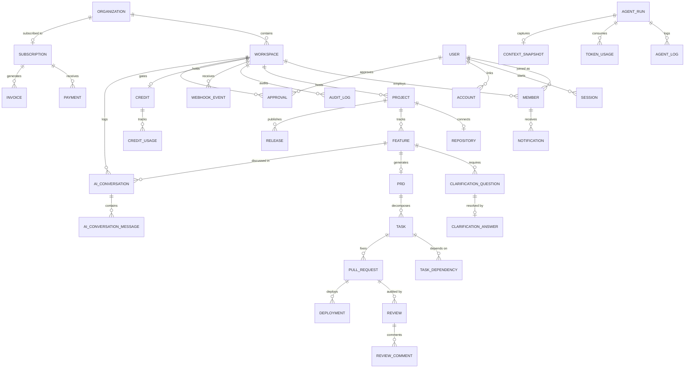

# ShipFlow AI — Production Database Documentation

**Document Version:** 1.0.0  
**Schema Location:** `packages/db/prisma/schema.prisma`  
**Engine:** PostgreSQL 16+ (Neon / AWS RDS)  
**ORM:** Prisma 5.14+  

---

## Table of Contents
1. [Model Overview](#1-model-overview)
2. [Relationship Explanations](#2-relationship-explanations)
3. [ER Diagram](#3-er-diagram)
4. [Indexing Strategy](#4-indexing-strategy)
5. [Multi-Tenant Strategy](#5-multi-tenant-strategy)
6. [Design Decisions](#6-design-decisions)
7. [Enum Reference](#7-enum-reference)
8. [Future Schema Extensions](#8-future-schema-extensions)

---

## 1 Model Overview

The production schema contains **34 models** and **16 enums** organized into 9 domains.

### Identity & Auth (BetterAuth-compatible)

| Model | Purpose | Relationships |
|:------|:--------|:--------------|
| `User` | Central identity profile | Has many Sessions, Accounts, Memberships, Verifications, ApiKeys, AuditLogs, Approvals |
| `Session` | BetterAuth browser session with expiry | Belongs to User |
| `Account` | OAuth provider link (GitHub, Google) | Belongs to User |
| `Verification` | Email/OTP verification tokens | Optionally belongs to User |
| `ApiKey` | SHA-256 hashed workspace API key | Belongs to Workspace and User |

### Multi-Tenancy (Organization → Workspace → Member)

| Model | Purpose | Relationships |
|:------|:--------|:--------------|
| `Organization` | Top-level billing entity | Has many Workspaces, has one Subscription |
| `Workspace` | Logical tenant isolation unit | Has many Members, Projects, Features, ApiKeys, AuditLogs, WebhookEvents, Approvals, AIConversations, MonthlyUsages, Invitations; has one Credit |
| `Member` | Workspace membership with RBAC role | Belongs to Workspace and User; has many Notifications; has one NotificationPreference |
| `WorkspaceInvitation` | Pending invitation with token + expiry | Belongs to Workspace |

### Git Integration

| Model | Purpose | Relationships |
|:------|:--------|:--------------|
| `GitHubInstallation` | GitHub App installation record | Linked to Workspace via `workspaceId` |
| `Repository` | Connected code repository config | Belongs to Project; has many Branches, PullRequests |
| `Branch` | Git branch tracking | Belongs to Repository; has many Commits, Tasks |
| `Commit` | Immutable commit record | Belongs to Branch |

### Projects & Features

| Model | Purpose | Relationships |
|:------|:--------|:--------------|
| `Project` | Groups repository with features and releases | Belongs to Workspace; has one Repository; has many Features, Releases |
| `Feature` | High-level feature request with lifecycle status | Belongs to Workspace and Project; has many ClarificationQuestions, AgentRuns, AIConversations; has one PRD |
| `ClarificationQuestion` | AI-generated question to resolve ambiguity | Belongs to Feature; has one ClarificationAnswer |
| `ClarificationAnswer` | Developer/PM answer to question | Belongs to ClarificationQuestion |

### Product (PRD → Task → TaskDependency)

| Model | Purpose | Relationships |
|:------|:--------|:--------------|
| `PRD` | Product Requirements Document | Belongs to Feature; has many Tasks |
| `Task` | Atomic code task mapped to files | Belongs to PRD; optionally linked to Branch; has many PullRequests, TaskDependencies |
| `TaskDependency` | DAG edge between tasks | References two Tasks |

### Review (PullRequest → Review → ReviewComment)

| Model | Purpose | Relationships |
|:------|:--------|:--------------|
| `PullRequest` | GitHub PR with lifecycle tracking | Belongs to Repository and Task; has many Reviews, Deployments |
| `Review` | AI code review session per commit | Belongs to PullRequest; has many ReviewComments |
| `ReviewComment` | Inline comment on specific file line | Belongs to Review |

### Approval Gates

| Model | Purpose | Relationships |
|:------|:--------|:--------------|
| `Approval` | Audit-grade gate decision record | Belongs to Workspace and User (approver); references target via polymorphic `targetId`/`targetType` |

### Release Management

| Model | Purpose | Relationships |
|:------|:--------|:--------------|
| `Release` | Versioned release with changelog | Belongs to Project |
| `Deployment` | Canary deployment pipeline event | Belongs to PullRequest |

### AI Agent Execution

| Model | Purpose | Relationships |
|:------|:--------|:--------------|
| `AgentRun` | Single agent worker execution | Belongs to Feature; has many AgentLogs, TokenUsages, ContextSnapshots, MemoryReferences, AgentRetries |
| `AgentLog` | Structured log line per agent step | Belongs to AgentRun |
| `ContextSnapshot` | Full prompt context capture (1:1) | Belongs to AgentRun |
| `MemoryReference` | Vector DB reference for RAG | Belongs to AgentRun |
| `TokenUsage` | LLM token consumption per call | Belongs to Workspace and AgentRun |
| `AgentRetry` | Retry error record | Belongs to AgentRun |
| `PromptVersion` | Versioned prompt template for A/B testing | Standalone |

### AI Conversation Memory

| Model | Purpose | Relationships |
|:------|:--------|:--------------|
| `AIConversation` | Multi-turn chat thread for memory hydration | Belongs to Workspace; optionally linked to Feature; has many AIConversationMessages |
| `AIConversationMessage` | Single message in conversation | Belongs to AIConversation |

### Billing, Payments & Credits

| Model | Purpose | Relationships |
|:------|:--------|:--------------|
| `Subscription` | Razorpay-backed org subscription | Belongs to Organization; has many Payments, Invoices |
| `Payment` | Payment transaction record | Belongs to Subscription |
| `Invoice` | Invoice PDF record | Belongs to Subscription |
| `Credit` | Token credit balance | Belongs to Workspace; has many CreditUsages |
| `CreditUsage` | Individual credit deduction event | Belongs to Credit |
| `MonthlyUsage` | Monthly token + compute caps | Belongs to Workspace |

### Notifications

| Model | Purpose | Relationships |
|:------|:--------|:--------------|
| `Notification` | In-app alert delivered to member | Belongs to Member |
| `NotificationPreference` | Per-member channel preferences | Belongs to Member |

### Security & Observability

| Model | Purpose | Relationships |
|:------|:--------|:--------------|
| `WebhookEvent` | Inbound webhook payload log | Belongs to Workspace |
| `AuditLog` | Immutable write-once audit trail | Belongs to Workspace and User (actor) |

---

## 2 Relationship Explanations

### Tenant Hierarchy
```
Organization (1) → (N) Workspace (1) → (N) Member (N) ← (1) User
                                     → (N) Project (1) → (1) Repository
```

Every customer-facing entity descends from `Workspace`, which is the tenant isolation key. The `Organization` exists above workspaces as the billing entity.

### Feature Lifecycle Chain
```
Feature (1) → (N) ClarificationQuestion (1) → (0..1) ClarificationAnswer
Feature (1) → (0..1) PRD (1) → (N) Task (1) → (N) PullRequest
PullRequest (1) → (N) Review (1) → (N) ReviewComment
```

This chain represents the full feature-to-code pipeline. Each feature moves through clarification → PRD → tasks → pull requests → reviews.

### Approval Gates (Polymorphic)
```
Approval.targetType = "PRD"         → references PRD.id
Approval.targetType = "PullRequest" → references PullRequest.id
Approval.targetType = "Release"     → references Release.id
```

The `Approval` model uses a polymorphic pattern (`targetId` + `targetType`) to record decisions across the 3 Human-in-the-Loop gates defined in the architecture (§16).

### AI Execution vs. AI Conversation
```
AgentRun (1) → (N) AgentLog       ← Execution trace (what the agent did)
AIConversation (1) → (N) Message  ← Chat history (what was said)
```

These are intentionally separated: `AgentRun`/`AgentLog` track execution metadata (duration, cost, errors, retries), while `AIConversation`/`AIConversationMessage` store the actual multi-turn prompt/response text used for memory hydration.

---

## 3 ER Diagram



---

## 4 Indexing Strategy

### Design Principles

1. **Foreign key indexes**: Every `@relation` field has a corresponding `@@index` to prevent full table scans on joins.
2. **Composite indexes for filtered feeds**: Common query patterns like "features in workspace X with status Y" use composite indexes (`@@index([workspaceId, status])`).
3. **Chronological composite indexes**: High-growth tables use `@@index([parentId, createdAt])` for paginated feed queries (e.g., `AuditLog`, `AgentLog`, `Notification`, `CreditUsage`).
4. **Unique constraints as business rules**: Composite `@@unique` constraints enforce domain invariants (e.g., one member per user per workspace, one branch name per repository).

### Index Summary

| Model | Indexes | Rationale |
|:------|:--------|:----------|
| `User` | `email` (unique) | Login lookups |
| `Session` | `userId`, `expiresAt` | Auth checks, cleanup |
| `Account` | `userId`, `[provider, providerId]` (unique) | OAuth lookups |
| `Workspace` | `organizationId`, `slug` (unique) | Tenant routing |
| `Member` | `[workspaceId, userId]` (unique), `workspaceId`, `userId`, `role` | Permission checks |
| `Feature` | `workspaceId`, `projectId`, `status`, `[workspaceId, status]` | Dashboard feeds, filtered lists |
| `Task` | `prdId`, `status`, `[prdId, orderIndex]` | Ordered task lists |
| `PullRequest` | `[repositoryId, number]` (unique), `taskId`, `status` | PR lookups |
| `Review` | `pullRequestId`, `status` | Review feeds |
| `Approval` | `workspaceId`, `[targetId, targetType]`, `approverId`, `[workspaceId, createdAt]` | Gate lookups, audit feeds |
| `AIConversation` | `workspaceId`, `featureId`, `[workspaceId, agentType]` | Memory retrieval |
| `AIConversationMessage` | `conversationId`, `[conversationId, createdAt]` | Chronological message loading |
| `AuditLog` | `workspaceId`, `actorId`, `[workspaceId, createdAt]`, `action` | Compliance feeds |
| `WebhookEvent` | `workspaceId`, `[provider, event]`, `processed` | Event processing queues |
| `TokenUsage` | `workspaceId`, `agentRunId`, `[workspaceId, modelName]` | Cost analytics |
| `AgentLog` | `agentRunId`, `[agentRunId, createdAt]` | Execution trace feeds |

---

## 5 Multi-Tenant Strategy

### Architecture: Shared Database, Logical Isolation

ShipFlow uses a **shared-database, shared-schema** multi-tenant model. All tenants share the same PostgreSQL database and tables, with row-level isolation enforced through `workspaceId` foreign keys.

```
Request → tRPC Middleware → Extract workspaceId from session
                          → Inject WHERE workspaceId = ? into all Prisma queries
```

### Isolation Rules

1. **Every tenant-scoped entity** carries a `workspaceId` column (or descends from one that does).
2. **tRPC workspace middleware** validates that the requesting user holds an active `Member` record in the target workspace before allowing any query.
3. **Composite unique constraints** prevent cross-tenant collisions (e.g., `@@unique([workspaceId, email])` on `WorkspaceInvitation`).

### Tenant Hierarchy

| Level | Entity | Isolation Scope |
|:------|:-------|:----------------|
| L0 | `User` | Global (not tenant-scoped) |
| L1 | `Organization` | Billing boundary |
| L2 | `Workspace` | **Primary tenant key** — all data isolation happens here |
| L3 | `Project` → `Feature` → `Task` → `PullRequest` | Inherits workspace isolation via foreign key chain |

### Models Without Direct `workspaceId`

Some models don't have a direct `workspaceId` but are still workspace-isolated through their parent chain:

- `ClarificationQuestion` → via `Feature.workspaceId`
- `PRD` → via `Feature.workspaceId`
- `Task` → via `PRD` → `Feature.workspaceId`
- `PullRequest` → via `Task` → `PRD` → `Feature.workspaceId`
- `Review`/`ReviewComment` → via `PullRequest` chain
- `Branch`/`Commit` → via `Repository` → `Project.workspaceId`

---

## 6 Design Decisions

### 1. BetterAuth Preparation

The `User`, `Session`, `Account`, and `Verification` models match BetterAuth's expected schema structure. Fields use the same names and types that BetterAuth expects (`token`, `expiresAt`, `provider`, `providerId`, `accessToken`, `refreshToken`, `idToken`). BetterAuth can be integrated in a future milestone without schema changes.

### 2. Polymorphic Approval Model

The `Approval` model uses `targetId` + `targetType` instead of separate foreign keys for each approvable entity. This was chosen because:
- The architecture defines 3 distinct approval gates (PRD, PR Merge, Release) that share identical fields
- A polymorphic pattern avoids 3 redundant tables with identical structures
- The `@@index([targetId, targetType])` composite index ensures fast lookups

### 3. AIConversation Separated from AgentRun

`AIConversation` is intentionally separate from `AgentRun`/`AgentLog` because:
- **AgentRun** tracks execution metadata: duration, cost, errors, retries, context snapshots
- **AIConversation** stores the actual multi-turn text content used for LLM memory hydration
- The architecture (§12) explicitly separates "Conversation Memory" (PostgreSQL) from "Short-Term Execution Memory" (Redis)

### 4. Soft Deletes via `deletedAt`

Only entities that users might want to recover use `deletedAt` (nullable `DateTime`): `User`, `Organization`, `Workspace`, `Member`, `Project`, `Feature`. Infrastructure models (logs, events, commits) do not use soft deletes — they are either immutable or cascading-deleted with their parent.

### 5. Cascading Deletes

Cascade rules follow the tenant hierarchy: deleting an Organization cascades to Workspaces → Members → Projects → Features → Tasks → PullRequests → Reviews → ReviewComments. This ensures no orphaned records remain when a tenant is removed.

### 6. UUID Primary Keys

All models use `@default(uuid()) @db.Uuid` for primary keys. This prevents enumeration attacks, supports distributed ID generation, and aligns with BetterAuth's expected ID format.

---

## 7 Enum Reference

| Enum | Values | Used By |
|:-----|:-------|:--------|
| `UserRole` | OWNER, ADMIN, PM, DEVELOPER, REVIEWER, VIEWER | `Member.role`, `WorkspaceInvitation.role` |
| `FeatureStatus` | DRAFT → CLARIFYING → READY_FOR_PRD → PRD_GENERATED → PRD_APPROVED → TASKS_CREATED → IN_PROGRESS → PR_OPEN → AI_REVIEWING → FIX_REQUIRED → RE_REVIEWING → READY_FOR_APPROVAL → APPROVED → SHIPPED, ARCHIVED | `Feature.status` |
| `TaskStatus` | TODO, IN_PROGRESS, DONE | `Task.status` |
| `PRStatus` | DRAFT, OPEN, CHANGES_REQUESTED, APPROVED, MERGED, CLOSED | `PullRequest.status` |
| `ReviewStatus` | PENDING, COMMENTED, CHANGES_REQUESTED, APPROVED | `Review.status` |
| `ReleaseStatus` | DRAFT, PUBLISHED, RETRACTED | `Release.status` |
| `DeploymentStatus` | QUEUED, BUILDING, SMOKE_TESTING, CANARY_ACTIVE, PROMOTED, FAILED, ROLLED_BACK | `Deployment.status` |
| `NotificationType` | SYSTEM, FEATURE_STATUS_CHANGED, PRD_APPROVAL_REQUIRED, TASK_ASSIGNED, PR_REVIEW_COMPLETED, RELEASE_SUCCESS, BILLING_ALERT | `Notification.type` |
| `AgentType` | SUPERVISOR, CLARIFICATION, PRD_GENERATOR, TASK_GENERATOR, REPO_ANALYZER, CODE_GENERATOR, PR_REVIEWER, QA_VALIDATOR, RELEASE_MANAGER | `AgentRun.agentType`, `AIConversation.agentType`, `PromptVersion.agentType` |
| `AgentStatus` | QUEUED, RUNNING, PAUSED_FOR_APPROVAL, SUCCESS, FAILED, TIMEOUT | `AgentRun.status` |
| `BillingPlan` | FREE, STARTER, BUSINESS, ENTERPRISE | `Subscription.plan` |
| `SubscriptionStatus` | ACTIVE, PAST_DUE, CANCELED, UNPAID | `Subscription.status` |
| `GitProvider` | GITHUB, GITLAB | `Repository.provider` |
| `RepositoryVisibility` | PUBLIC, PRIVATE | `Repository.visibility` |
| `ApprovalType` | PRD_APPROVAL, PR_MERGE_APPROVAL, RELEASE_APPROVAL | `Approval.type` |
| `ApprovalDecision` | APPROVED, REJECTED | `Approval.decision` |

---

## 8 Future Schema Extensions

### TaskComment (Intentionally Deferred)

The user's requirements list included a `TaskComment` model for threaded discussion on engineering tasks. After thorough review, this model was **intentionally deferred** from this milestone because:

1. **Not in the approved architecture.** Neither `docs/architecture.md` nor `docs/database-architecture.md` define a TaskComment entity. The architecture's ER diagram (§3) does not include it, and the database-architecture entity list (§1) does not mention it.

2. **Not modeled elsewhere.** Task discussion is not represented by any existing model. The `ReviewComment` model handles PR-level inline code comments, but no model exists for general task-level discussion threads.

3. **UI does not reference it.** The `<TaskCard>` component (architecture.md §6) displays "impact level, affected files, estimated development tokens" — no comment or discussion functionality is described. The `<KanbanBoard>` only handles drag-and-drop status changes.

4. **Potential future value.** A `TaskComment` model would be useful for collaboration features where developers and AI agents can discuss implementation details on individual tasks. If the architecture is updated to include task-level discussion, this model should be added with the following suggested structure:

```prisma
model TaskComment {
  id        String   @id @default(uuid()) @db.Uuid
  taskId    String   @db.Uuid
  authorId  String?  @db.Uuid
  content   String   @db.Text
  isAI      Boolean  @default(false)
  createdAt DateTime @default(now())
  updatedAt DateTime @updatedAt

  task   Task  @relation(fields: [taskId], references: [id], onDelete: Cascade)
  author User? @relation(fields: [authorId], references: [id], onDelete: SetNull)

  @@index([taskId])
  @@index([taskId, createdAt])
}
```

**Action required:** Update `docs/architecture.md` Section 3 ER diagram and entity list to include TaskComment before implementing it in the schema.
