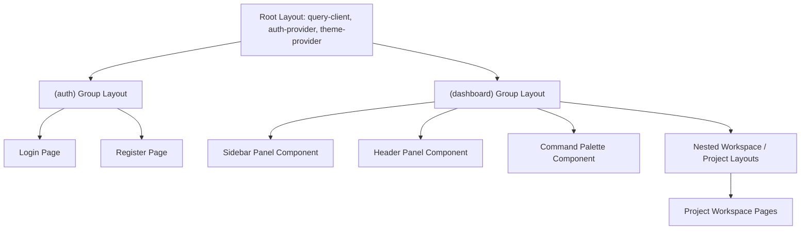
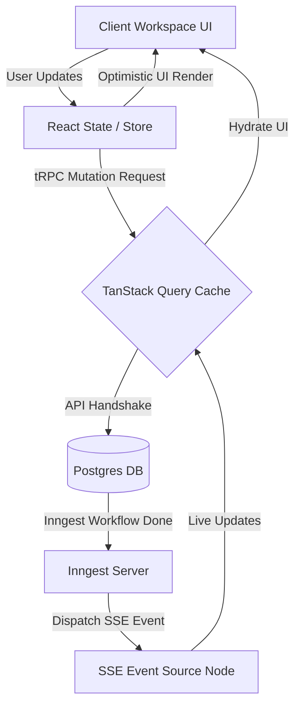
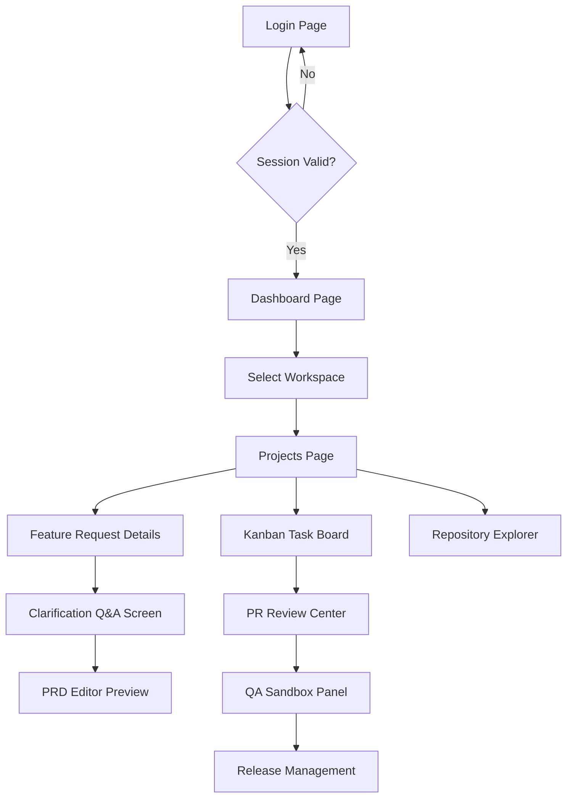
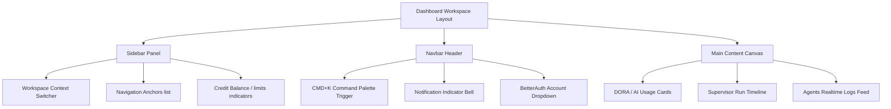
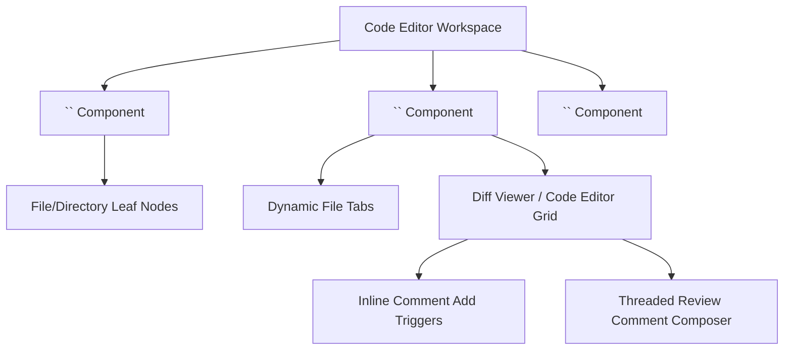
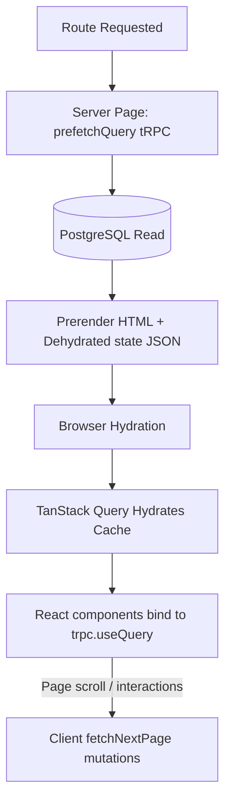
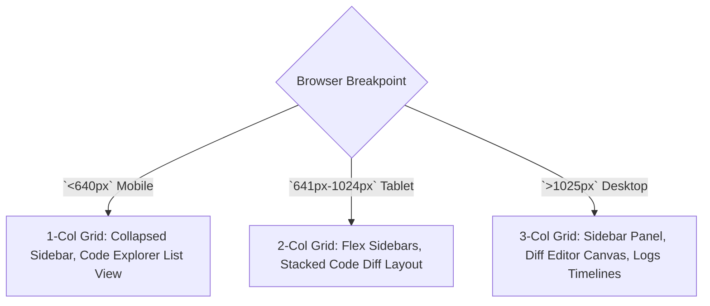
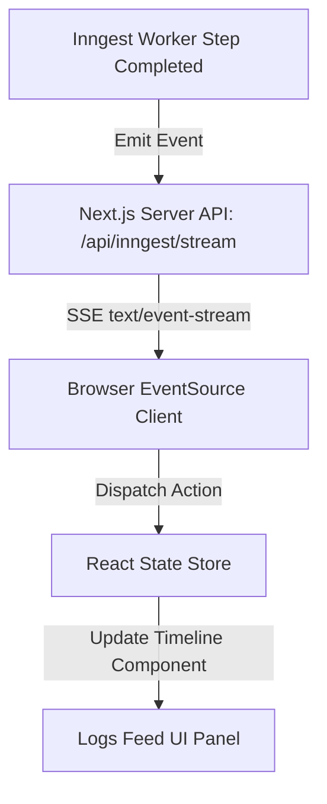

# ShipFlow AI — Frontend & UI/UX Architecture

**Document Version:** 1.0.0  
**Author:** Principal Frontend Architect & Staff UX Engineer  
**Status:** Approved for Implementation  
**Dependency Baselines:** `architecture.md`, `database-architecture.md`, `ai-agent-architecture.md`  

---

## Table of Contents
1. [Application Architecture](#1-application-architecture)
2. [Complete Route Map](#2-complete-route-map)
3. [Dashboard Design](#3-dashboard-design)
4. [Component Architecture](#4-component-architecture)
5. [Feature Flow Screens](#5-feature-flow-screens)
6. [State Management](#6-state-management)
7. [Data Fetching Strategy](#7-data-fetching-strategy)
8. [Design System](#8-design-system)
9. [Responsive Strategy](#9-responsive-strategy)
10. [Accessibility (a11y)](#10-accessibility-a11y)
11. [Animation System](#11-animation-system)
12. [Loading UX](#12-loading-ux)
13. [Error UX](#13-error-ux)
14. [Notification UX](#14-notification-ux)
15. [Mermaid Diagrams Catalog](#15-mermaid-diagrams-catalog)

---

## 1 Application Architecture

ShipFlow AI leverages **Next.js 15 App Router** and **React 19** to deliver server-side layouts alongside reactive, client-side workspaces.

### App Layout Topology



### Next.js 15 Core Building Blocks

1. **Route Groups:** 
   * `(auth)`: Centers screen modules for authentication paths without impacting URL segment directories.
   * `(dashboard)`: Shares persistent sidebar and header states, active workspace selections, and Command Palette contexts.
   * `(onboarding)`: Guides initial repository connections and billing setup.
2. **Server-Side Rendering (RSC) vs Client Components (RCC):**
   * **RSC (Server-First):** Layout wrappers, metadata definitions, initial DB queries, and Static/Dynamic pages caching.
   * **RCC (Client-Side Interaction):** Kanban task dragging grids, realtime Agent execution logs stream containers, interactive code diff blocks, and Razorpay checkout frames.
3. **Suspense & Streaming:** Next.js 15 streams HTML segments from server to browser, resolving components concurrently. Skeleton loaders prevent content layout shifts.
4. **Partial Prerendering (PPR):** Static UI layouts (navigation sidebars, headers) render instantly from Vercel Edge networks while dynamic data panels (active task counts, credit balances) stream concurrently as database calls complete.

---

## 2 Complete Route Map

Every page maps path patterns to roles and component structures.

| URL Route | Access Level | Primary Components | API Integrations | Target Navigation |
| :--- | :--- | :--- | :--- | :--- |
| `/` | Public | `<LandingHero>`, `<FeaturesGrid>` | None | Directs to `/login` or `/dashboard` |
| `/login` | Public | `<AuthCard>`, `<BetterAuthForm>` | BetterAuth login endpoints | `/dashboard` on success |
| `/dashboard` | Protected (Viewer+) | `<WorkspaceGrid>`, `<ActivityTimeline>` | `workspace.list`, `dashboard.getStats` | Link `/projects/[projectId]` |
| `/projects/[id]` | Protected (Viewer+) | `<ProjectHeader>`, `<FeatureList>` | `project.getById`, `feature.list` | `/features/[featureId]` |
| `/projects/[id]/features/[featId]` | Protected (Viewer+) | `<ClarificationDialog>`, `<PRDViewer>` | `prd.getForFeature`, `feature.getById`| Dynamic state routing |
| `/projects/[id]/board` | Protected (Developer+) | `<KanbanBoard>`, `<TaskCard>` | `task.listForProject`, `task.updateStatus` | Dynamic details sheet |
| `/projects/[id]/explorer` | Protected (Developer+) | `<FileTreeViewer>`, `<CodeSandbox>` | `github.getRepoStructure` | Code editor views |
| `/projects/[id]/review/[prId]` | Protected (Reviewer+) | `<DiffViewer>`, `<ReviewCommentsList>` | `review.getComments`, `review.post` | GitHub branch comparisons |
| `/projects/[id]/qa` | Protected (Developer+) | `<ConsoleLogs>`, `<TestRunner>` | `review.retriggerReview` | Inline debug grids |
| `/projects/[id]/releases` | Protected (PM+) | `<ReleasesTimeline>`, `<ChangelogEditor>`| `release.generateNotes`, `release.publish`| Deploy progress indicators |
| `/billing` | Workspace Admin | `<PricingGrid>`, `<InvoiceList>` | `billing.createSub`, `billing.verify` | Razorpay modal overlays |
| `/settings` | Workspace Admin | `<ConfigForm>`, `<MemberInvitesGrid>` | `workspace.invite`, `workspace.delete` | Workspace administration pages |

---

## 3 Dashboard Design

The dashboard provides real-time progress indicators for workspace projects and agent activities.

### Layout Blueprint

```
┌────────────────────────────────────────────────────────────────────────┐
│ Workspace Switcher  │  Navbar [Search Features (Cmd+K) | Notif Bell]   │
├─────────────────────┼──────────────────────────────────────────────────┤
│ - Projects          │  Active Features Grid    │ Agent Activity Feed   │
│ - Tasks Board       │  [Card 1] [Card 2]       │ [Supervisor: Running] │
│ - Repositories      ├──────────────────────────┤ - Code Gen: Pushing   │
│ - Billing           │  AI Token Cost Widget    │ - PR Reviewer: Fail   │
│ - Settings          │  [Chart Panel]           │                       │
└─────────────────────┴──────────────────────────┴───────────────────────┘
```

* **Agent Activity Feed:** Lists Inngest-driven run events, logs, and token expenditures using live server updates.
* **Execution Timeline:** Displays structural milestones (e.g. *Tasks Decomposed -> Branch Opened -> PR Review Completed -> Smoke Tests Passed*).
* **AI Cost Widget:** Connects database usage analytics to SVG chart components.
* **Command Palette Integration:** Registers global keys handlers `CMD+K`/`CTRL+K` to search workspaces, features, and active settings directories.

---

## 4 Component Architecture

Atomic React 19 visual units are mapped with explicit styling and interactions.

* **`<FileTreeViewer>`:** Displays nested code repository hierarchies. Intercepts clicks to fetch source codes.
* **`<CodeDiffViewer>`:** Renders git diff blocks with syntax highlighting and inline comment boxes.
* **`<KanbanBoard>`:** Provides drag-and-drop task columns (`TODO`, `IN_PROGRESS`, `DONE`) utilizing optimistic client updates.
* **`<RealtimeTerminal>`:** Displays sandbox tests executions logs with dynamic autoscroll containers.
* **`<ClarificationChat>`:** Dedicated Q&A card rendering markdown responses and input forms.
* **`<MarkdownEditor>`:** Collaborative requirements editor supporting synchronous previews.

---

## 5 Feature Flow Screens

Screens are mapped to progression stages, requiring human sign-offs to advance changes.

### UI Progression State Mapping

```mermaid
graph LR
    Req["1. Submission Screen"] --> Clar["2. Q&A Dialog Screen"]
    Clar --> PRD["3. PRD Preview Screen"]
    PRD -->|Gate 1: PM Sign-off| Tasks["4. Tasks Board Screen"]
    Tasks --> Code["5. Agent Console / Editor"]
    Code --> Rev["6. Diff Reviews Screen"]
    Rev -->|Gate 2: Dev Merge Sign-off| QA["7. Sandbox Shell Console"]
    QA --> Rel["8. Release Pipeline Screen"]
    Rel -->|Gate 3: Deploy Sign-off| Ship["9. Live Site Analytics"]
```



1. **Submission Screen:** Text areas parsing feature descriptions.
2. **Q&A Dialog Screen:** Interactive Q&A card displays questions from the Clarification Agent.
3. **PRD Preview Screen:** Displays generated requirements, prompting PM approval.
4. **Tasks Board Screen:** Kanban board displaying file-level coding tasks.
5. **Agent Console:** Real-time log monitor displaying file editing and terminal build tasks.
6. **Diff Reviews Screen:** Side-by-side diff viewers with inline comment boxes.
7. **Sandbox Shell Console:** Real-time console logs from test runners.
8. **Release Pipeline Screen:** Release changelog compiler. Contains deployment controls and rolling alerts.

---

## 6 State Management

ShipFlow AI divides states between server-side caching and client-side workspace states.

### State Synchronization Flow



* **Server State (TanStack Query):** Caches, refetches, and invalidates API data hooks context. Integrates with tRPC callers.
* **Client State:** Manages dialog visibility, editor cursor locations, and navigation panels.
* **Optimistic Updates:** Task card mutations apply instantly, reverting only if server mutations fail.
* **Realtime Sync:** Uses Server-Sent Events (SSE) to update agent activity feeds and progress bars.

---

## 7 Data Fetching Strategy

Fetching schemas balance initial page load speeds against reactive updates.

* **RSC Prefetching:** Server layouts fetch workspace collections, active project lists, and profiles directly from PostgreSQL. Hydrates client templates via `<HydrateClient>` wrappers.
* **tRPC Dynamic Fetching:** Client components utilize cached React Query hooks for client pagination (e.g. `trpc.workspace.list.useQuery()`).
* **Infinite Scroll Telemetry:** Audit and activity logs retrieve records sequentially using cursor-based keys.
* **Streaming Suspense boundaries:** High-latency layouts load static sections instantly while dynamic panels are streamed inside Suspense envelopes.

---

## 8 Design System

Consistent styling variables verify WCAG AA compliance across desktop and mobile devices.

* **Typography:** Enforces Google Fonts Inter for interfaces, and JetBrains Mono for markdown code boxes.
* **Harmonious Color Palette:** Custom CSS Tailwind colors.
  ```css
  --background: 224 71% 4%;
  --foreground: 213 31% 91%;
  --primary: 263.4 70% 50.4%; /* Modern Indigo accent */
  ```
* **Spacers & Grid layouts:** Tailwind 4px grids (`gap-4`, `p-6`) ensure consistent alignments.
* **Accessibility:** Native ARIA labels and clean color contrast check-outs.
* **Responsive breakpoints:** Standard flex wraps and grids for screen dimensions between 320px to 1920px.
* **Animations:** Subtle transition rules (`transition-all duration-200`) prevent layout shift glitches.

---

## 9 Responsive Strategy

Viewport designs resize grid components dynamically across screen sizes.

* **Mobile (320px - 640px):** Single-column layout. The sidebar collapses into a drawer, and code views switch to file lists.
* **Tablet (641px - 1024px):** Dual-column layout. Code diff structures switch to stack grids.
* **Desktop & Laptop (1025px - 1440px):** Standard dashboard layout. Persistent sidebars, active workspaces grid, and code view panes are fully active.
* **Ultra Wide (1440px+):** Three-column layout. Displays code editors, task boards, and active terminal logs concurrently.

---

## 10 Accessibility (a11y)

ShipFlow UI components conform strictly to WCAG AA guidelines.

* **Keyboard Navigation:** Command Dialogs, Workspace Selectors, and Nav Link elements support complete focus control using Arrow, Tab, and Enter keys.
* **Focus Management:** Modal components trap keyboard focus, restoring it to the trigger element when closed.
* **ARIA Constraints:** Dialog components implement native roles (`role="dialog"`, `aria-modal="true"`, `aria-describedby`).
* **Reduced Motion:** Tailwind utilities disable animations if clients request reduced motion settings.
* **Color Contrast:** Text values maintain a minimum contrast ratio of 4.5:1 against adjacent panels backgrounds.

---

## 11 Animation System

Framer Motion animations provide fluid transitions between agent states.

* **Page Transitions:** Page changes slide horizontally to maintain workflow direction:
  ```typescript
  export const pageTransition = {
    initial: { opacity: 0, x: -10 },
    animate: { opacity: 1, x: 0 },
    exit: { opacity: 0, x: 10 }
  };
  ```
* **AI Streaming Text:** Chat and requirements elements fade in dynamically to mimic typing layouts.
* **Kanban Drags:** Framer Motion’s layout animations guide task card moves.
* **Alert Notifications:** Toast notifications slide in from screen borders.

---

## 12 Loading UX

Dynamic loading states prevent layouts from shifts during data retrievals.

* **Skeleton Elements:** Navigation hubs and metrics grids display structural loaders to prevent layouts from shifts during initial database loads.
* **Agent Log Steppers:** Activity timelines show current workers states alongside progress loaders, giving users clear visibility into long-running tasks.
* **SSE Progress Bars:** Real-time progress bars update dynamically on incoming Server-Sent Events (SSE).

---

## 13 Error UX

Clean layouts prevent workspace users from encountering unhandled errors.

* **Route Error Boundaries:** Adjacent `error.tsx` layouts intercept database failures or unauthorized requests, keeping dashboard navigation headers operational.
* **Offline Alert Panels:** If browser connectivity drops, a global floating card prompts users while caching mutations.
* **AI & API Failure Recovery:** Displays retry buttons to retrigger workflows and dispatches diagnostic details to active developer channels.

---

## 14 Notification UX

Alert priorities partition messaging queues to prevent developer fatigue.

* **Toasts (Low Priority):** Floating status cards displaying quick alerts (e.g. *Task Assigned, Repository Connected*).
* **Inbox Notifications (Medium Priority):** Dropdown list showing PR comments and review status changes.
* **Execution Logs (High Priority):** Activity timelines showing real-time agent execution milestones.
* **Administrative Alerts:** Dialog overlays tracking payment failures or credit balance alerts.

---

## 15 Mermaid Diagrams Catalog

### 15.1 Application Layout Architecture
*(Detailed routing layouts mapping layouts configurations across App Router groups)*
See [1. Application Architecture](#1-application-architecture)

### 15.2 Navigation Flow Chart
*(Explains developer, PM routing pathways across authentication, workspaces, and code workspaces)*



### 15.3 Dashboard Components Hierarchy
*(Detailed hierarchy mapping sidebar headers, activity elements, and metrics components)*



### 15.4 Client Component Tree (Code Workspace)
*(Composition diagram mapping React component trees for file navigations and reviews)*



### 15.5 State Management & Caching Pipeline
*(Visual data maps detailing client, server, and Inngest SSE configurations)*
See [6. State Management](#6-state-management)

### 15.6 Data Fetching Hydration Cycle
*(Displays RSC loading paths, prefetching, and query bindings)*



### 15.7 Feature Lifecycle UI Flow
*(Visual navigation graph detailing UI stages from feature submission to release)*
See [5. Feature Flow Screens](#5-feature-flow-screens)

### 15.8 Responsive Layout Resizing
*(Displays layout alterations across target breakpoints)*



### 15.9 Realtime Event Flow (SSE Pipeline)
*(Displays events dispatched from Inngest and rendered inside logs dashboards)*


