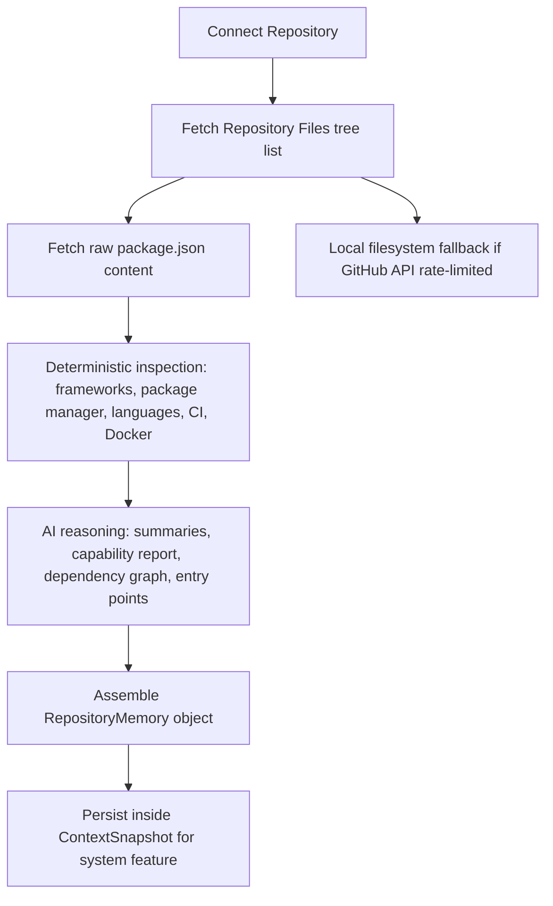
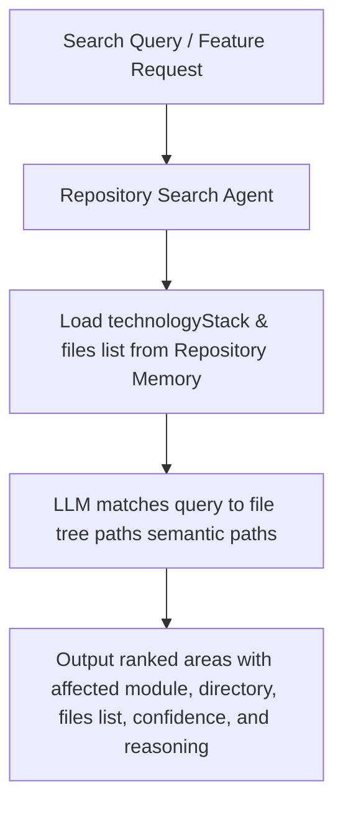

# ShipFlow AI — GitHub Intelligence Engine

The GitHub Intelligence Engine provides deep, module-level understanding of connected repositories. It indexes repository layouts, detects technologies deterministically, deduces module-level dependencies, maps directories and entry points, and provides semantic relevance ranking of repository files against feature requests.

---

## Technical Architecture

The repository analysis utilizes a **hybrid pipeline** to ensure reliability and speed:

1. **Deterministic Inspection (Static Analysis)**:
   - Evaluates the repository files tree paths and downloads *only* `package.json` to detect active frameworks, package managers, languages, docker setups, CI configurations, and deployment setups. No AI is used in this stage.
2. **AI-Based Reasoning (Semantic Summarization)**:
   - Combines deterministic inspection results with the file list tree to compile summaries, detect logical modules, map directory purposes, assess architectures, identify entry points, build dependency graphs, and draft capability reports.

---

## Persistent Repository Memory

The result of the analysis is written into the `ContextSnapshot` associated with a system feature (`"System: Repository Intelligence"`) to satisfy database foreign keys without modifying the read-only Prisma schema.

### Memory Snapshot Payload (`RepositoryMemory`)

* **`technologyStack`**: Framework, package manager, languages, CI provider, Docker support, deployment platform, and configuration files.
* **`detectedModules`**: Logical module groupings.
* **`directoryMap`**: Folder-to-purpose mapping.
* **`repositoryCapabilities`**: What is supported vs. missing.
* **`importantEntryPoints`**: Main bootstrap files.
* **`repositoryHealthMetrics`**: Measurable file counts, TypeScript coverage, test coverage, outdated dependencies estimation, lint errors, documentation score.
* **`dependencyGraph`**: Module-level dependency edges (e.g. `packages/web → packages/api`).
* **`majorEntryPoints`**: Specified entry files (Frontend, Backend, Middleware, API, Database layers).

---

## Semantic File Ranking (RepositorySearch)

Accepts a feature request or semantic search query and returns the relevant files. Future AI agents (Planning, Code Generation) reuse this mapping instead of performing redundant codebase tree scans.

---

## API Layer

Exposed under the tRPC `github` router:

* **`connectRepository`** (Mutation): Upserts repository database row.
* **`analyzeRepository`** (Mutation): Triggers the hybrid analysis pipeline.
* **`getRepositorySummary`** (Query): Loads summary.
* **`getTechnologyStack`** (Query): Loads technology stack.
* **`getRepositoryHealth`** (Query): Loads health metrics.
* **`searchRelevantAreas`** (Query): Runs semantic file relevance ranking.

---

## Future Review Agent Integration

When code review is introduced in future milestones, the Review Agent will:
1. Load the `RepositoryMemory` and `dependencyGraph` from `ContextSnapshot` to understand the workspace boundaries.
2. Intercept pull request files and map them to their corresponding `detectedModules`.
3. Assess structural impact by tracing upstream dependencies through the `dependencyGraph` (e.g., if `packages/db` changes, review both `packages/api` and `apps/web` components).
