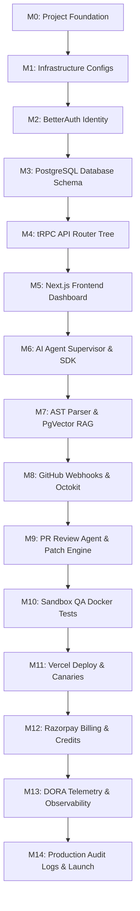
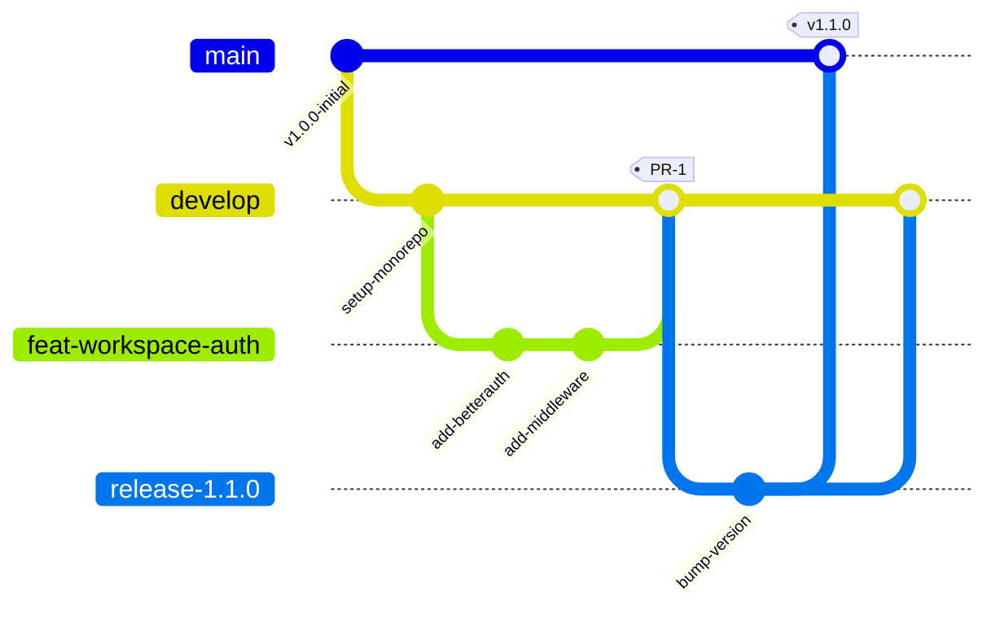
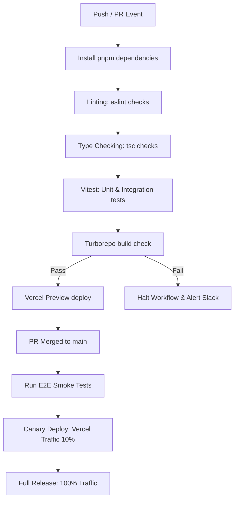
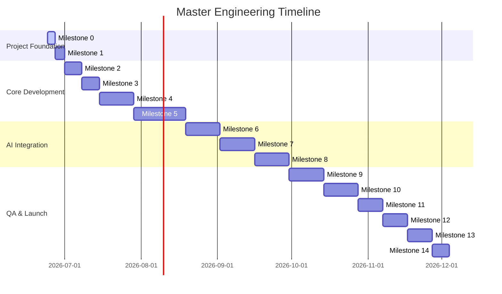
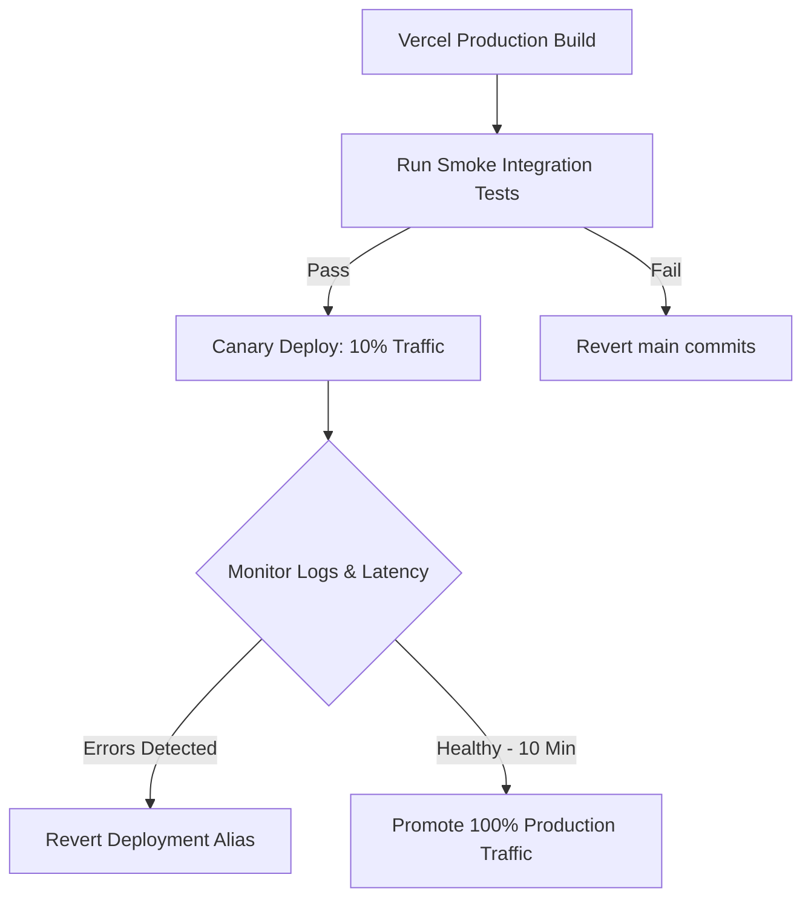
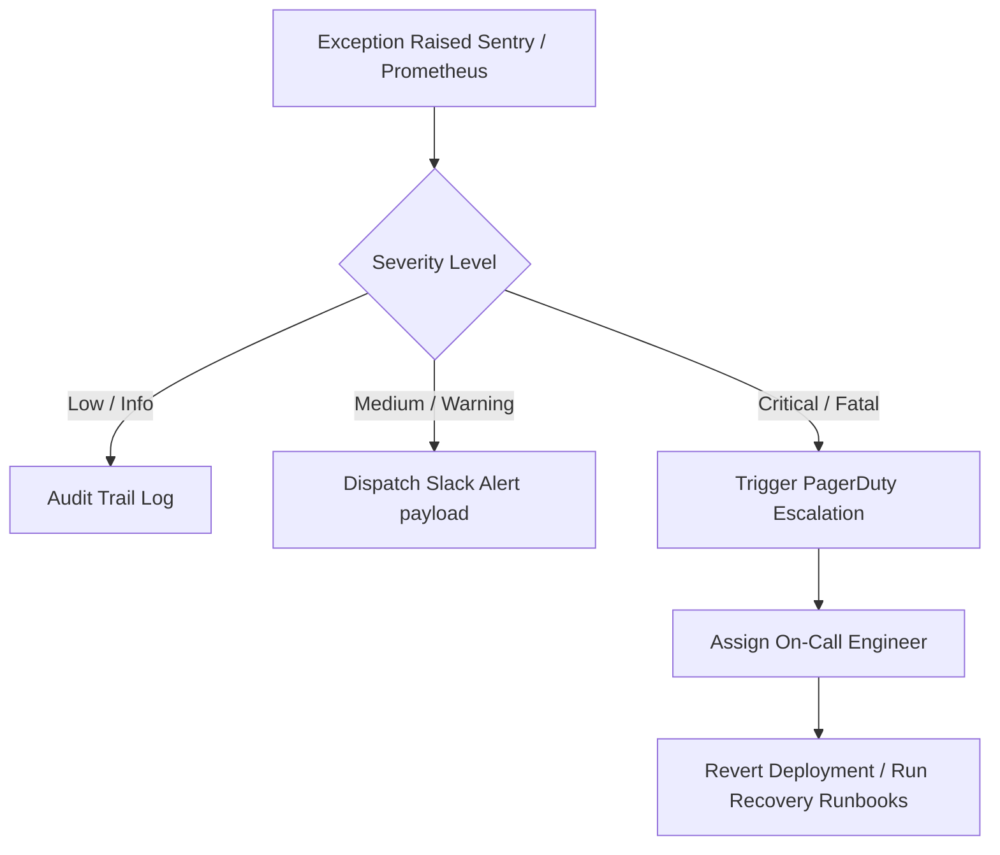

# ShipFlow AI — Engineering Execution Plan & Master Implementation Roadmap

**Document Version:** 1.0.0  
**Author:** TPM, DevOps Architect & Staff Engineering Manager  
**Status:** Approved for Core Execution  
**Target Duration:** 12 Sprints (24 Weeks)  
**Execution Team Size:** 6 Senior Software Engineers + AI Coding Agents  

---

## Table of Contents
1. [Executive Overview](#1-executive-overview)
2. [Engineering Milestones](#2-engineering-milestones)
3. [Sprint Planning](#3-sprint-planning)
4. [Feature Dependency Graph](#4-feature-dependency-graph)
5. [Module-by-Module Development Plan](#5-module-by-module-development-plan)
6. [Monorepo Development Strategy](#6-monorepo-development-strategy)
7. [Git Strategy](#7-git-strategy)
8. [Coding Standards](#8-coding-standards)
9. [Testing Strategy](#9-testing-strategy)
10. [CI/CD Pipeline](#10-cicd-pipeline)
11. [Development Environments](#11-development-environments)
12. [Observability](#12-observability)
13. [Performance Goals](#13-performance-goals)
14. [Security Checklist](#14-security-checklist)
15. [Production Launch Checklist](#15-production-launch-checklist)
16. [Risk Register](#16-risk-register)
17. [Definition of Done](#17-definition-of-done)
18. [Mermaid Diagrams](#18-mermaid-diagrams)
19. [Final Engineering Timeline](#19-final-engineering-timeline)

---

## 1 Executive Overview

This execution plan serves as the definitive implementation roadmap for **ShipFlow AI**. Our objective is to translate finalized system design requirements into an orderly, sequential build plan.

### Engineering Philosophy
* **Dependency-First Progression:** Base structures (database, schemas, configuration) must be fully established and verified before launching dependent services (tRPC routers, client forms).
* **AI-First Development Workflow:** Development tasks are partitioned to support execution by AI coding agents. Tasks define strict Zod request schema validation bounds, target files, and Vitest testing assertions.
* **Human-in-the-Loop Safeguards:** System progression pauses for human validations during PRD creations, merge checks, and canary rollout stages to verify build quality.

---

## 2 Engineering Milestones

The project is divided into 15 milestones, tracking base configuration to production launch.

### Milestone 0: Project Foundation
* **Purpose:** Setup workspace layout and monorepo compilation rules.
* **Objectives:** Initialize monorepo, pnpm configurations, and shared config packages.
* **Deliverables:** Validated compile configurations (`packages/config`), shared lint parameters, workspace dependencies tree.
* **Dependencies:** None.
* **Complexity:** Low (1-2 days).
* **Exit Criteria:** Run `pnpm build` successfully with empty packages.

### Milestone 1: Infrastructure
* **Purpose:** Provision PostgreSQL databases, Redis nodes, and Inngest clusters.
* **Objectives:** Connect Neon DB instances, PgBouncer poolers, and Docker local containers.
* **Deliverables:** Infrastructure configurations, environment variables template file (`.env.example`).
* **Dependencies:** Milestone 0.
* **Exit Criteria:** Validated query handshakes from local CLI tools to PostgreSQL and Redis.

### Milestone 2: Authentication
* **Purpose:** Build workspace identity and session logic.
* **Objectives:** Integrate BetterAuth providers and setup OAuth logins.
* **Deliverables:** Authentication API endpoint handlers, session validator middleware.
* **Dependencies:** Milestone 1.
* **Exit Criteria:** Pass OAuth authentication flows and successfully retrieve session logs.

### Milestone 3: Database
* **Purpose:** Materialize relational entities and indices.
* **Objectives:** Push the validated Prisma Schema, generate client libraries, and configure pgBouncer credentials.
* **Deliverables:** Generated client ORM library (`packages/db`), schema migrations logs, multi-tenant indices.
* **Dependencies:** Milestone 2.
* **Exit Criteria:** Run Prisma seed script successfully without query errors.

### Milestone 4: Core Backend
* **Purpose:** Setup tRPC routers and services.
* **Objectives:** Establish routers tree, write database repositories, and validation rules.
* **Deliverables:** API route handlers (`/api/trpc`), Zod inputs schemas files, mock repository methods.
* **Dependencies:** Milestone 3.
* **Exit Criteria:** API endpoints return mockup JSON payload responses on client requests.

### Milestone 5: Frontend
* **Purpose:** Build workspace dashboard and forms.
* **Objectives:** Setup dashboard layout, navigation links, and project views.
* **Deliverables:** Sidebar layouts, project boards, collaborative markdown editors, real-time terminals.
* **Dependencies:** Milestone 4.
* **Exit Criteria:** Navigating dashboard views renders responsive layout panels without API crashes.

### Milestone 6: AI Agent Runtime
* **Purpose:** Build prompt templates and model routing.
* **Objectives:** Configure Vercel AI SDK wrappers, model routers, and tool registries.
* **Deliverables:** Prompt libraries, LLM endpoint routes, and tools signatures schemas.
* **Dependencies:** Milestone 5.
* **Exit Criteria:** Run LLM mock requests returning Zod-validated structures.

### Milestone 7: Repository Intelligence
* **Purpose:** Construct code RAG search tools.
* **Objectives:** Build AST parsers, PageRank file analyzers, and PgVector search indexes.
* **Deliverables:** AST extraction scripts, index hooks, PgVector query methods.
* **Dependencies:** Milestone 6.
* **Exit Criteria:** Run similarity query matching vectors against postgres tables.

### Milestone 8: GitHub Automation
* **Purpose:** Link git branching, commits, and PR actions.
* **Objectives:** Configure Octokit wrappers, webhook verification keys, and branch triggers.
* **Deliverables:** Webhook route handler, Octokit actions libraries.
* **Dependencies:** Milestone 7.
* **Exit Criteria:** Verification check passes on raw webhook requests from GitHub.

### Milestone 9: Review Engine
* **Purpose:** Build automated code review reviews.
* **Responsibilities:** Code reviews agent parses diffs, posts review comments.
* **Deliverables:** PR Review Agent prompts, inline comment loops.
* **Dependencies:** Milestone 8.
* **Exit Criteria:** Review comments successfully post to target GitHub pull request threads.

### Milestone 10: QA Automation
* **Purpose:** Sandbox tests validation.
* **Objectives:** Instantiate Docker execution blocks to verify code quality.
* **Deliverables:** Sandboxed test runners, result parsers.
* **Dependencies:** Milestone 9.
* **Exit Criteria:** Returns test success/failure outputs from sandboxed terminal runs.

### Milestone 11: Deployment
* **Purpose:** Build canary deployment paths.
* **Objectives:** Integrate Vercel APIs to promote deployment aliases.
* **Deliverables:** Rollback webhook triggers, canary router configurations.
* **Dependencies:** Milestone 10.
* **Exit Criteria:** Successfully routes 10% of traffic to canary preview slots.

### Milestone 12: Billing
* **Purpose:** Setup SaaS subscription plans.
* **Objectives:** Integrate Razorpay billing checkout sessions and plan limits checks.
* **Deliverables:** Razorpay payments checkout handler, subscription middleware.
* **Dependencies:** Milestone 11.
* **Exit Criteria:** Completes checkout transactions and updates organization subscription flags.

### Milestone 13: Analytics
* **Purpose:** Build performance telemetry dashboards.
* **Objectives:** Index token counts, costs metrics, and DORA tracking parameters.
* **Deliverables:** SVG chart components, analytics query engines.
* **Dependencies:** Milestone 12.
* **Exit Criteria:** Renders token and cost graphs with accurate data.

### Milestone 14: Production Launch
* **Purpose:** Promote to production environments.
* **Objectives:** Audit system security keys, verify RLS database policies, and activate live pipelines.
* **Deliverables:** Verified production URLs, active logs streams, incident runbooks.
* **Dependencies:** Milestone 13.
* **Exit Criteria:** System processes feature request to deploy pipeline in production.

---

## 3 Sprint Planning

The project uses 12 sprints (24 weeks) to guide implementation.

### Sprint 1: Workspace Initialization & Shared Configs
* **Goal:** Initialize monorepo packages.
* **Stories:** Setup workspace files, ESLint configs, pnpm workspaces, and environment templates.
* **Tasks:**
  * Configure `package.json` workspaces.
  * Define ESLint and TypeScript config packages.
  * Setup Tailwind variables mapping.
* **Acceptance Criteria:** `pnpm install && pnpm build` runs successfully.

### Sprint 2: DB Schema & Migrations
* **Goal:** Materialize database entities.
* **Stories:** Configure database client configurations and schema index matrices.
* **Tasks:**
  * Add multi-tenant index schemas to tables.
  * Configure Prisma db configurations.
  * Create db seed configuration files.
* **Acceptance Criteria:** Seeding completes successfully.

### Sprint 3: Authentication & Workspace middleware
* **Goal:** Build workspace identity validation checks.
* **Stories:** Install BetterAuth OAuth login checks and RBAC routers.
* **Tasks:**
  * Configure session cookie options.
  * Build workspace permissions check helpers.
* **Acceptance Criteria:** Validates logins and routes to workspaces.

### Sprint 4: Core Services & tRPC Gateway
* **Goal:** Build core workspace APIs.
* **Stories:** Setup tRPC routers tree and Zod validation layers.
* **Tasks:**
  * Write tRPC router bindings (`workspace`, `project`, `feature`).
  * Implement base business service classes.
* **Acceptance Criteria:** Queries return validated mock JSON structures.

### Sprint 5: Dashboard Layout & Command Palette
* **Goal:** Build main dashboard interface.
* **Stories:** Implement sidebar, headers, and quick-actions menu.
* **Tasks:**
  * Add CMD+K keyboard search palette.
  * Setup workspace toggle dropdown grids.
* **Acceptance Criteria:** Palette opens and allows basic navigation.

### Sprint 6: Inngest Event Engine & Queues
* **Goal:** Connect asynchronous task queues.
* **Stories:** Install Inngest dev tools and setup queues.
* **Tasks:**
  * Build feature execution workflow steps.
  * Configure event catalog metrics indices.
* **Acceptance Criteria:** Events trigger corresponding workflow workers.

### Sprint 7: AI Service & Prompt Templates
* **Goal:** Implement Vercel AI SDK model routing.
* **Stories:** Build prompts and fallback routing rules.
* **Tasks:**
  * Create models selector middleware.
  * Construct validation outputs schema templates.
* **Acceptance Criteria:** Fallback model triggers when main API returns errors.

### Sprint 8: Repository RAG & AST Search
* **Goal:** Index codebases.
* **Stories:** Set up Tree-Sitter parsing scripts and PgVector search indexes.
* **Tasks:**
  * Write logical code chunking scripts.
  * Connect similarity distance match vector functions.
* **Acceptance Criteria:** Similarity queries return matching codebase files.

### Sprint 9: GitHub App Webhooks & Branching
* **Goal:** Connect git automation.
* **Stories:** Set up webhook verification keys and Octokit branch controls.
* **Tasks:**
  * Write webhook HMAC-SHA256 signature verification middleware.
  * Implement branch creation and PR commit scripts.
* **Acceptance Criteria:** Webhook events trigger branch checkouts.

### Sprint 10: PR Review & Auto-Patch Engine
* **Goal:** Automated code review loops.
* **Stories:** Deploy review agents and code patching loops.
* **Tasks:**
  * Write inline PR comment injection scripts.
  * Build auto-patching loop logic.
* **Acceptance Criteria:** Agent comments successfully post to GitHub PRs.

### Sprint 11: QA Test Containers & Deployment
* **Goal:** Build sandboxed test validations.
* **Stories:** Setup test runners inside Docker containers.
* **Tasks:**
  * Configure canary deployment handlers.
  * Implement automated rollback scripts.
* **Acceptance Criteria:** Sandbox tests execute and return code statuses.

### Sprint 12: Billing, Telemetry & Hardening
* **Goal:** Multi-tenant billing and analytics.
* **Stories:** Integrate payments verification steps and metrics widgets.
* **Tasks:**
  * Add Razorpay checkout redirect handlers.
  * Set up OpenTelemetry trace hooks.
* **Acceptance Criteria:** Passes E2E tests, verifying billing loops.

---

## 4 Feature Dependency Graph

Our implementation sequence resolves core packages before coding downstream services.



### Dependency Logic
* **Infrastructure before Schemas:** Prisma needs active connection pools to push tables.
* **tRPC before Dashboards:** Next.js client forms import typescript parameters maps to query APIs.
* **RAG before Code Editing:** Embeddings matching provides target files coordinates context.
* **Canaries before Billing:** SaaS plan tier checks are implemented after deployment paths are validated.

---

## 5 Module-by-Module Development Plan

This section defines implementation parameters for each module.

### 1. Authentication Module
* **Files to Create:** `packages/api/src/routers/auth.ts`, `apps/web/src/app/api/auth/[...betterauth]/route.ts`.
* **Database Tables:** `User`, `Session`, `Account`.
* **Priority:** Critical (Sprint 3).
* **Testing:** E2E logins verification tests.

### 2. Workspace Module
* **Files to Create:** `packages/api/src/routers/workspace.ts`, `packages/services/src/workspace.service.ts`.
* **Database Tables:** `Workspace`, `Member`.
* **Priority:** Critical (Sprint 3).
* **Testing:** Role permission validation tests.

### 3. Repository Module
* **Files to Create:** `packages/github/src/client.ts`, `packages/github/src/webhook.ts`.
* **Database Tables:** `Repository`, `Branch`, `Commit`.
* **Priority:** High (Sprint 9).
* **Testing:** Webhook payload validation checks.

### 4. Feature Request Module
* **Files to Create:** `packages/api/src/routers/feature.ts`, `packages/services/src/feature.service.ts`.
* **Database Tables:** `Feature`, `AgentRun`.
* **Priority:** High (Sprint 4).
* **Testing:** Feature status change checks.

### 5. PRD Module
* **Files to Create:** `packages/api/src/routers/prd.ts`, `packages/services/src/prd.service.ts`.
* **Database Tables:** `PRD`.
* **Priority:** High (Sprint 7).
* **Testing:** PRD format validation checks.

### 6. Code Generation Module
* **Files to Create:** `packages/ai/src/agents/code-gen.ts`, `packages/services/src/code-gen.service.ts`.
* **Database Tables:** `AgentRun`, `AgentLog`, `TokenUsage`.
* **Priority:** High (Sprint 10).
* **Testing:** File edit checks and retry loop validation.

---

## 6 Monorepo Development Strategy

ShipFlow AI employs a monorepo setup utilizing **pnpm workspaces** and **Turborepo** to structure and build packages.

### Monorepo Structure

```
shipflow-ai/
├── apps/
│   └── web/                   # Next.js 15 frontend
├── packages/
│   ├── api/                   # tRPC routers
│   ├── db/                    # Prisma client config
│   ├── ai/                    # AI SDK prompt wrappers
│   ├── github/                # Octokit client
│   ├── ui/                    # Shared shadcn components
│   └── config/                # Linters parameters
├── package.json
├── pnpm-workspace.yaml
└── turbo.json
```

* **Caching Policies:** Builds, lints, and tests tasks use cache outputs configurations inside `turbo.json` to skip unchanged files and compile only modified packages.

---

## 7 Git Strategy

The Git workflow coordinates code branch progression from dev to production releases.

### Git Branching & Progression Flow



### Git Protocol Rules
* **Branch Prefix Rules:** Branches must use task prefixes: `shipflow/feat-*` or `shipflow/fix-*`.
* **PR Squash & Merge:** All merges to `develop` require peer code reviews and passing CI compilation checks before squashing commits.
* **SemVer Tagging:** Releases tags use semantic syntax: `v[Major].[Minor].[Patch]`.

---

## 8 Coding Standards

Code quality parameters are enforced through lint configurations.

* **TypeScript Constraints:** Enforces strict compiler parameters (`noImplicitAny: true`, `strictNullChecks: true`).
* **Naming Guidelines:**
  * Folders: Lowercase kebab-case (`packages/github-api`).
  * Files: PascalCase for components (`WorkspaceSwitcher.tsx`), camelCase for helpers (`workspace.service.ts`).
  * Database: CamelCase for Prisma schemas.
* **Environment Configuration:** All `.env` values are validated at launch using Zod configurations.

---

## 9 Testing Strategy

A detailed testing matrix ensures reliability across the monorepo:

| Target Module | Test Category | Tools Used | Test Case Description | Coverage Goal |
| :--- | :--- | :--- | :--- | :--- |
| **Authentication** | E2E Integration | Playwright | Mock OAuth login flows. verify session cookies. | 90% |
| **tRPC Middleware** | Integration | Vitest | Verify role check permissions reject invalid requests. | 95% |
| **RAG search** | Integration | Vitest | Mock PgVector similarity query returns relevant code chunks. | 85% |
| **GitHub webhooks**| Unit / Mock | Vitest | Validate HMAC signatures on incoming payload headers. | 95% |
| **Code Editor** | Frontend E2E | Playwright | Verify drag-and-drop Kanban updates, diff comment entries. | 80% |
| **AI Prompt compiler**| Validation | Vitest | Validate LLM returns conform to expected Zod schemas. | 90% |
| **QA Sandboxing** | Integration | Docker CLI | Execute build and test scripts inside Docker sandbox. | 85% |

---

## 10 CI/CD Pipeline

Build checks run inside automated GitHub Actions workflows.

### Pipeline Execution Topology



---

## 11 Development Environments

Environment separation parameters are isolated at the host tier:

* **Local Environment:** Dev servers connect to local docker containers (PostgreSQL, Redis). Environment variables read `.env.local` parameters.
* **Staging Environment:** Runs inside Vercel preview environments connected to Supabase databases, checking migration compatibility.
* **Production Environment:** Managed services hosting Neon DB instances, PgBouncer transaction routers, and Inngest Cloud workers.

---

## 12 Observability

Observability adapters connect metrics triggers to dashboards.

* **Correlation Tracking:** Every request is tagged with a unique correlation ID (`x-correlation-id`) that propagates across Next.js routers, Inngest queues, and agent workflows.
* **OpenTelemetry traces:** Traces track API latencies and database operations.
* **Sentry Errors Capture:** catches frontend crashes and runtime exceptions.
* **Custom Grafana Panels:** Displays credit consumption trends and monthly token expenditures.

---

## 13 Performance Goals

Engineering KPIs define target parameters for the application:

* **Frontend TTFB:** `<80ms` (Next.js server layouts cached via Vercel Edge networks).
* **tRPC Queries Latency:** `<50ms` (under PgBouncer pooler configurations).
* **RAG Retrieval Time:** `<120ms` (vector similarity search checks).
* **AI Agent Feedback Streams:** `<300ms` first-token delay (SSE updates).
* **Deploy Promotion:** `<4 minutes` (production builds compilation).

---

## 14 Security Checklist

Production deployment gates verify configurations are secure:

- [ ] Verify BetterAuth session validation cookies use HTTP-Only, Secure, and Same-Site settings.
- [ ] Verify database PostgreSQL Row-Level Security (RLS) configurations are active.
- [ ] Verify credentials stored in postgres (GitHub tokens) are encrypted using AES-256-GCM.
- [ ] Verify incoming webhook payloads enforce HMAC-SHA256 signature verification.
- [ ] Verify external API key hashes use SHA-256.
- [ ] Verify Inngest workflow runs implement rate limits and concurrency controls.

---

## 15 Production Launch Checklist

Execution gates verify configurations are ready before launch:

* **Infrastructure:** Verify SSL certificate bindings and Doppler key configurations.
* **Database:** Verify PgBouncer pooling limits and Postgres backup schedules.
* **AI Providers:** Verify fallback router keys and Anthropic prompt caching configs.
* **Incident Response:** Verify Slack webhook triggers and incident escalation runbooks.

---

## 16 Risk Register

We mitigate execution risks through plan check-offs.

| Risk Category | Likelihood | Impact | Mitigation Plan | Fallback Route | Owner |
| :--- | :--- | :--- | :--- | :--- | :--- |
| **LLM Throttling** | High | Severe | Enable prompt caching, limit agent run concurrency. | Router switches to fallback model. | AI Lead |
| **Git API Limit** | Medium | Severe | Cache repository file structures locally in Redis. | Pause execution, alert workspace owners. | DevOps |
| **Prisma Connection Limits**| Low | Severe | Implement PgBouncer transaction-mode connections. | Auto-scale Postgres read-replicas. | DB Arch |
| **Vercel timeout limits**| High | Severe | Run long tasks asynchronously using Inngest queues. | Fall back to background processing. | Staff Eng |

---

## 17 Definition of Done

Features are marked complete only after resolving these quality check-offs:

- [ ] Code is fully typed and passes linting parameters.
- [ ] Unit and integration test coverage meets or exceeds 80%.
- [ ] Relational schema updates and migration files are validated.
- [ ] Environment variables are registered in `.env.example` templates.
- [ ] Correlation logs are verified across logs traces.
- [ ] Code changes are reviewed and merged into `develop`.

---

## 18 Mermaid Diagrams

### 18.1 Master Engineering Timeline
*(Milestone progression timeline)*



### 18.2 Release Progression Workflow
*(Canary rollout pipeline)*



### 18.3 Incident Response Workflow
*(Telemetry trigger alerts flow)*



---

## 19 Final Engineering Timeline

The project timeline spans 12 sprints (24 weeks), utilizing parallel development opportunities to optimize delivery speed.

* **Critical Path:** Base database schema migration -> tRPC context bindings -> AI Supervisor agent integration -> GitHub App webhook processing -> QA test sandbox run.
* **Parallelization Opportunities:** Workspace UI layout forms are built in parallel with AST analysis indices. Similarly, Billing integrations are built concurrently with Observability setups.
* **Capacity Planning:** Sprint plans assume 80% capacity configurations (64 developer hours per person per sprint) to accommodate code reviews and operational tasks.
