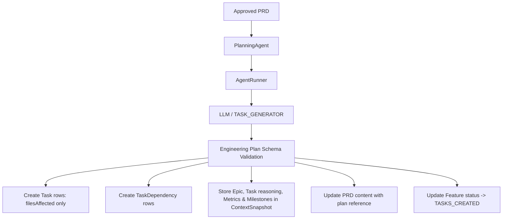

# ShipFlow AI — Planning Intelligence Engine

The Planning Intelligence Engine is responsible for decomposing an approved Product Requirements Document (PRD) into a highly structured, executable Engineering Plan consisting of epics, tasks, a structured testing strategy, milestones, and planning metrics.

---

## Architecture Flow

---

## Persistence Model (Schema Constraint Compliance)

Since the database schema is read-only, planning details are split to keep database tables clean:

1. **`Task` Table**:
   - `prdId`: Associated PRD ID.
   - `title`: Short task name.
   - `description`: Detailed task description.
   - `filesAffected`: **Strictly** repository file paths array (`string[]`).
   - `orderIndex`: Execution wave ordering sequence.
2. **`TaskDependency` Table**:
   - Graph edges mapped to database UUIDs.
3. **`ContextSnapshot` Table**:
   - Stores the full plan metadata snapshot JSON:
     - `epics`: Groupings of tasks with descriptions and engineering risk analyses.
     - `tasks`: Detailed task records containing `storyPoints`, `complexity`, `estimatedHours`, `labels`, `acceptanceCriteria`, `confidence` score/reason, `riskAnalysis`, `affectedAreas`, and `reasoning` (`whyThisTaskExists`, `whyThisOrder`, `whyThisDependsOn`).
     - `testingStrategy`: Unit, Integration, End-to-End, Performance, Security strategies.
     - `executionMetadata`: Concurrency Wave details, Critical Path sequence, and Parallel Work Groups.
     - `implementationStrategy`: Recommended commit sequence and phases.
     - `milestones`: Sprints/Milestones grouping of tasks.
     - `metrics`: Overall plan metrics (`totalTasks`, `totalStoryPoints`, `estimatedHours`, `criticalPathLength`, `parallelizationPercentage`, `averageConfidence`, `riskScore`, `testingCoverage`).

---

## API Layer

The planning engine exposes 4 endpoints under the `planning` router:

* **`generatePlan`** (Mutation): Generates a new plan for a PRD.
* **`regeneratePlan`** (Mutation): Re-generates a plan.
* **`getPlan`** (Query): Retrieves the reconstructed engineering plan by merging the database task records with metadata in `ContextSnapshot`.
* **`getPlanningMetrics`** (Query): Retrieves only the metrics and milestones block directly.

---

## Internal Developer Playground

Accessible at `/internal/planning-test`:
- Allows selecting active org, workspace, and feature.
- Displays actions to trigger or regenerate plan.
- Provides tabbed interfaces to inspect metrics cards, milestones, tasks details, reasoning, risks, testing strategy, critical path, parallel groups, commit sequence, and raw output.
