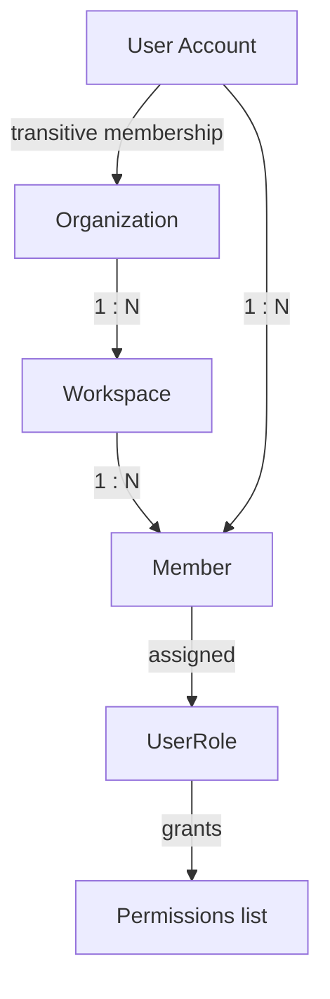
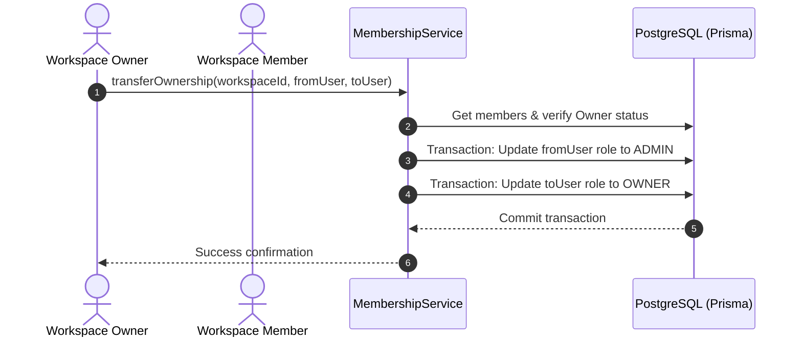
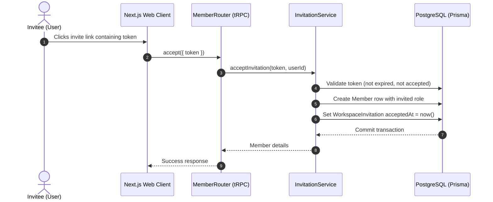

# ShipFlow AI — Multi-Tenant Workspace & Organization Architecture

**Document Version:** 1.0.0  
**Status:** Implemented  
**Reference Files:** `packages/auth/src/`, `packages/api/src/`

---

## 1. Multi-Tenant Architecture Overview

ShipFlow AI implements logical multi-tenancy utilizing a hierarchical containment model:
`Organization` ➔ `Workspace` ➔ `Member` ➔ `Role` ➔ `Permissions`

Instead of keeping user-to-organization links at the database level, a user is associated with an organization transitively. They belong to an organization by holding membership in at least one workspace within that organization.

### Multi-Tenancy Hierarchy

---

## 2. Lifecycles and Flows

### 2.1 Organization Lifecycle
1. **Creation:** An authenticated user invokes `organization.create`. A new `Organization` is created. Inside the same database transaction, a default `Workspace` (e.g. "Name Workspace") is provisioned, and the creator is assigned as `OWNER` of that workspace.
2. **Update:** An organization owner or administrator can modify organization metadata (name, slug).
3. **Deletion (Soft Delete):** A workspace owner can delete the organization. The organization's `deletedAt` field is set. In the same database transaction, all nested workspaces and member records are also soft-deleted (setting their `deletedAt` timestamps).

### 2.2 Workspace Lifecycle
1. **Creation:** A member with appropriate administrative roles (Owner/Admin) in the organization invokes `workspace.create`. A new `Workspace` is provisioned under the organization, and the creator is assigned the `OWNER` role for that workspace.
2. **Update:** Authorized roles can rename the workspace or update its slug.
3. **Archive (Soft Delete):** Workspace is soft-deleted by setting the `deletedAt` timestamp.
4. **Restore:** Authorized administrators can clear `deletedAt` to restore the workspace.
5. **Delete:** Permanent hard delete (primarily for sandbox cleanups).

### 2.3 Membership Flow & Ownership Transfer
* **Adding Members:** A member joins either by direct setup or by accepting an invitation.
* **Leaving Workspaces:** Members can leave workspaces freely. However, the last `OWNER` of a workspace is blocked from leaving to prevent orphaned workspaces.
* **Ownership Transfer:** Owners can transfer their role to another active member. The original owner is automatically demoted to `ADMIN` to prevent multiple owner conflicts while retaining operational access.

### 2.4 Invitation Flow
1. **Dispatch:** A workspace Owner or Admin invites an email address with a specified role. A `WorkspaceInvitation` record is created containing a secure, random token and an expiration timestamp (defaulting to 14 days).
2. **Acceptance:** The recipient invokes the accept mutation with the token.
   - The token is verified (not expired, not already accepted).
   - The user is added as a `Member` of the workspace.
   - The invitation is marked as accepted (`acceptedAt` set).
3. **Rejection/Cancellation:** The creator cancels the invitation, or the recipient rejects it, setting the acceptance timestamp to the epoch (indicating cancellation) to invalidate the token.

---

## 3. Role-Based Access Control (RBAC)

### 3.1 Roles Matrix
The following roles are defined in the workspace RBAC hierarchy (highest privilege to lowest):
1. **OWNER:** Full administrative controls, billing operations, and workspace deletion rights. Can transfer ownership.
2. **ADMIN:** Workspace settings updates, member invites, role management (up to Admin), repository linking, and project creations.
3. **PM (Project Manager):** Product requirements generation, task creation, project updates, and release scheduling.
4. **DEVELOPER:** Code updates, feature answers submission, PR creation, and task status modifications.
5. **REVIEWER:** Review features and approve PR code changes.
6. **VIEWER:** Read-only access to files, tasks, settings, and Dora metrics.

### 3.2 Permission Enforcement Matrix

| Permission | OWNER | ADMIN | PM | DEVELOPER | REVIEWER | VIEWER |
| :--- | :---: | :---: | :---: | :---: | :---: | :---: |
| `canDeleteWorkspace` | ✅ | ✅ | ❌ | ❌ | ❌ | ❌ |
| `canUpdateWorkspace` | ✅ | ✅ | ❌ | ❌ | ❌ | ❌ |
| `canTransferOwnership` | ✅ | ❌ | ❌ | ❌ | ❌ | ❌ |
| `canInviteMembers` | ✅ | ✅ | ❌ | ❌ | ❌ | ❌ |
| `canRemoveMembers` | ✅ | ✅ | ❌ | ❌ | ❌ | ❌ |
| `canUpdateMemberRole` | ✅ | ✅ | ❌ | ❌ | ❌ | ❌ |
| `canLeaveworkspace` | ✅ | ✅ | ✅ | ✅ | ✅ | ✅ |
| `canCreateProject` | ✅ | ✅ | ✅ | ❌ | ❌ | ❌ |
| `canDeleteProject` | ✅ | ✅ | ✅ | ❌ | ❌ | ❌ |
| `canUpdateProject` | ✅ | ✅ | ✅ | ❌ | ❌ | ❌ |
| `canCreateFeature` | ✅ | ✅ | ✅ | ✅ | ❌ | ❌ |
| `canUpdateFeature` | ✅ | ✅ | ✅ | ✅ | ❌ | ❌ |
| `canDeleteFeature` | ✅ | ✅ | ✅ | ❌ | ❌ | ❌ |
| `canReviewFeature` | ✅ | ✅ | ❌ | ❌ | ✅ | ❌ |

---

## 4. Context Resolution Pipeline

Every authenticated tRPC query or mutation seeking a workspace context traverses a strict resolution pipeline:

1. **Authentication:** `getSessionFromHeaders` matches BetterAuth cookies to retrieve the authenticated `user` and `session`.
2. **Identifier Extraction:** `workspaceProcedure` extracts `workspaceId` or `workspaceSlug` from the procedure input payload or request headers (`x-workspace-id` / `x-workspace-slug`).
3. **Hierarchy Resolution:**
   - **Workspace Resolution:** Fetches the workspace from DB. Verifies it is not soft-deleted.
   - **Organization Resolution:** Resolves the workspace's parent organization.
   - **Membership Resolution:** Queries the active `Member` record for the user and workspace.
   - **Role & Permission Resolution:** Assigns the workspace `UserRole` and calculates the granted permissions array via the permission matrix.
4. **Context Injection:** Attaches `workspaceContext` and `orgContext` to the tRPC context object.

---

## 5. Key Design Decisions

* **Row-Level Tenancy isolation:** All mutations are isolated at the workspace boundary. The context guarantees that the authenticated user only acts on workspaces where they hold active membership.
* **Implicit Organization Associations:** Avoiding redundant user-to-organization mappings keeps the Prisma schema clean and prevents synchronization bugs (such as a user being removed from all workspaces but somehow remaining an active member of the parent organization).
* **Safe Context Fallbacks:** By capturing headers in `createContext` but delaying validation until `workspaceProcedure` execution, queries that do not require workspace scopes (e.g. public healthchecks or listing user organizations) remain fully functional even if workspace headers are omitted.
